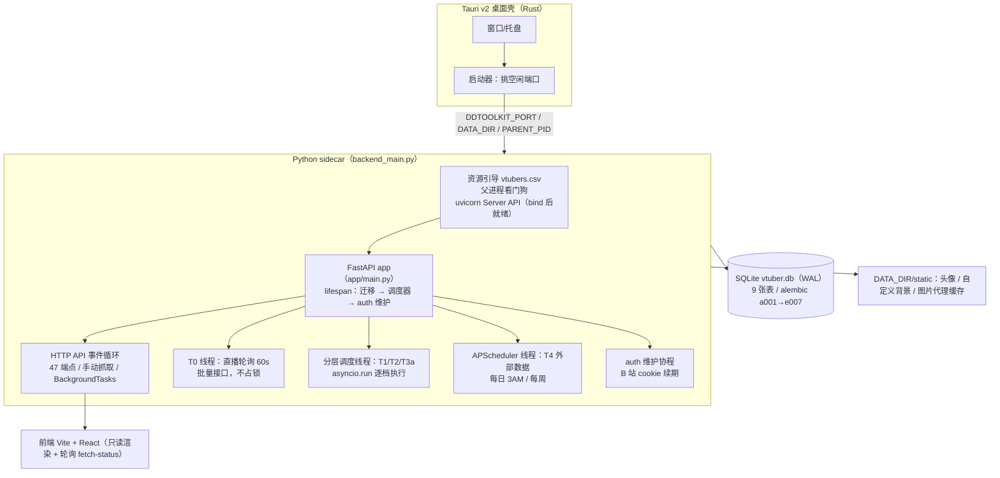
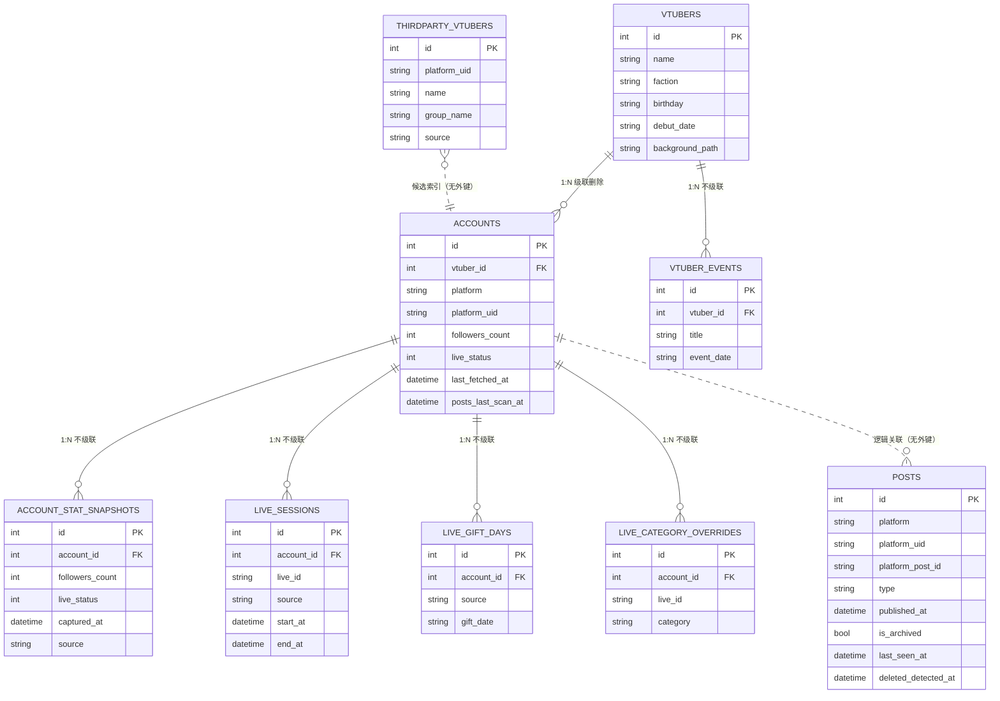
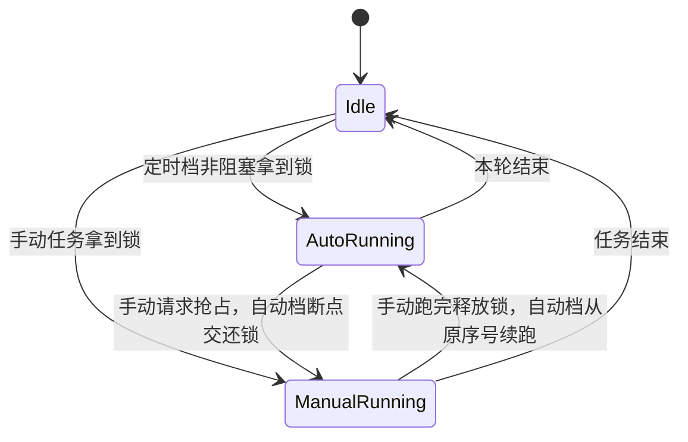
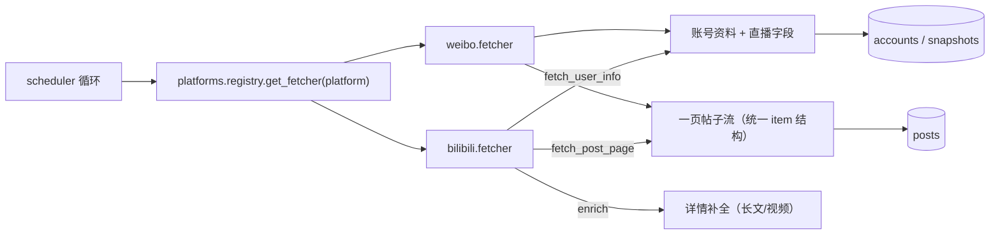
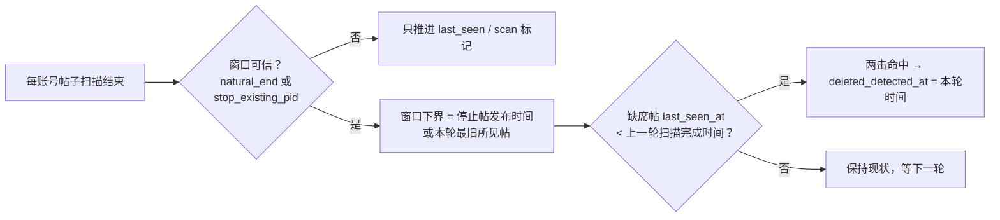
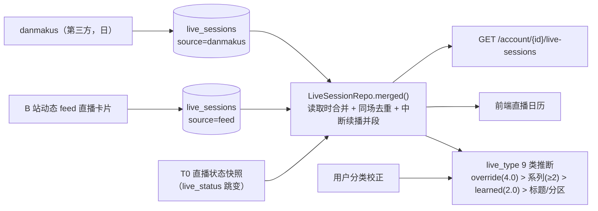
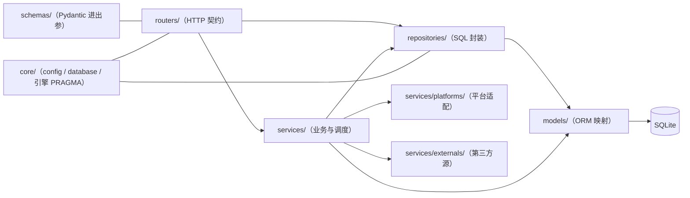

# 后端架构总览：数据模型 + 抓取技术架构

> 适用版本：`main`（2026-09-09，`MIGRATION_HEAD = e007`）。
> 本文是**入口文档**：先看这里建立全貌，再按需进两份深度文档——
> - `docs/backend-repositories-and-routers.md`：9 张表的列级定义、9 个仓储类、47 个 HTTP 端点；
> - `docs/backend-fetch-pipeline.md`：抓取链路细节（API 清单、节流测算、风控判定、停止原因）。
> 前端形态见 `docs/UI-MAP.md`；本地开发/验证见 `docs/DEV-LOOP.md`。

---

## 0. 一句话定位

**本地优先的个人 VTuber 证据归档系统**：Tauri 桌面壳拉起一个 FastAPI sidecar，
把 B 站 / 微博的账号资料、动态投稿、直播场次与第三方历史**固定化**到单机 SQLite；
前端只读渲染，所有抓取由后端的**分层调度 + 手动任务优先**驱动，第三方站点只在
每日/每周低频拉取。

---

## 1. 运行时形态（进程 / 线程 / 协程）

| 并发单元 | 载体 | 职责 | 是否占抓取锁 |
|---|---|---|---|
| HTTP API | FastAPI 事件循环 | 路由、手动抓取（同步端点在线程池） | 手动抢锁（可抢占自动档） |
| BackgroundTasks | 事件循环（响应之后） | 收录 / 加账号后的抓取 + 第三方回填 | 同上 |
| T0 直播状态 | 独立守护线程 | 每 60s ±15s 批量回写 `live_*` 字段 | **不占锁**（与一切任务并行） |
| T1/T2/T3a | 分层调度线程 | 周期抓取（启动链语义并入首轮） | 两把锁 |
| T4 外部数据 | APScheduler 线程 | zeroroku / danmakus cron | `any_fetch_running()` 为真则跳过 |
| auth 维护 | 事件循环协程 | B 站 cookie 心跳/续期、微博登录态探测 | — |

**冷启动优化**：`app/routers/vtuber.py` 不直接 import `scheduler`（依赖链重：apscheduler /
tenacity / httpx / fetcher），经 `_sched()` 缓存包装首次调用才导入；`main.py` 的 lifespan
也把调度器 import 放在函数内——让 uvicorn 尽快 bind 端口。

**数据目录**：一切可变数据都在 `DDTOOLKIT_DATA_DIR`（桌面端 = `%APPDATA%\com.ddtoolkit.app`，
开发态 = `…-dev`）：`vtuber.db`（+ WAL/SHM）、`.env`（凭据）、`vtubers.csv`（候选池）、
`logs/{app,sidecar}.log`、`static/{avatars,custom_bg,img-cache}`。

---

## 2. 数据模型（9 张表 · 迁移链 a001 → e007）

### 2.1 ER 总览

### 2.2 表职责

| 表 | 定位 | 关键约束 / 索引 | 写入方 |
|---|---|---|---|
| `vtubers` | 主播本体（平台无关）：名字/阵营/生日/出道日/设定/默认头像/自定义背景 | `ix_vtubers_name` | 手动 CRUD、候选池收录 |
| `accounts` | 各平台账号：昵称/头像/签名/粉丝数/直播字段/`last_fetched_at`/`posts_last_scan_at` | **UNIQUE(platform, platform_uid)**；`ix_accounts_vtuber_id` | 收录/加账号、T0/T1/T3a 抓取回写 |
| `posts` | 动态 / 投稿 / 专栏 / 转发 / 音乐 / 直播卡片（直播卡片转存后不入表） | **UNIQUE(platform, platform_uid, platform_post_id)**；复合索引 `(platform, platform_uid, published_at)`、`ix_posts_published_at`、`ix_posts_deleted_detected` | 帖子抓取（批量攒批 commit） |
| `account_stat_snapshots` | 粉丝数 / 直播状态时间序列（涨粉趋势、直播日历的地基） | `ix_..._account_id`、`ix_..._captured_at`；`source` 区分自采/第三方 | 每次账号抓取成功后追加一行 |
| `live_sessions` | 直播场次（标题/起止/分区/封面/收益/弹幕数） | **UNIQUE(account_id, live_id)**；`ix_live_sessions_account_start` | danmakus 回填、B 站 `feed` 直播卡片、读取时并入 self 快照 |
| `live_gift_days` | 礼物 / 大航海 / SC 日聚合（金额保字符串精度） | **UNIQUE(account_id, source, gift_date)** | zeroroku |
| `live_category_overrides` | 用户对场次分类的手工校正（9 类引擎最高优先级信号） | **UNIQUE(account_id, live_id)** | 前端分类下拉 |
| `vtuber_events` | 手动维护的纪念日 / 活动（一次性日期） | `ix_vtuber_events_vtuber_date` | 前端增删 |
| `thirdparty_vtubers` | 第三方 VTuber 索引（企划 / 公会），供候选池搜索增强 | **UNIQUE(source, platform_uid)** | danmakus vup-list（周级整表刷新） |

### 2.3 迁移链与启动迁移

| 版本 | 内容 | 版本 | 内容 |
|---|---|---|---|
| `a001` | 建 `vtubers` + `accounts` | `e001` | `account_stat_snapshots` |
| `b001` | 建 `posts` | `e002` | 墓碑：`posts.last_seen_at / deleted_detected_at` + `accounts.posts_last_scan_at` |
| `c001` | `posts.is_archived` | `e003` | `posts.body_text`（全文搜索） |
| `c002` | 唯一约束改为 (platform, uid, pid) | `e004` | 外部源：`thirdparty_vtubers` / `live_gift_days` + 快照 `source` |
| `d001` | `vtubers.faction` + 3 个热路径索引 | `e005` | `vtuber_events` |
| `d002` | `vtubers.background_path` | `e006` | `live_sessions` |
| | | `e007` | `live_category_overrides` |

启动迁移四形态（`app/main.py::_run_migrations`，冷启动快路径）：

1. **全新库**（无任何表）→ `alembic upgrade head`；
2. **旧库**（有表无 `alembic_version`）→ 补列补索引后 `stamp head`；
3. **落后版本** → `upgrade head` 增量升级；
4. **版本 == `MIGRATION_HEAD`** → 直接返回，零 alembic 开销。

> 纪律：新增迁移必须同步 `app/main.py` 的 `MIGRATION_HEAD`（`tests/test_services.py`
> 断言它与 alembic head 一致），否则快路径会把旧库误判为已最新。

### 2.4 存储约定

- **时区**：库内 datetime 一律 **naive UTC**；路由层比较参数同为 naive；输出模型补 `+00:00`。
- **SQLite PRAGMA**（`app/core/database.py`，每个连接）：`journal_mode=WAL`、
  `busy_timeout=30000`、`synchronous=NORMAL`、**`foreign_keys=ON`**。
- **外键语义**：只有 `vtubers→accounts` 有 ORM 级联；其余 5 条外键（快照/场次/礼物日/
  分类校正/活动条目）**不级联**——删除必须显式清理，见 `app/services/purge.py`（§6）。
- **posts 无外键**：与账号靠 `(platform, platform_uid)` 逻辑关联（联合投稿会在每个 V
  下各存一份），删除时按平台+UID 显式清。

---

## 3. 抓取技术架构

### 3.1 时效分层（谁在什么时候抓）

| 层 | 内容 | 载体 | 默认周期 | 冲突策略 |
|---|---|---|---|---|
| **T0** 直播状态 | 批量接口只回写 `live_*`（跳变落快照） | 独立线程 | 60s ±15s | 与一切并行（不占锁） |
| **T1** 主要账号 | 每 V 主账号全字段（`PRIMARY_PLATFORM_ORDER`） | 分层线程（账号锁） | 5min ±30s | 起跑见手动任务→跳过；持锁见手动请求→**断点让位** |
| **T2** 最新动态 | 每主账号 1 页 + 限 `STARTUP_DYNAMICS_LIMIT=2` 条新帖 | 分层线程（帖子锁） | 15min ±2min | 同上 |
| **T3a** 全量账号 | 全部账号全字段（补 T1 不覆盖的非主账号） | 紧接 T2 串行（同频） | 随 T2 | 同上 |
| **T3** 手动全量/补档 | 用户触发（全量账号 / 全量帖子 / 单 V / 更新动态 / 收录 / 加账号） | HTTP + BackgroundTasks | — | **永远优先于 T1/T2/T3a** |
| **T4** 外部数据 | zeroroku / danmakus 第三方固定化数据 | APScheduler cron | 3AM 日 / 周 | `any_fetch_running()` 为真则跳过 |

启动链（`STARTUP_CHAIN_ENABLED`，首轮 T1→T2→T3a，`STARTUP_CHAIN_DELAY=4s`）让应用
打开就有数据；之后各档按周期 + 抖动循环。

### 3.2 任务模型：两把锁 + 手动优先

（自动档**起跑**时若锁被手动任务占着 → 直接跳过本轮，不打断手动任务。）

- 两把独立锁：`_fetch_lock`（账号信息）与 `_post_fetch_lock`（帖子），互不牵连；
- **自动让手动**：手动侧 `_acquire_manual_*()` 拿不到锁且占用者是自动档时，置位
  `_preempt_account/_preempt_post` 并轮询等锁（上限 120s）；自动档在**账号之间**的断点
  `_maybe_preempt_*()` 交还锁、等信号清除、重新拿锁、**从原序号续跑**；
- **手动之间不互相打断**：占用者是另一个手动任务时直接返回 `skipped`；
- 端点 409 判定用 `manual_task_running()`（自动档持锁不算忙），外部批次用
  `any_fetch_running()`（任一在跑或有人在等让位都算忙）；
- 状态通道 `GET /vtuber/fetch-status` 暴露 `account.{running,current,index,total,recent}`、
  `post.{running,target}` 与 `last_result`（完成胶囊）；前端 ~2s 轮询。

### 3.3 平台适配层（直采）

- `BasePlatform` 只定义三个方法：`fetch_user_info` / `fetch_post_page` / `enrich`（可选）；
- 新平台 = 继承 + 在 `platforms/registry.py` 注册一行，调度器自动获得账号抓取、
  全量/增量帖子抓取、风控退避与完成报告（详见 `docs/platforms-extension-guide.md`）；
- B 站请求走 `fetcher.py`：WBI 签名（`wbi.py`，混钥缓存）+ `auth_manager.build_headers()`
  注入 Cookie/UA；微博走 PC ajax 端点 + 扫码登录保存的 Cookie。

### 3.4 帖子抓取：模式与停止原因

| 模式 | 参数 | 用途 |
|---|---|---|
| 全量 | `video_pages=-1, dynamics_pages=-1` | 首次收录补档、手动全量 |
| 快速 | `2/3` 页（前端）/ `3/5`（默认） | 手动「抓取帖子」 |
| 增量 | `stop_on_existing=True` | 更新未归档动态：遇到第一条已入库帖即停（首页首条豁免，防置顶误停） |
| 最新 N 条 | `limit_latest=2` | T2 每 15 分钟消化 2 条新帖，单次时长有上界 |
| 仅动态 | `include_videos=False` | 更新未归档动态（不碰视频流） |

- **归档边界剪枝**：整页帖子都已归档（`is_archived=1`）→ 更早的页必然也已归档，
  立即停止翻页，不再产生任何网络请求；
- **内存去重**：抓取前一次性查库取 `existing_ids` / `archived_ids`，避免唯一约束回滚；
- **批量入库**：攒满 `_POST_BATCH_SIZE` 才 commit；
- **停止原因归类**（前端据此区分「预期停止」与「丢数据」）：`done / page_limit /
  rate_limited / network_error / archived_boundary / stopped_early / error`；
- B 站视频流额外比对 `arc/search.page.count`（参考总数）估算缺失量。

### 3.5 风控与节流

| 机制 | 实现 |
|---|---|
| 风控判定 | `RATE_LIMIT_CODES = {-509, -412, -799, 412}`（HTTP 码或业务码） |
| 状态隔离 | 风控标志放 `ContextVar`（`fetcher.py`），账号/帖子任务互不污染 |
| 冷却 | 触发后 `RATE_LIMIT_COOLDOWN=600s` 冷却，从**当前账号/页**续跑（不重头） |
| 请求间隔 | `REQUEST_INTERVAL_MIN/MAX = 3~5s` 随机；每 10 个账号休息 60s |
| 页间间隔 | 视频页 1s、动态页 20s、账号间 20s（全量帖子） |
| 频率测算 | 16 账号一轮 ≈ 32 req / 5min ≈ 7 req/min（平均安全，突发靠批次休息摊平） |
| 风控续抓 | 列表页触发风控后同页重试上限 `_PAGE_RETRIES=2` |

### 3.6 删除检测（墓碑机制，v0.5.1）

- 「已验证窗口」是防误判关键：增量模式停在某帖时，更早的帖子本轮**根本没扫**，
  不参与判定；
- 已归档帖不参与；已墓碑不重复判定、不逆转（复活只刷新 `last_seen_at`）；
- 判定失败只记日志，不影响抓取结果。

### 3.7 直播场次管道（三源合一）

- 表内场次（danmakus / feed）+ self 快照推导的「虚拟场次」在**读取时**合并，
  不落表；合并窗口 90 分钟，同 `room_id` 去重，同标题中断续播并段；
- `end_at` 由快照/次日 danmakus 补全；收益/弹幕数来自 danmakus。

### 3.8 状态通道

`_status`（模块级 dict）+ `_push_account_snapshot()` 队列 → `GET /vtuber/fetch-status`
→ 前端 TopBar 轮询（~2s）→ 左栏徽标 / 右栏卡片实时合并（`recent` 增量快照）。
T0 的进度反馈就是这条通道（无进度条、无胶囊）。

---

## 4. 数据来源地图

| 来源 | 接口 | 鉴权 | 频率 | 落库 |
|---|---|---|---|---|
| **B 站直采** | `x/space/wbi/acc/info`、`x/relation/stat`、`live/room/v1/Room/get_status_info_by_uids`（批量 100/req）、`arc/search`、`polymer/web-dynamic/v1/feed/space`、`/detail`、`x/web-interface/view`、`x/article/view` | Cookie（SESSDATA 等，扫码登录 + refresh_token 续期）+ WBI 签名 | T0 60s / T1 5min / T2 15min / T3 手动 | accounts、snapshots、posts、live_sessions(feed) |
| **微博直采** | `weibo.com/ajax/profile/info`、PC 时间线 ajax | Cookie（扫码登录保存） | 同上 | accounts、snapshots、posts |
| **zeroroku**（第三方） | `/api/bilibili/author/{mid}/history`、`/live-paid-aggregations` | 无 | 每日 3AM | snapshots(source=zeroroku)、live_gift_days |
| **danmakus**（第三方） | `vup-list`、直播场次接口 | 无 | 每周（索引）/ 每日（场次） | thirdparty_vtubers、live_sessions |
| **laplace** | 声明为源（`jobs=[]`），当前仅作为 danmakus 的辅助 | 无 | — | — |
| **本地名单** | `vtubers.csv`（随包分发，首启引导到数据目录） | — | 手动导入 / 候选池检索 | vtubers + accounts（收录时） |
| **图片代理** | `/img-proxy?url=`（白名单主机 + 磁盘缓存） | 按主机带 Referer | 按需 | `static/img-cache` |

外部源契约（`app/services/externals/`）：`ExternalSource.run_job(kind, db, client,
account_ids)`，幂等纪律「重复执行不产生重复行」；`account_ids` 白名单用于收录/加账号时
只回填该账号，避免全量扫第三方站点。

---

## 5. 分层与依赖方向

| 目录 | 职责 | 约定 |
|---|---|---|
| `app/routers/` | HTTP 契约、状态码语义（404/409/415/413）、`Depends(get_db)` | 不写 SQL；抓取类端点做忙判定 |
| `app/repositories/` | 按仓库类持会话（9 个 Repo），批量删除/分页/统计等 SQL | 写操作当场 commit；`PostRepo.create(commit=False)` 供批量入库 |
| `app/models/` | SQLAlchemy 2.0 ORM（单文件 9 表） | 唯一约束/索引与迁移链一致 |
| `app/schemas/` | Pydantic 输入输出模型 | `Out` 用 `from_attributes` |
| `app/services/` | 调度、抓取、平台适配、第三方源、认证、类型引擎、墓碑、清理 | 不碰 HTTP；重依赖延迟 import |
| `app/core/` | 配置（数据目录/环境变量）、引擎与 PRAGMA、`get_db` | — |

---

## 6. 不变量与纪律（改代码前必读）

1. **库内时间一律 naive UTC**，输出补 `+00:00`；
2. **posts 无外键**——删除 V / 账号必须走 `app/services/purge.py`（帖子按 platform+uid，
   4 张子表按 account_id，活动条目按 vtuber_id），漏清一张就会被 `foreign_keys=ON`
   整次回滚（v0.9.3 修复的事故）；
3. **新增迁移必须同步 `MIGRATION_HEAD`**（测试断言与 alembic head 一致）；
4. **唯一约束去重**：账号 `(platform, platform_uid)`、帖子 `(platform, platform_uid,
   platform_post_id)`、场次 `(account_id, live_id)`、礼物日 `(account_id, source, gift_date)`；
5. **抓取去重靠内存集合**，不靠捕获 IntegrityError（避免事务回滚污染整批）；
6. **归档边界剪枝**：抓取前先跑归档规则，已归档帖零网络请求；
7. **手动任务优先于定时档**（自动档起跑让位 + 持锁断点让位，两个方向都要在）；
8. **外部源幂等**，且只在每日/每周低频访问第三方站点；
9. **冻结运行时路径**：`PROJECT_ROOT = sys._MEIPASS`（打包后 alembic.ini / 迁移脚本随包）；
10. **凭据只落本机** `DATA_DIR/.env`（原子替换），不进仓库、不上传。

---

## 7. 扩展点

| 想做什么 | 改哪里 |
|---|---|
| 接入新平台（抖音/小红书…） | 继承 `platforms/base.py::BasePlatform` → `platforms/registry.py` 注册 → 前端平台常量；调度器自动接管 |
| 接入新第三方源 | 实现 `externals/base.py::ExternalSource` → `externals/__init__.py` 注册（声明 `jobs` 与周期） |
| 新增表/列 | 新建 `alembic/versions/eNNN_*.py` → 同步 `MIGRATION_HEAD` → 补 `models` 与 Repo → 若挂 `accounts/vtubers` 外键，**同步 `services/purge.py`** |
| 调整抓取频率/节流 | `app/core/config.py`（T0-T4 周期、请求间隔、批量休息、风控冷却） |
| 新增前端视图 | `docs/UI-MAP.md`（右栏视图光条 + 场景状态机） |
| 改抓取/布局后的验证 | `python scripts/dev_check.py`（测试 + 后端冒烟）、`python scripts/ui_probe.py`（布局不变量） |
