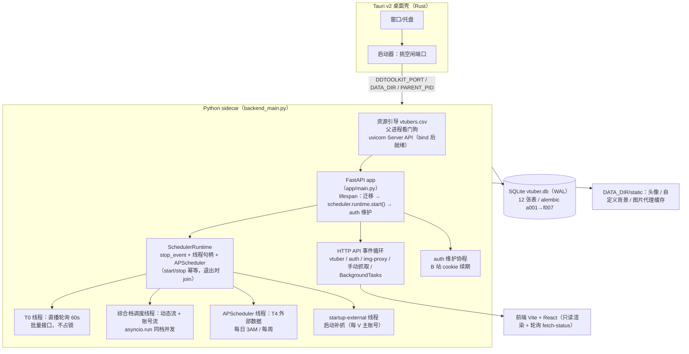
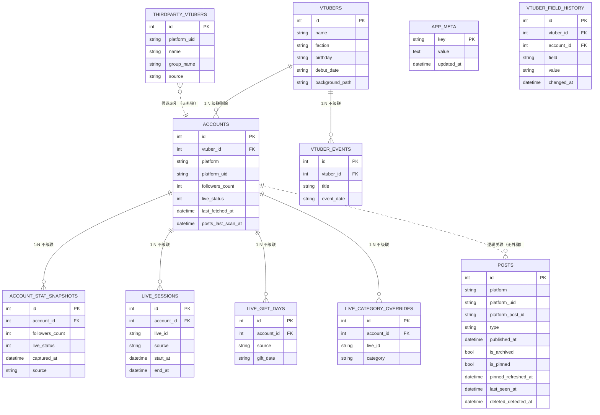
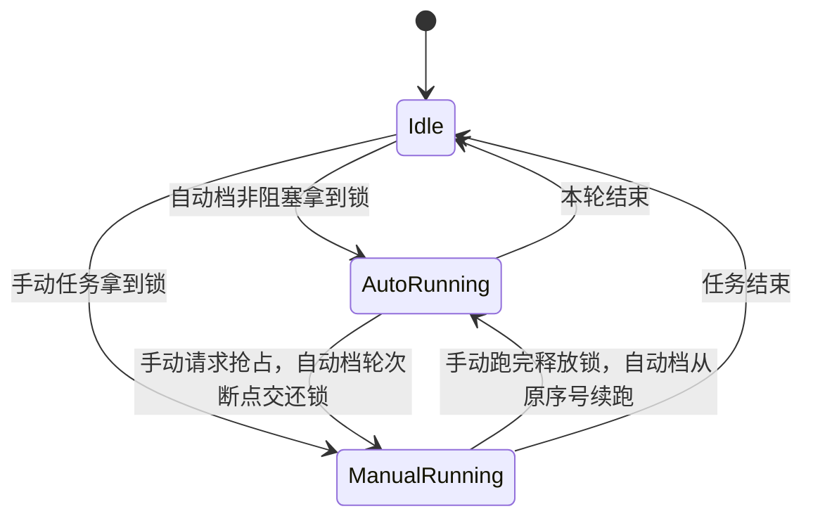
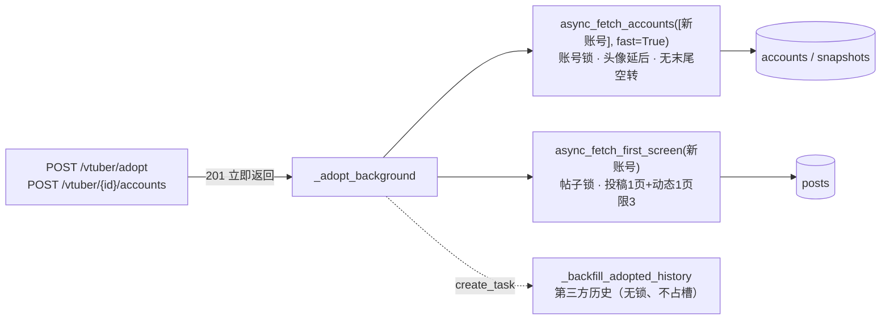
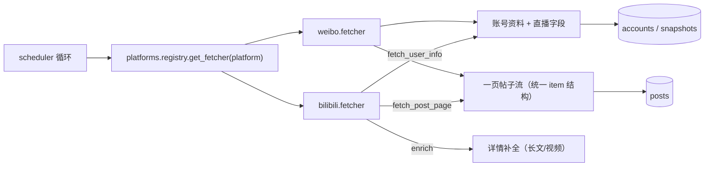
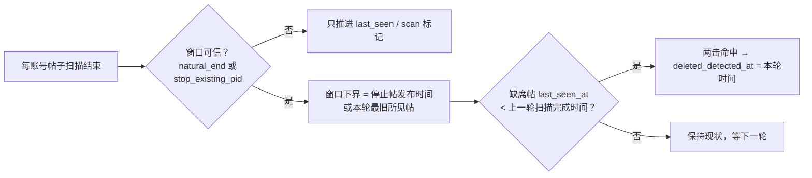
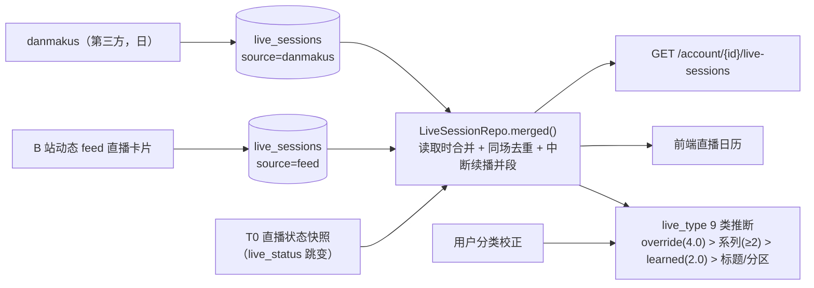
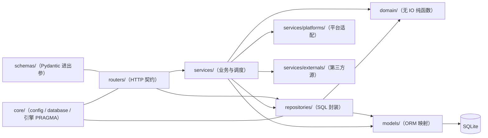

# 后端架构总览：数据模型 + 抓取技术架构

> 适用版本：`main`（2026-09-23，`MIGRATION_HEAD = f007`）。
> 本文是**入口文档**：先看这里建立全貌，再按需进两份深度文档——
> - `docs/GLOSSARY.md`：**查名词/代码路径**（改 bug 或做需求第一步）；
> - `docs/backend-repositories-and-routers.md`：12 张表的列级定义、12 个仓储类、HTTP 路由计数（三种数法见该文 §3）；
> - `docs/backend-fetch-pipeline.md`：抓取链路细节（API 清单、节流测算、风控判定、停止原因）。
> 前端形态见 `docs/UI-MAP.md`；本地开发/验证见 `docs/DEV-LOOP.md`；全部文档索引见 `docs/README.md`。

---

## 0. 一句话定位

**本地优先的个人 VTuber 证据归档系统**：Tauri 桌面壳拉起一个 FastAPI sidecar，
把 B 站 / 微博的账号资料、动态投稿、直播场次与第三方历史**固定化**到单机 SQLite；
前端只读渲染，所有抓取由后端的**分层调度 + 手动任务优先**驱动，第三方站点只在
每日/每周低频拉取。

---

## 1. 运行时形态（进程 / 线程 / 协程）

| 并发单元 | 载体 | 职责 | 是否占抓取锁 |
|---|---|---|---|
| HTTP API | FastAPI 事件循环 | 路由、手动抓取（同步端点在线程池） | 手动抢锁（可抢占自动档） |
| BackgroundTasks | 事件循环（响应之后） | 收录 / 加账号后的抓取 + 第三方回填 | 同上 |
| T0 直播状态 | 独立守护线程 | 每 60s ±15s 批量回写 `live_*` 字段 | **不占锁**（与一切任务并行） |
| 综合档 | 调度线程 | 动态流（预算自适应，见 §3.1）+ 账号流（数据到期，约 24h）**同档并发** | 两把锁 |
| T4 外部数据 | APScheduler 线程 | zeroroku / danmakus cron | 手动任务在跑则**排队等待**（v0.9.3，不再跳过） |
| 启动外部补抓 | 独立守护线程（`startup-external`） | 每 V 主账号的第三方数据，<24h 跳过 | 与综合档互斥（`_external_running`），不占锁 |
| auth 维护 | 事件循环协程 | B 站 cookie 心跳/续期、微博登录态探测 | — |

**这五条都由 `scheduler.runtime`（`SchedulerRuntime`）起与停**（R1，devlog/211）：
各自持 `threading.Event` + 线程句柄 + APScheduler + **在飞事件循环登记表**，
`start()` / `stop()` 幂等；线程里用 `wait()` 代 `time.sleep`、`run()` 代 `asyncio.run`
（后者让"停止"能取消在飞轮次）。详见 §6 第 31 条。

**冷启动优化**：`app/routers/vtuber.py` 不直接 import `scheduler`（依赖链重：apscheduler /
tenacity / httpx / fetcher），经 `_sched()` 缓存包装首次调用才导入；`main.py` 的 lifespan
也把调度器 import 放在函数内——让 uvicorn 尽快 bind 端口。

**数据目录**：一切可变数据都在 `DDTOOLKIT_DATA_DIR`（桌面端 = `%APPDATA%\com.ddtoolkit.app`，
开发态 = `…-dev`）：`vtuber.db`（+ WAL/SHM）、`.env`（凭据）、`vtubers.csv`（候选池）、
`logs/{app,sidecar}.log`、`static/{avatars,custom_bg,img-cache}`。

---

## 2. 数据模型（12 张表 · 迁移链 a001 → f007）

### 2.1 ER 总览

### 2.2 表职责

| 表 | 定位 | 关键约束 / 索引 | 写入方 |
|---|---|---|---|
| `vtubers` | 主播本体（平台无关）：名字/阵营/生日/出道日/设定/默认头像/自定义背景 + 签名**来源/覆盖**（`sign_override` / `sign_source_account_id`） | `ix_vtubers_name` | 手动 CRUD、候选池收录 |
| `accounts` | 各平台账号：昵称/头像/签名/粉丝数/直播字段/`last_fetched_at`/`posts_last_scan_at` | **UNIQUE(platform, platform_uid)**；`ix_accounts_vtuber_id` | 收录/加账号、T0/综合档抓取回写 |
| `posts` | 动态 / 投稿 / 专栏 / 转发 / 音乐 / 直播卡片（直播卡片转存后不入表） | **UNIQUE(platform, platform_uid, platform_post_id)**；复合索引 `(platform, platform_uid, published_at)`、`ix_posts_published_at`、`ix_posts_deleted_detected` | 帖子抓取（批量攒批 commit） |
| `account_stat_snapshots` | 粉丝数 / 直播状态时间序列（涨粉趋势、直播日历的地基） | `ix_..._account_id`、`ix_..._captured_at`；`source` 区分自采/第三方 | 每次账号抓取成功后追加一行 |
| `live_sessions` | 直播场次（标题/起止/分区/封面/收益/弹幕数） | **UNIQUE(account_id, live_id)**；`ix_live_sessions_account_start` | danmakus 回填、B 站 `feed` 直播卡片、读取时并入 self 快照 |
| `live_gift_days` | 礼物 / 大航海 / SC 日聚合（金额保字符串精度） | **UNIQUE(account_id, source, gift_date)** | zeroroku |
| `live_category_overrides` | 用户对场次分类的手工校正（9 类引擎最高优先级信号） | **UNIQUE(account_id, live_id)** | 前端分类下拉 |
| `vtuber_events` | 手动维护的纪念日 / 活动（一次性日期） | `ix_vtuber_events_vtuber_date` | 前端增删 |
| `thirdparty_vtubers` | 第三方 VTuber 索引（企划 / 公会），供候选池搜索增强 | **UNIQUE(source, platform_uid)** | danmakus vup-list（周级整表刷新） |
| `app_meta` | 通用 KV（进程外需要记住的少量状态，如 `external.startup.last_run`） | `key` 主键 | 启动外部补抓时间戳（f003） |
| `vtuber_field_history` | **曾用值**：昵称/签名被**平台侧覆盖前**的旧值（f004 起取代字段锁定；手改不入账） | `ix_vtuber_field_history_vtuber`（`vtuber_id`, `field`） | 只由抓取回写记账（`scheduler._fetch_one_account` → `services/vtuber_history.py`） |

### 2.3 迁移链与启动迁移

| 版本 | 内容 | 版本 | 内容 |
|---|---|---|---|
| `a001` | 建 `vtubers` + `accounts` | `e001` | `account_stat_snapshots` |
| `b001` | 建 `posts` | `e002` | 墓碑：`posts.last_seen_at / deleted_detected_at` + `accounts.posts_last_scan_at` |
| `c001` | `posts.is_archived` | `e003` | `posts.body_text`（全文搜索） |
| `c002` | 唯一约束改为 (platform, uid, pid) | `e004` | 外部源：`thirdparty_vtubers` / `live_gift_days` + 快照 `source` |
| `d001` | `vtubers.faction` + 3 个热路径索引 | `e005` | `vtuber_events` |
| `d002` | `vtubers.background_path` | `e006` | `live_sessions` |
| `f001` | `posts.note`（投稿动态并入后的 UP 主附言） | `e007` | `live_category_overrides` |
| `f002` | `accounts.sort_order` + `accounts.locked_fields`（后者 f004 已删） | `f003` | `app_meta`（KV 表） |
| `f004` | `vtubers.sign_override / sign_source_account_id` + `vtuber_field_history`，**删除 `accounts.locked_fields`**（devlog/074） | `f005` | 置顶动态：`posts.is_pinned / pinned_refreshed_at` + 索引 `ix_posts_platform_uid_pinned`（devlog/139） |
| `f006` | 档案视图卡片布局：建 `profile_cards`（**12 张表**）（devlog/142） | `f007` | `vtuber_events` 加 `kind` / `emoji` + 索引 `ix_vtuber_events_vtuber_kind` = **当前 head**（devlog/162） |

> 共 **20** 个版本（`alembic/versions/` 实际文件数：`a001`–`f007`）。f001–f003 由 v0.9.6–v0.9.8 批次引入，f004 见 devlog/074、f005 见 devlog/139、f006 见 devlog/142、f007 见 devlog/162。

启动迁移四形态（`app/main.py::_run_migrations`，冷启动快路径）：

1. **全新库**（无任何表）→ `alembic upgrade head`；
2. **旧库**（有表无 `alembic_version`）→ 补列补索引后 `stamp head`（⚠️ 补不了唯一约束，
   故 `stamp` 前先过 `app/main.py::_missing_unique_keys`，不一致**拒绝启动**，见 devlog/053）；
3. **落后版本** → `upgrade head` 增量升级；
4. **版本 == `MIGRATION_HEAD`** → 直接返回，零 alembic 开销。

> 纪律：新增迁移必须同步 `app/main.py` 的 `MIGRATION_HEAD`（`tests/test_services.py`
> 断言它与 alembic head 一致），否则快路径会把旧库误判为已最新。

### 2.4 存储约定

- **时区**：库内 datetime 一律 **naive UTC**；路由层比较参数同为 naive；输出模型补 `+00:00`。
- **SQLite PRAGMA**（`app/core/database.py`，每个连接）：`journal_mode=WAL`、
  `busy_timeout=30000`、`synchronous=NORMAL`、**`foreign_keys=ON`**。
- **外键语义**：只有 `vtubers→accounts` 有 ORM 级联；其余 7 条外键（快照/场次/礼物日/
  分类校正/曾用值 → `accounts`，活动条目 + 曾用值 → `vtubers`）**不级联**——删除必须显式清理，
  见 `app/services/purge.py`（§6）。
- **posts 无外键**：与账号靠 `(platform, platform_uid)` 逻辑关联（联合投稿会在每个 V
  下各存一份），删除时按平台+UID 显式清。

---

## 3. 抓取技术架构

### 3.1 时效分层（谁在什么时候抓）

v0.9.3 把原 T1（主账号 5min）+ T2（最新动态 15min）+ T3a（全量账号随 T2）**合并为一个综合档**：
动态流每档跑，账号流按数据到期跑，两者同档并发。

| 层 | 内容 | 载体 | 周期 | 冲突策略 |
|---|---|---|---|---|
| **T0** 直播状态 | 批量接口只回写 `live_*`（跳变落快照） | 独立线程 | 60s ±15s | 与一切并行（不占锁） |
| **综合档·动态流** | **按平台名单**：全部账号各 1 页 + 每账号限 `STARTUP_DYNAMICS_LIMIT=2` 条新帖；名单间并行、名单内串行（R7，devlog/078） | 调度线程（帖子锁） | **预算自适应**：12 req·min⁻¹/平台，轮间 `max(30s, 预算等待) ±15s`，**再套周期下限 60s（按轮开始计时）** | 起跑见手动任务→跳过；持锁见手动请求→**轮次断点让位** |
| **综合档·账号流** | 全部账号全字段（含主账号；原 T1+T3a 合并） | 调度线程（账号锁） | **数据驱动**：任一账号 `last_fetched_at` 超 `ACCOUNT_SWEEP_STALE_HOURS=24h`（或为空）即到期 | 同上 |
| **T3** 手动全量/补档 | 用户触发（全量账号 / 全量帖子 / 单 V / 更新动态 / 收录 / 加账号） | HTTP + BackgroundTasks | — | **永远优先于综合档**；收录/加账号抢锁失败会入队补抓（v0.9.4） |
| **T4** 外部数据 | zeroroku / danmakus 第三方固定化数据 | APScheduler cron | 3AM 日 / 周 | 手动任务在跑则**排队等待**（最多 30min），不再直接跳过 |

- 启动链（`STARTUP_CHAIN_ENABLED`，`STARTUP_CHAIN_DELAY=4s`）：动态流必跑一次；
  **账号流按同一套数据到期判定**决定要不要跑（用户 2026-09-09 定稿：账号字段变化慢）；
- 两条流在同一事件循环里 `asyncio.gather` 并发起跑，墙钟 ≈ max(两条流) 而不是相加；
- **并发粒度 = 平台**（`_run_platform_rounds`）：每轮各就绪平台各抓一个账号，
  平台之间并行、平台内部串行 —— 单平台请求速率不变，某平台风控只冷却该平台。

### 3.2 任务模型：两把锁 + 手动优先

（自动档**起跑**时若锁被手动任务占着 → 直接跳过本轮，不打断手动任务。）

- 两把独立锁：`_fetch_lock`（账号信息）与 `_post_fetch_lock`（帖子），互不牵连；
  **综合档两条流各持一把**，因此可以同档并发；
- **自动让手动**：手动侧 `_acquire_manual_*()` 拿不到锁且占用者是自动档时，置位
  `_preempt_account/_preempt_post` 并轮询等锁（上限 120s）；自动档在**轮次断点**
  （每平台每账号之间）交还锁、等信号清除、重新拿锁、**从原序号续跑**；
- **手动之间不互相打断**：占用者是另一个手动任务时直接返回 `skipped`；
  **例外（v0.9.4）**：收录 / 加账号拉起的抓取失败时**入队**（`_pending_*`），
  由综合档心跳 `_drain_pending_fetches()` 在锁空闲时补抓 —— 新 V 的信息不会丢；
- 端点 409 判定用 `manual_task_running()`（自动档持锁不算忙），外部批次用
  `any_fetch_running()`（任一在跑或有人在等让位都算忙）；
- 状态通道 `GET /vtuber/fetch-status` 暴露 `account.{running,current,index,total,recent}`、
  `post.{running,target}`、`external.{running,label,last_label,seq}` 与 `last_result`
  （完成胶囊）；前端 ~2s 轮询；并发时 `current/target` 显示当轮就绪的平台名
  （如「bilibili、weibo」）。`external` 是外部第三方数据任务（收录回填 / 每日批次）
  的进度，其 `seq` 每次结束自增 —— 前端据此发 `fetch-idle`，让停在档案视图的
  粉丝趋势/直播日历卡片自动重拉（v0.9.4）。

### 3.2.1 收录 / 加账号链路（v0.9.4，devlog/044）

- 账号信息与首屏内容**并发**（两把锁独立，墙钟 ≈ max）；第三方历史脱离关键路径；
- 实测（模拟时延）账号信息可见 **6.0s → 0.9s**，首屏入库 **0 → 33 条**（devlog/044）。

### 3.3 平台适配层（直采）

- `BasePlatform` 只定义三个方法：`fetch_user_info` / `fetch_post_page` / `enrich`（可选）；
- 新平台 = 继承 + 在 `platforms/registry.py` 注册一行，调度器自动获得账号抓取、
  全量/增量帖子抓取、风控退避与完成报告（详见 `docs/platforms-extension-guide.md`）；
- B 站请求走 `fetcher.py`：WBI 签名（`wbi.py`，混钥缓存）+ `auth_manager.build_headers()`
  注入 Cookie/UA；微博走 PC ajax 端点 + 扫码登录保存的 Cookie。

### 3.4 帖子抓取：模式与停止原因

| 模式 | 参数 | 用途 |
|---|---|---|
| 全量 | `video_pages=-1, dynamics_pages=-1` | 首次收录补档、手动全量 |
| 快速 | `2/3` 页（前端）/ `3/5`（默认） | 手动「抓取帖子」 |
| 增量 | `stop_on_existing=True` | 更新未归档动态：**整页扫完**才停（边界取页内首条「已入库且非置顶」帖）；置顶帖豁免——微博 `isTop` 可多条、B 站 `module_tag.text=置顶`，且会打乱流序，旧「遇已入库即 break」会漏掉同页靠后的新帖（devlog/045） |
| 最新 N 条 | `limit_latest=2` | 综合档动态流每轮消化 2 条新帖，单次时长有上界 |
| 仅动态 | `include_videos=False` | 更新未归档动态（不碰视频流） |

- **归档边界剪枝**：整页帖子都已归档（`is_archived=1`）→ 更早的页必然也已归档，
  立即停止翻页，不再产生任何网络请求；
- **内存去重**：抓取前一次性查库取 `existing_ids` / `archived_ids`，避免唯一约束回滚；
- **批量入库**：攒满 `_POST_BATCH_SIZE` 才 commit；
- **停止原因归类**（前端据此区分「预期停止」与「丢数据」）：`done / page_limit /
  rate_limited / network_error / archived_boundary / stopped_early / error`；
- B 站视频流额外比对 `arc/search.page.count`（参考总数）估算缺失量。

### 3.5 风控与节流

| 机制 | 实现 |
|---|---|
| 风控判定 | `RATE_LIMIT_CODES = {-509, -412, -799, 412}`（HTTP 码或业务码） |
| 状态隔离 | 风控标志放 `ContextVar`（`fetcher.py`），每个并发流/轮次互不污染 |
| 冷却（按平台） | 触发后按命中次数升级：`1→RATE_LIMIT_COOLDOWN（默认 600s）` / `2→2×` / `≥3→4×`（封顶 60 分钟），**只冷却出问题的平台**，其它平台继续推进；状态落 `app_meta`（`ratelimit.<平台>`）⇒ **重启不遗忘**；解禁后 10 分钟恢复期（动态流轮间隔 ×2）—— 见 R27 / `app/services/rate_limit.py` |
| 请求间隔 | `REQUEST_INTERVAL_MIN/MAX = 3~5s` 随机；每 10 个账号休息 60s（各平台各自计数） |
| 页间间隔 | 视频页 1s、动态页 20s、账号间 20s（全量帖子） |
| 频率测算 | 16 账号一轮 ≈ 32 req / 5min ≈ 7 req/min（平均安全，突发靠批次休息摊平） |
| 并发影响 | 综合档两条流并发时，重叠窗口内同平台瞬时速率约 2×（仍低于经验阈值）；平台内并发不放大单平台速率 |
| 风控续抓 | 列表页触发风控后同页重试上限 `_PAGE_RETRIES=2` |
| **匿名调用被硬拒** | 未登录调空间内容接口（`arc/search`、动态 `feed/space`）→ `-352` 后转 **HTTP 412 `request was banned`**（IP 级、会持续）；**不连累登录态**。见 §3.9 |
| **实测请求量级**（2026-09-16） | **T0 直播 = 1 请求/分钟**（`get_status_info_by_uids` 批量 ≤100 uid/请求）≈ 1440/天；**动态流才是主力**：实测一轮 8 请求 / 周期 60–70s ≈ **1.1 万/天**（7 V / 10 账号口径） |
| **抖动** | 处处随机，不是固定节拍：T0 `60±15s`、动态轮间 `±15s`、名单内 `2–5s`、手动 `3–5s`、启动链各自随机 |
| **动态流节流（R28，devlog/127）** | ① **预算当真上限**：一轮装不下 `DYNAMICS_BUDGET_RPM` 时，下一轮至少等 `(n / rpm) × 60s` ⇒ 稳态回到 `rpm` 次/分钟，**不再随账号数线性上抬**；② **闲下来就慢**：连续 **3 / 6 / 12** 轮无新帖 ⇒ 轮间隔下限抬到 **2 / 5 / 10 分钟**，**抓到新帖 / 手动抓一次 / T0 检测到开播** 立即恢复满速 |
| **静默时段（R30，devlog/130）** | 用户在设置里指定的**本地时段**（支持跨午夜，`START == END` = 不生效）内，动态流间隔下限抬到 `QUIET_HOURS_DYNAMICS_MIN_SECONDS`（默认 15 分钟）；与 R28 的档位**取更保守的那个**。**默认关闭**（用户口径：默认不动既有行为）· **只降动态流**：T0 保持 60s —— 日历场次起止时间由 live 跳变推导，降它会把场次时间变粗 · 与 R24b 不冲突（那条否掉的是"隐藏到托盘就降频"，本项是"用户显式声明我睡了"）· 时段进出各记一条日志，`fetch-status.quiet_hours` 给出快照 |
| ~~已知缺口~~ **已全部收口** | 2026-09-16 盘点记的两条缺口都已修：① 冷却不落库 ⇒ **R27**（devlog/125）；② 稳态速率随账号数上抬 ⇒ **R28**（devlog/127）。请求头/设备指纹那三条也已在 **R26**（devlog/126 + 128）处置完毕 —— 这一轮盘点只剩 **R29**（风控状态对托盘用户可见）没做 |

> **请求头与设备指纹现状**（2026-09-16 盘点 + 同日修复，devlog/124 → 126/128）：
> UA / `Referer` / `Origin` / `Accept-Language` 全是硬编码常量 —— **共用 UA 本身不是风险**
> （同版本浏览器本就同 UA，平台按 Cookie/账号 + IP + 设备号归因），但盘点出三处真实的"工具签名"，
> **现在都已处置**：
> ① **设备号 cookie 名写错** ⇒ 真机 A/B 证实服务端不认 `bvuid3`（带它时仍会铸一枚新 `buvid3`
> 回来），现已发 `buvid3`/`buvid4`，并**每个安装自己领一份**（`app/services/auth.py::ensure_device_ids`，
> 照浏览器调 `x/frontend/finger/spi` 落 `.env`，**绝不写死**）；
> ② **UA 散落且版本各异**（盘点时 4 个大版本：131/150/126/150）⇒ 收敛到**零依赖**模块
> `app/core/useragent.py`（`UA_MAJOR`，**发版时刷新这一处**），`tests/test_user_agent.py`
> 用结构化扫描钉住"只有它能写 UA 字面量"；
> ③ **多发 `Connection: keep-alive`** ⇒ 已去掉（浏览器在 HTTP/1.1 下不显式发它）。
> **明确不做**（用户口径，理由在 `core/useragent.py` 的模块说明里）：**client hints**
> （`sec-ch-ua` 的 GREASE 串只能靠猜，猜错的组合比不补更像脚本）· **HTTP/2**
> （**实测过**：本机对 B 站 `nav` 各 6 次取中位 —— h1.1 25.4ms vs h2 20.5ms，每次快约 5ms，
> 对后台轮询无意义；而 h2 的多路复用/头压缩我们本来就用不上（平台内刻意串行 + 连接已复用），
> 代价是加 `h2` 依赖 + 重打后端产物）。**2026-09-16 这轮盘点（devlog/124）提出的事项至此全部收口**
> （R26 设备指纹与请求头 · R27 冷却 · R28 动态流节流 · R29 风控进托盘 · R30 静默时段）。

### 3.6 删除检测（墓碑机制，v0.5.1）

- 「已验证窗口」是防误判关键：增量模式停在某帖时，更早的帖子本轮**根本没扫**，
  不参与判定；
- 已归档帖不参与；已墓碑不重复判定、不逆转（复活只刷新 `last_seen_at`）；
- 判定失败只记日志，不影响抓取结果。

### 3.7 直播场次管道（三源合一）

- 表内场次（danmakus / feed）+ self 快照推导的「虚拟场次」在**读取时**合并，
  不落表；合并窗口 90 分钟，同 `room_id` 去重，同标题中断续播并段；
- `end_at` 由快照/次日 danmakus 补全；收益/弹幕数来自 danmakus。

### 3.8 状态通道

`_status`（模块级 dict）+ `_push_account_snapshot()` 队列 → `GET /vtuber/fetch-status`
→ 前端 TopBar 轮询（~2s）→ 左栏徽标 / 右栏卡片实时合并（`recent` 增量快照）。
T0 的进度反馈就是这条通道（无进度条、无胶囊）。

---

### 3.9 未登录能力矩阵与内容抓取闸门（2026-09-15，devlog/086）

用户要"未登录也能尽可能用所有功能，并明确告知限制"。事实边界由**实测**给出
（`scripts/capability_matrix.py`，两态逐接口、一进程一请求）：

| 能力 | 未登录 | 依据 |
|---|---|---|
| 本地浏览/搜索/筛选/归档、档案视图 | ✅ | 纯本地 |
| 第三方历史（danmakus/zeroroku） | ✅ | 公开接口 |
| 添加 V 的检索（名称模糊搜 / UID 直查） | ✅ | 匿名 `nav` 也下发 `wbi_img`；`search/type` 匿名 `code=0` |
| 账号信息 / 粉丝数 / 直播状态 | ⚠️ 间歇 | `acc/info` 实测一次 `code=0`、一次 `-352`；`stat`/`live` 稳定 |
| **抓投稿与动态内容** | ❌ **要登录** | 匿名 `arc/search` → `-352`；重复后 **412 封禁**；动态流**直接 412** |
| 微博内容 | ❌ **要登录** | 匿名 `mymblog` → `302` 登录页 |

三条实现纪律：

1. **`wbi` 分层**：`get_wbi_keys(allow_anonymous=…)` —— 检索路径放行匿名签名，
   **抓取路径保持严格默认**（未登录快速明确失败）；密钥来源记录在 `wbi_status()` 里。
2. **闸门在入口**（`services/capabilities.content_fetch_allowed()`）：未登录时
   `async_fetch_posts` / `async_fetch_first_screen` **一次请求都不发**（返回 `login_required`），
   动态名单整条跳过（与微博名单同一套 `_lane_skip_reason`），5 个内容端点直接 **403 + 原因**。
   理由不只是省配额：匿名硬撞会把 IP 弄脏，代价由用户承担。
3. **能力是策略，不是断言**：`services/capabilities.py::FEATURES` 是**我们承诺什么**，
   `tests/fixtures/capability_matrix.json` 是**平台当时给什么**；`tests/test_capabilities.py`
   双向约束（实测可用 ⇒ 不得标 `requires_login`；被 412 硬拒 ⇒ 必须标）——
   平台一变，用例先红，逼我们重测再改承诺。

### 3.10 桌面壳生命周期：隐藏 / 深休眠 / 退出（2026-09-15，R18 devlog/095 + R20 devlog/097）

壳（Tauri）与后端是**两个进程**，`✕`、托盘、深休眠各自触发不同的事件。三条规则：

1. **关闭 ≠ 退出**：`CloseRequested` 被拦成 `hide()` + `set_skip_taskbar(true)` + `emit(shell:hidden)`
   （后台抓取照常、前端**停表**）；`RunEvent::ExitRequested` 在非主动退出时 `prevent_exit()`
   —— 深休眠销毁 WebView 也会走到这里，少这一句整个应用会被"休眠"带走。关闭语义由
   `prefs.close_action` 决定（`ask` 默认 / `tray` / `quit`，首次问一次并记住）。
2. **隐藏 ≠ 停止**：隐藏期间前端停掉顶栏两条轮询与状态岛轮播，**恢复时立刻补一轮**。判据必须读
   **同步源** `isShellHidden()`，且"排程"与"触发"两处都要判 —— 只判一处会漏掉隐藏前排下的那一发
   （实测漏网时刻 `22063`，隐藏发生在 `14349`）。
   **唯一的例外（R29，devlog/129）**：`hooks/useTrayStatus` 在隐藏期间保留一个 **60s 心跳**
   （只为了让托盘那行「风控冷却中 · …」不过期），且**刻意不在隐藏瞬间打第一发** ——
   隐藏时界面刚同步过（≤2s 旧），而停表判据（探针 `--tray-suspend`）看的正是"隐藏后有没有请求"。
3. **退出路径不依赖前端**（R20 用户实测事故的结论）：原先托盘「退出」只 `emit(shell:quit-requested)`
   等前端确认，而深休眠/未加载时**没人接这个事件** ⇒ 选过"最小化到托盘"后根本退不出去。现在 Rust
   先问后端**单一事实来源**（`GET /vtuber/fetch-status` 的 `manual_running`）：**没任务在跑就 `exit(0)`**，
   有任务才唤回窗口 + 发事件让前端确认（`quit_app` 置 `QUITTING` 再 `exit(0)`）。通用纪律：
   **"必须成功"的动作不能建立在可被销毁的一侧**；判据由 `cargo test` 2 条守着。
4. **隐藏期间后端保持"尽可能快"的抓取节奏 —— 不要降频**（R24b 被明确取消，2026-09-16 用户口径）：
   托盘模式的目的是"后台照抓"，而且**已规划的消息推送（TODO R25：把开播/新动态推到其他平台）
   直接依赖这条** —— 隐藏时把 T0 直播轮询从 60s 调成 5 分钟，就等于把推送时效拖慢 5 倍。
   所以：**隐藏只影响"前端渲染与前端轮询"**（`useShellHidden` 停的是界面自己那两条链），
   **后端调度节奏与隐藏状态无关**。将来若要省电，只能在这条约束之外另找办法
   （例如系统级节能、或用户显式选择"省电模式"，且必须在界面上写清会拖慢推送）。

**深休眠（P2）**：隐藏满 10 分钟销毁 WebView 省内存（`DDTOOLKIT_TRAY_SLEEP_SECONDS` 仅供测试覆盖），
唤回时**重建窗口**并加载 `index.html?restored=1`（SPA 深链接在资源协议下会 404）；位置与视图从
`localStorage` 的 `ddtoolkit.shell-state` 恢复，`?restored=1` 是**唯一的恢复开关**（普通启动不恢复）。

### 3.11 数据目录与磁盘占用（2026-09-16，R22 devlog/103）

数据目录默认在 `%APPDATA%\com.ddtoolkit.app`（便携版可用 `DDTOOLKIT_DATA_DIR` 指定）。
实测开发档（8 个 V / 11 账号）：**库 54.3MB**（其中 `posts.raw_json` 占 **46%**，5.9KB/帖）、
**图片缓存 101.7MB**、日志 5.7MB ⇒ 涨得最快的是**图片缓存**，其次是库里的原文 JSON。

| 机制 | 规则 | 为什么 |
|---|---|---|
| 图片缓存 | TTL 7 天；**容量上限 `IMG_CACHE_MAX_MB`（默认 300）**，超限按 **mtime 最旧优先**淘汰 | 缓存是纯可再生数据。**命中会刷新 mtime** ⇒ 淘汰近似 LRU，热图（头像/常看封面）不会因"抓得早"被误删 |
| 库回收 | 启动时把库切成 `auto_vacuum=INCREMENTAL`（**超 512MB 跳过**）；解除订阅/删账号之后调 `incremental_vacuum()` | SQLite 默认 `NONE`：删掉的行只进 freelist，**文件永不缩小**；而全库 VACUUM 的临时空间≈库大小，不适合在升级路径上做 |
| 体检 | `app/services/db_maintenance.py::dir_stats()`：库（含 `-wal`/`-shm`）/ 缓存 / 日志 / 其余 + 磁盘剩余 + **遗留备份清单** | "哪块在长"必须能被回答；`vtuber.db.bak-*` 这类手工备份不会自己消失 |

> **数据目录怎么定**（`frontend/src-tauri/src/datadir.rs`，devlog/105–112）：优先级 =
> **环境变量 `DDTOOLKIT_DATA_DIR` > 应用内迁移记录（指针） > 默认目录**。默认目录有两份：
> 安装版 `%APPDATA%\com.ddtoolkit.app`、**dev 构建加 `-dev` 后缀**（`lib.rs` 的
> `cfg(debug_assertions)` 分支 —— 免得调试抓取/登录写进生产数据）；**后缀只加在默认目录上**，
> 因为环境变量与迁移指针都是"用户显式指定"，不该被改。指针文件 =
> `%APPDATA%\DDToolkit\data-dir.txt`（**刻意与数据目录平级**：放数据目录里会被"删除旧目录"一起删掉），
> 一行绝对路径、原子写（临时文件 + rename）。目标目录不存在 / 不是绝对路径 / 读失败 ⇒
> **回退默认目录并把原因带给界面（关于页红字），绝不在坏路径上新建空库**。
>
> ⚠️ **指针文件不带构建标识 ⇒ dev 构建与安装版共用同一份迁移记录**（2026-09-16 实测踩到：
> 用户装完构建产物后发现两边用同一个库 —— 在 dev 里迁到 `E:\test\DDToolkit-data`，安装版读到
> 同一条记录就跟了过去）。对**普通用户无影响**（只装一份安装版）；另外**卸载时 NSIS 不会删这个指针**。
> 收口方案（指针按构建分家 + 加"清除迁移记录"入口）记在 `docs/TODO.md` §1.4。

> ⚠️ 两条 PRAGMA（`auto_vacuum` / `VACUUM`）**不能在事务里执行** —— 维护代码走 DBAPI 的
> autocommit 连接，不套 SQLAlchemy 的隐式事务（`tests/test_db_maintenance.py` 用真库钉住）。

### 3.12 后端常驻内存与打包体积（2026-09-16 实测，devlog/121）

> 起因：用户看任务管理器问"后端还是占 128MB"。结论先摆：**这是框架地板的量级，不是缺陷** ——
> 我们自己的业务代码只占其中约 **8MB（6%）**，其余是 Python 运行时与框架依赖。

**打包版空闲**（`binaries/backend/ddtoolkit-backend.exe`，空数据目录，就绪后静置 8s）

| 指标 | 值 |
|---|---|
| **私有工作集（任务管理器"内存"列）** | **128.7 MB** |
| 总工作集 / 提交 | 117.1 MB / 97.8 MB |
| 线程 / 句柄 / 冷启动到就绪 | 12 / 219 / 2.0 s |

**分段归因**（dev 同版本解释器，按组 import 后读工作集；跨口径有 ±10MB 模糊，比例可靠）

| 段 | 累计 | 本段增量 |
|---|---|---|
| 裸 CPython 3.14 → +标准库 | 20.5 MB | 17.3 + 3.2 |
| + FastAPI/Starlette（连带 Pydantic / anyio） | 43.1 MB | **+22.6** |
| + uvicorn | 49.4 MB | +6.3 |
| + SQLAlchemy / Alembic | 77.5 MB | **+28.1**（最大单块） |
| + APScheduler / httpx | 82.7 MB | +5.2 |
| + `app.core`（配置 + 数据库引擎 / PRAGMA） | 89.9 MB | +7.2 |
| + `app.main`（**全部业务代码**：路由与服务） | 98.1 MB | **+8.2** |
| + `import jieba`（只导模块） | 100.8 MB | +2.7 |
| + `jieba.initialize()`（前缀词典常驻） | 155.6 MB | **+54.8** |

打包版比 dev 多 ~19MB（自带一份 `python314.dll`、`base_library.zip`、冻结导入器与额外 MSVC/UCRT DLL）。
**jieba 词典只在真开过一次词云之后才常驻**（R24a 起不再启动预热）：这既是 178MB → 128MB 的来源，
也是"托盘常驻久了内存会不会涨"目前**唯一已知的涨点**。

**打包目录里"在盘不在内存"的东西**（`_internal/` 共 100.6MB，空闲都不驻留）

| 条目 | 体积 | 说明 |
|---|---|---|
| `jieba/` 词典数据 | 29.6 MB | 一开词云就变成内存里那 ~55MB，且不回收 |
| `numpy` + `numpy.libs` | 25.9 MB | **`app/` 里无人 import** —— Pillow `Image.fromarray()` 里那句函数级 `import numpy` 被静态分析跟进来的 |
| `PIL` | 12.7 MB | 同上（由依赖链的钩子带进图） |
| `win32/` `pywin32_system32/` | 1.1 MB | **在 PyInstaller 依赖图里根本不存在** → 历史构建残留（构建产物没被彻底清干净） |

> **复测方法**（本次用的两把尺子）：① 打包版空闲占用 —— 以 `DDTOOLKIT_DATA_DIR` 指空目录起 exe，
> 等 `DDTOOLKIT_READY` 后读性能计数器 `\Process(ddtoolkit-backend)\Working Set - Private`（= 任务管理器口径）；
> ② 分段归因 —— 按上表顺序逐组 `import`，每次读 `GetProcessMemoryInfo().WorkingSetSize`
> （⚠️ ctypes **必须声明 argtypes**：`GetCurrentProcess()` 的伪句柄是 -1，不声明会按 32 位传、读到恒 0）。
> 诊断脚本 `scripts/check_danmaku_fetch.py` 可验词云上游现况（中文控制台需要 `PYTHONIOENCODING=utf-8`）。
>
> **优化候选（都评估过、当前都不做**，用户 2026-09-16 口径"只记账不删"）：词云词典空闲卸载 **−55MB** /
> 打包瘦身（排除 numpy+PIL）**−38.6MB 磁盘、内存无变化** / Alembic 懒加载（几 MB）。详见 `docs/TODO.md` §1.4。

### 3.13 整机占用与启动（"低配机器跑得怎样"的实测口径，2026-09-17，devlog/134）

> 起因：用户问"这个应用在较低性能的机器上运行得怎样，或者最低限度要求怎样的性能"。
> **§3.12 只量了后端一个进程**，而使用者在任务管理器里看到的是一整片：
> 壳 + 五六个 WebView2 进程 + 后端 + conhost。这一节把那棵树量全，并给出**可复跑的尺子**
> （`python scripts/perf_report.py`）。

**实测环境**：Ryzen 5 5600GT（6 核 12 线程）/ 14GB / 便携版 1.0.2 / **空数据目录**（0 账号）
/ Vite 无关（跑的是打包产物）。内存口径 = 性能计数器 `\Process(*)\Working Set - Private`
（= 任务管理器「内存」列）。

| 指标 | 实测 | 拆解 |
|---|---|---|
| 点图标 → 后端就绪 | **首启 3.1–4.4s / 热启动 2.2–2.9s** | 后端自报：首启 3119–3865ms（含 17 步迁移 742ms）、热启 1673–2707ms；其余是壳拉起 sidecar + WebView2 初始化 |
| 其中 `import app.main` | 热启 **855–1207ms**（最大单块） | SQLAlchemy / Alembic / FastAPI 的 import 地板，§1 已做过一轮懒加载（vtuber.py 不 import scheduler） |
| 整机私有工作集（空闲） | **243–257 MB** | 后端 83.4–96.7 + **WebView2 六个进程 143–152** + 壳 8.9–10.5 + conhost 1 |
| 线程 / 句柄 | **194–199 / 4301–4582** | 后端 12 线程；其余几乎全是 WebView2（Chromium 多进程） |
| 空闲 CPU | **0.86–1.19s / 60s ≈ 1.4–2.0% 单核** | 抓取是**定时器节奏**，与 CPU 无关；这段还含首启扫码轮询 |
| **托盘深休眠后**（隐藏满 10 分钟销毁 WebView） | 进程 **9 → 3**，私有工作集 **230.5–250.6 → 91.5–92.5 MB（省 139–158）** | 只剩后端 + 壳 + conhost —— **低内存机器最有效的一根杠杆**。应用自己的日志链路：`已隐藏到托盘 → CloseRequested → 深休眠：已销毁界面 → Destroyed → RunEvent::ExitRequested → 拦下（托盘常驻）` |
| 磁盘 | 便携解压 **135 MB** / 安装包 57.5 MB；空库数据目录 0.6 MB | 真实使用约 160MB（图片缓存上限 300MB，见 README） |

**单核亲和实验**（弱 CPU 代理，`--affinity-proxy`）：把后端限制到 1 个逻辑核（启动路径本来就串行），
同目录**再启动**耗时 **1707 → 2512ms（×1.47）**（另两轮 ×1.25 / ×1.74；三个样本量级一致）。
⚠️ 这是**代理指标**：只削并行度，不削单核主频/IPC，**不等于**低配机实测。
⚠️ 必须**先热身一轮再量**：空库首启那 17 步迁移在单核上会从 742ms 涨到 **4951ms**，把 import 路径的信号整个淹掉（第一版量出 ×2.65 的假结论）。

**结论与边界（诚实版）**

- 内存与磁盘都不是门槛：**双核 / 4GB / 机械盘能跑** —— 整机 250MB 量级、空闲几乎不占 CPU、
  请求受定时器而非算力驱动；真正吃资源的是 WebView2（Chromium）那一块，**收进托盘十分钟就还回去了**。
- **会因机器变差而难受的三处**：① **启动**（热启 2.2–2.9s 是这台机器的数，弱 CPU 按单核实验乘 ~1.2–1.7，
  机械盘再加文件缓存未命中的钱）；② **第一次打开词云/趋势图**（词云拼版在强 CPU 上就 320–530ms，
  且 jieba 词典一次 +55MB 常驻，§3.12）；③ 老 GPU 走软件渲染时 UI 动画变肉（**未实测**）。
- **未做的测量**（别把上面的数当"低配机实测"）：没在 2 核 / 4GB / HDD 真机上跑过；没量 GPU 软件渲染路径；
  没量**真实库（8V/11 账号）**的空闲 CPU（只有空库口径）。
- 复跑方式：`python scripts/perf_report.py --affinity-proxy`（约 4 分钟，自动解压便携版、跑完自清）。

## 4. 数据来源地图

| 来源 | 接口 | 鉴权 | 频率 | 落库 |
|---|---|---|---|---|
| **B 站直采** | `x/space/wbi/acc/info`、`x/relation/stat`、`live/room/v1/Room/get_status_info_by_uids`（批量 100/req）、`arc/search`、`polymer/web-dynamic/v1/feed/space`、`/detail`、`x/web-interface/view`、`x/article/view` | Cookie（SESSDATA 等，扫码登录 + refresh_token 续期）+ WBI 签名 | T0 60s / 动态流 预算自适应（约 30s~）/ 账号流 约 24h / 手动 | accounts、snapshots、posts、live_sessions(feed) |
| **微博直采** | `weibo.com/ajax/profile/info`、PC 时间线 ajax | Cookie（扫码登录保存） | 同上 | accounts、snapshots、posts |
| **zeroroku**（第三方） | `/api/bilibili/author/{mid}/history`、`/live-paid-aggregations` | 无 | 每日 3AM | snapshots(source=zeroroku)、live_gift_days |
| **danmakus**（第三方） | `vup-list`、直播场次接口 | 无 | 每周（索引）/ 每日（场次） | thirdparty_vtubers、live_sessions |
| **laplace** | 声明为源（`jobs=[]`），当前仅作为 danmakus 的辅助 | 无 | — | — |
| **本地名单** | `vtubers.csv`（随包分发，首启引导到数据目录） | — | 手动导入 / 候选池检索 | vtubers + accounts（收录时） |
| **图片代理** | `/img-proxy?url=`（白名单主机 + 磁盘缓存） | 按主机带 Referer | 按需 | `static/img-cache` |

外部源契约（`app/services/externals/`）：`ExternalSource.run_job(kind, db, client,
account_ids)`，幂等纪律「重复执行不产生重复行」；`account_ids` 白名单用于收录/加账号时
只回填该账号，避免全量扫第三方站点。

---

## 5. 分层与依赖方向

**依赖方向只许向下**（M1a，devlog/213）：`routers → services → repositories → models`，
`domain/` 是**叶子**（谁都能用、它谁也不依赖）。反向边一律判红 ——
判据 `tests/test_dependency_direction.py`（AST 扫 import）。

| 目录 | 职责 | 约定 |
|---|---|---|
| `app/routers/` | HTTP 契约、状态码语义（404/409/415/413）、`Depends(get_db)` | 不写 SQL；抓取类端点做忙判定 |
| `app/repositories/` | 按仓库类持会话（13 个 Repo），批量删除/分页/统计等 SQL | 多数写方法**末尾 commit**；级联清理 `delete_by_*` 与 `AccountStatSnapshotRepo.add` **不提交**（留给调用方一个事务，见 §6 第 32 条）；`PostRepo.create(commit=False)` 供批量入库；**不许 import `app.services`** |
| `app/models/` | SQLAlchemy 2.0 ORM（单文件 12 表） | 唯一约束/索引与迁移链一致；**不许 import 上面任何一层** |
| `app/domain/` | 无 IO 的纯函数（目前只有 `text.py::normalize_title`） | **叶子**：不许 import 任何 `app.*` 上层，也不许 `sqlalchemy` / `httpx` / `fastapi`；纯函数下沉放这里 |
| `app/schemas/` | Pydantic 输入输出模型 | `Out` 用 `from_attributes` |
| `app/services/` | 调度、抓取、平台适配、第三方源、认证、类型引擎、墓碑、清理 | 不碰 HTTP；重依赖延迟 import |
| `app/core/` | 配置（数据目录/环境变量）、引擎与 PRAGMA、`get_db`、共享 HTTP 客户端构造（`http.py`） | 新代码发请求一律 `new_async_client()` |

---

## 6. 不变量与纪律（改代码前必读）

1. **库内时间一律 naive UTC**，输出补 `+00:00`；
2. **posts 无外键**——删除 V / 账号必须走 `app/services/purge.py`（帖子按 platform+uid，
   **5 张子表按 account_id**：统计快照 / 直播场次 / 礼物日 / 分类校正 / 曾用值；
   **`profile_cards`（f006）与活动条目按 `vtuber_id`** —— 不是按 account_id），漏清一张就会被
   `foreign_keys=ON` 整次回滚（v0.9.3 修复的事故；f004 的 `vtuber_field_history` 两个外键都有，
   删 V 必须再按 `vtuber_id` 清一遍——`account_id=NULL` 的行按 account 清不到；
   回归用例 `test_delete_vtuber_cleans_account_children` 看住）。清单的真源是
   `app/services/purge.py` 头部那张表，别在别处再抄一遍；
3. **新增迁移必须同步 `MIGRATION_HEAD`**（测试断言与 alembic head 一致）；
4. **唯一约束去重**：账号 `(platform, platform_uid)`、帖子 `(platform, platform_uid,
   platform_post_id)`、场次 `(account_id, live_id)`、礼物日 `(account_id, source, gift_date)`；
5. **抓取去重靠内存集合**，不靠捕获 IntegrityError（避免事务回滚污染整批）；
6. **归档边界剪枝**：抓取前先跑归档规则，已归档帖零网络请求；
7. **手动任务优先于定时档**（自动档起跑让位 + 持锁断点让位，两个方向都要在）；
8. **外部源幂等**，且只在每日/每周低频访问第三方站点；
9. **冻结运行时路径**：`PROJECT_ROOT = sys._MEIPASS`（打包后 alembic.ini / 迁移脚本随包）；
10. **凭据只落本机** `DATA_DIR/.env`（原子替换），不进仓库、不上传；
11. **HTTP 客户端统一走 `app/core/http.py::new_async_client()`**：直接 `httpx.AsyncClient()`
    每次构造都要 `load_verify_locations`（~1s，同步阻塞事件循环）；SSLContext 与事件循环
    无关，因此可在「每档 `asyncio.run()` 各起一循环」的模型下安全共享；
12. **增量停止必须整页扫完 + 豁免置顶帖**：平台会在流首插乱序条目（微博 `isTop` 可多条、
    B 站 `module_tag.text=置顶`），「遇已入库即 break」会漏掉同页靠后的新帖（devlog/045）；
    **R35 起这条再加两半**（devlog/139）：① 置顶帖**不再当「跳过不管」**——每轮都要刷新
    （列表页字段免费刷、详情接口按 `settings.PINNED_DETAIL_REFRESH_HOURS` 节流），
    否则作者换了周表/舰礼图库里还是首次抓到的版本（`_safe_store_post` 遇唯一约束只
    跳过**不更新**）；② 置顶集合**只在第一页同步**（平台只把置顶放首页），空集合即
    「当前没有置顶」⇒ 撤销；**抓取失败的那一轮绝不能调同步**，否则会把置顶标记整片清空；
13. **一条数据的多来源在写入侧合并**：B 站投稿的 `video`（arc/search）与 `video_dynamic`
    （动态流，同 bvid）只保留前者，动态附言进 `posts.note`（devlog/047）；
14. **场次合并要防「开放式区间」**：`end_at` 缺失既可能是「正在直播」也可能是「数据未定稿」，
    当无穷大会让很久以前的记录吞掉今天的场次 —— 用假定时长上界 + 双缺 end 时只认同标题
    （devlog/047）；
15. **模块级对象不得持有 asyncio 原语**（`Lock`/`Semaphore`/`Event`/`Queue`）：综合档是
    「**每轮一个 `asyncio.run()`**」，`asyncio.Lock` 首次 await 就绑死当时那个循环，
    第二轮必抛 `is bound to a different event loop` —— 2026-09-13 实际事故：
    起跑闸门把动态流**每轮**打成异常（devlog/076）。要跨轮复用就存**同步**状态
    （`threading.Lock` + 时刻表，锁外 `await`），或把原语按事件循环惰性创建。
    护栏：`test_platform_pacer_survives_new_event_loops`
    + `test_module_level_pacers_hold_no_event_loop_primitives`。
16. **新增挂 `accounts` / `vtubers` 外键的表 → 同步 `app/services/purge.py`**：
    漏一处，删 V 就会被 `foreign_keys=ON` 整次回滚（清单见第 2 条）。
17. **OverlayScroll 会插一层 `.os-scroll`**：给被包容器写 CSS 一律用后代选择器
    （`.list-scroll .list-inner`），写成直系子会静默失效（devlog/039）。
18. **并发粒度是平台**：同平台内部串行，不要在一条平台流里再并发放大速率。
19. **`scripts/backend-8000.bat` 属个人脚本，不得提交**。
20. **`asyncio.create_task` 必须留强引用**：收录回填是 fire-and-forget，返回值无人
    引用时任务可能被 GC 回收（Python 文档明确警告）→ 表现为「回填静默不跑」。
    统一走 `routers/vtuber.py::_spawn_background`（`_background_tasks` 集合 + done 回调）。
21. **上游结论必须在「冷进程 + 空数据目录」里复现一次**（2026-09-15 立，devlog/085）：
    凡"某情况下也能/不能工作"的判断，都要在**空数据目录 + 全新进程 + 显式清空凭据**下再验一遍
    —— R11 的"B 站检索不需要登录"就是在 **WBI 密钥已缓存**的环境里得出的，结论完全反过来。
    工具：`python scripts/smoke_upstream.py --cold`（断言未登录时的降级形态）。
    ⚠️ 两个反直觉前提：① "空数据目录"**不等于**候选池为空（`backend_main.py` 首启会把
    随包的 `vtubers.csv` 引导复制进数据目录）；② shell 里残留的 `BILI_SESSDATA` 会被子进程继承
    （`config.py` 读 `os.getenv`），不清空就测成了"登录态"。
22. **判据至少有一条用例吃真实数据**（同日立）：自造样本会让判据"看起来在工作"却永不命中
    —— 同一批里出现过两次：NSIS「打平」正则的样本漏了目标路径的引号（永远返回 0 行），
    "名字非空"的断言被 `... or str(mid)` 兜底喂成了 uid。真实数据放 `tests/fixtures/`
    （由 `scripts/smoke_upstream.py --capture` 从真上游/真构建产物刷），新判据必须有一条吃它。
23. **未登录 ≠ 不可用，但内容抓取必须登录**（2026-09-15，devlog/086）：
    匿名 `nav` **也下发 `wbi_img`**（WBI 密钥不随登录态变）⇒ 检索/账号信息/粉丝数/直播状态
    未登录都能用；而**空间内容接口**（`arc/search`、动态 `feed/space`）匿名会被平台
    `-352` 之后 **HTTP 412 `request was banned`**（IP 级、会持续，**不连累登录态**）。
    因此：`wbi.sign_params(allow_anonymous=True)` **只给检索路径**；
    内容抓取一律过 `services/capabilities.content_fetch_allowed()` 闸门 ——
    未登录时**一次请求都不发**（`stop_reason="login_required"`，5 个内容端点 403），
    而不是"试了失败"（那会白耗配额并弄脏 IP）。能力边界由
    `scripts/capability_matrix.py` 两态实测，落 `tests/fixtures/capability_matrix.json`。
24. **依赖来源只认 `uv.lock`**（2026-09-25，devlog/197）：真源是 `pyproject.toml` + `uv.lock`；
    `requirements.txt` 是 `uv export --frozen --no-dev` 的**只读导出产物**（带 hash，给 CI/容器用），
    **不再手改**。运行依赖（进用户的冻结产物）与 `dev` / `build` 组**必须分开** ——
    实测这一条就把冻结产物从 118.8MB 降到 71.7MB（`pytest` / `PyInstaller` / `werkzeug` /
    `email_validator` / `numpy` 这些误打进去的包消失）。
    ⚠️ **构建必须跑在锁环境里**：`scripts/build_backend.py` 会拒绝在非 `.venv` 里构建，
    并用 `uv sync --frozen --dry-run` 复核"环境 = 锁文件"。原因是它**不装任何依赖**，
    用"当前解释器里装了什么"去冻结 exe —— 没有这道守卫时，发布产物装的是"跑构建那天的版本"。
    ⚠️ **新增运行依赖必须显式声明**：`python-multipart` 此前一直被隐式满足（系统 Python 里
    别的包顺带装了它），缺失时 FastAPI 对 `UploadFile` / `Form(...)` 路由**注册即抛**
    `RuntimeError` ⇒ 4 个测试文件直接收集失败。**"在开发机能跑"推不出"依赖声明是完整的"。**
25. **删旧数据目录只认"一次性票据"**（2026-09-25，devlog/198）：`delete_old_data_dir` 收的是
    `migration_id` 而不是路径。迁移成功时 Rust 把 `{canonical_path, id}` 记在**内存**里
    （进程重启即失效 ⇒ 重启后删不了，只能手动删）；删除时按 id 查表、**重新 `canonicalize`**
    并严格等于记录，再依次拒绝：当前目录 / 当前目录的子孙 / 当前目录的祖先 / reparse 点 /
    "不像数据目录"（`vtuber.db` **且** 4 项特征里再命中 2 项 —— **合取，不是或**）；
    成功后立刻清票据（**防重放**）。界面上这一步**必须有二次确认**。
    ⚠️ **为什么这么严**：改造前的四道判据全部可绕 —— 裸 `PathBuf` 相等比不出 `..` / 大小写 /
    8.3 短名 / 尾随 `.`；`is_dir()` 跟随链接；特征是 `\|\|`（于是"任意含 `.env` 的目录"都能删）；
    全无链接检查。
    ⚠️ **两条实测事实**（本机 `mklink /J` 验证；`mklink /D` 需管理员特权而 **junction 不需要**，
    所以 junction 才是真实威胁的那一半）：① `canonicalize` 会**把 junction 解成目标** ⇒
    拿它当判据能识破"用 junction 冒充旧目录"；② `remove_dir_all(junction)` **不会穿进目标**
    （实测目标内容完好）⇒ 删链接本身不危险，真正的风险是①被绕过之后**直接删到活目录**。
26. **业务端点必须持本次启动的会话 token**（S1，devlog/201）：后端监听 `127.0.0.1:<随机端口>`，
    而**端口可以扫**；在没有这道门之前，本机任何进程、以及任何网页都能读到全部归档、
    改数据、触发抓取，而 `DATA_DIR/.env` 里是**活的登录凭据**。
    - token 由 **Tauri 每次启动生成**（32 字节 CSPRNG → 64 位十六进制），**只存内存**、
      不落盘、不进 argv，经子进程 env(`DDTOOLKIT_API_TOKEN`) 传给 sidecar；
      前端要的那一份走 `get_api_token` 命令 —— **该命令自己校验调用方窗口 label**
      （`build.rs` 没有 app manifest ⇒ 自定义命令**默认不查 ACL**，只拆 capability 等于没做）。
    - 请求头 `X-DDToolkit-Token`；比较走 `hmac.compare_digest`；失败统一 401
      且**不回显 token**（响应体、日志、OpenAPI schema 三处都有用例钉着）。
    - **公开白名单只有三处**：`/healthz`、`/static/*`、`GET /img-proxy`。
      前两者是 `` 直连（带不了自定义头）与桌面端就绪探活；`/img-proxy` 另有主机白名单。
      **往这个白名单里加东西要当成改安全边界**，`tests/test_api_auth.py` 有一条
      "路由表对账"用例：新增路由若既不在白名单、又没被要求 token，会直接红。
    - **开发态**（没有 Tauri：探针 / `npm run dev` / 直接跑 `backend_main.py`）用
      `DDTOOLKIT_DEV_API_TOKEN` 指定固定值；前端那一份由 `vite.config.ts` 的
      `VITE_DEV_API_TOKEN` 注入，**两处值必须一致**（不一致的症状是"页面数据全空 ⇒
      布局断言集体报红"，看起来像布局坏了）。
    - ⚠️ **没配 token ⇒ 拒绝**（S1b 收口，devlog/202）。批次 1 期间这里是"放行"
      （让"前端注入还没落地"时应用仍可用），但那样**"没配"与"配了"在行为上分不出来**，
      而症状是"一切正常" —— 本仓最忌讳的那类静默失效。现在没配 = 每个业务请求 401
      （**吵闹的失败**）。真机不可能走到这里（Tauri 一定注入）。
    - ⚠️ **前端的启动闸门只在桌面端关**（`api.ts` 的 `holdApiUntilReady` 自己判
      `__TAURI_INTERNALS__`）：浏览器里没有异步注入可等，关闸只会把探针自己的请求挂死
      —— 实测过，症状是"探针没量到 fetch-status"，看起来像产品坏了。
      对应地，**任何打后端的 fetch 都必须经过 `request()` 或 `authFetch()`**：
      `dev/probe.ts` 原先有十余处裸 `fetch`，S1 之后它们逐条 401（同样伪装成"布局坏了"）。
    - ⚠️ **开发态脚本同理，"谁起后端谁就得给它 token"**（devlog/203）：给子进程设了
      `DDTOOLKIT_PORT` 的脚本（`ui_probe` / `dev_check` / `smoke_upstream` / `perf_report`）
      都必须并进 `dev_token.backend_env()`，打后端时走 `dev_token.headers()`。
      那个固定值**只有一处真源** `scripts/dev_token.py`（TS 侧的两处复述由
      `tests/test_dev_token.py` 结构扫描钉住）。⚠️ 漏掉的症状**没有一个像门禁问题**：
      dev_check 报"网络不可达"、smoke 报"上游挂了"、perf_report 打出假数字 —— S1 之后
      这一组挂了整整一批才被发现（判据与命令见 `docs/DEV-LOOP.md` §6.13）。
    - ⚠️ **CORS 不是主防线，token 才是**（实测踩出来的，devlog/201 §五）：
      `CORS_ORIGINS` **保持默认 `"*"`**。一度想顺手收紧它，结果**打断了浏览器形态的开发态** ——
      探针与 `npm run dev` 都是跨源（页面在 `localhost:<vite>`、后端在 `127.0.0.1:<port>`），
      而没有允许头时浏览器**不让页面读响应**。症状极具误导性：**后端日志里一条 401 都没有**
      （请求到了、也是 200），页面数据全空 ⇒ 探针报"缺投稿 chip / 缺 list-video 帧 /
      页面标题为空"，**看起来像内容或布局坏了**。而收益接近零：拿不到 token 的网页
      即使能读到响应，读到的也只是 401。⇒ 要收紧就收紧 token 的**分发**
      （S3-A 的命令级权限），别动 CORS。
      值含正则元字符时按**正则**处理（探针的 Vite 端口每次随机），
      但 `"*"` 必须排除在正则判定外 —— 它本身就是元字符，会被 `re.compile` 拒掉。
27. **真跑 schema 迁移之前必须先备份**（批次 16，devlog/207）：`app/main.py::_migrate_with_safety`
    在动手前把库复制到 `<DATA_DIR>/backups/vtuber-<head>-<时间戳>.db`
    （`app/services/db_maintenance.py::backup_database`）。
    - **复制 `-wal`、不复制 `-shm`**：WAL 里有"已提交但还没并回主库"的数据，丢了就是丢数据；
      `-shm` 是共享内存索引，SQLite 打开时会自己重建（同一条理由也记在 `migrate.rs:20-30`）。
    - **快路径（版本已 == head）不备份** —— 那是常态启动，不能为此每次复制 50MB。
    - 保留 **最近 3 份**且总量封顶 300MB，超限按**最旧**淘汰，**永远至少留最新那一份**；
      排序按**文件名里的时间戳**（不是 mtime —— 复制/还原会改 mtime，那会让"最旧"变随机）。
    - ⚠️ **备份失败不挡住迁移**（磁盘满/权限问题时拒绝启动 = 用户连界面都进不去），
      但必须**说出来**：`/healthz` 的 `migration.backup.error` + 诊断包。
28. **迁移失败不得留下打不开的库，且失败要分类告诉用户**（批次 16，devlog/207）：
    迁移抛错时 `_quarantine_database()` 把坏库（**连同 `-wal`**）改名成
    `vtuber.db.failed-<时间戳>`、删掉 `-shm`，然后**用一本空库继续启动** ——
    应用可用，档案没丢，`/healthz` 的 `migration` 带出 `{status: "failed", error,
    quarantined, backup, recovered}`。
    - ⚠️ 隔离前**必须 `engine.dispose()`**：连接池握着句柄时 Windows 上改名会撞
      "另一个程序正在使用此文件"，WAL 也要先落盘。
    - ⚠️ **`/healthz` 是唯一能在"还没拿到 token"时把启动期故障带出去的通路**
      （启动幕轮询它的时候前端还没有令牌）—— "迁移失败要告诉用户"必须走这里。
    - ⚠️ **只有"schema 迁移失败"才允许说"数据可以找回"**：端口占用 / 超时 / 后端崩溃
      **不得**被误报成数据问题（误报会让用户去动数据目录，那才是真丢数据）。
      这句话在 `frontend/src/utils/bootFailure.ts` 里，**有 vitest 钉着**。
29. **自定义命令的准入表默认拒绝**（S3-0，devlog/208）：`lib.rs::COMMAND_ACL` 逐条列出
    "这条命令允许哪些窗口 label"，**没登记 = 谁都不能调**；每条命令入口第一句是
    `if !guard_window(&window, "<自己的名字>") { … }`，拒绝时留痕（stdout +
    `<数据目录>/logs/shell.log`）。
    - ⚠️ **为什么必须自己判**：本应用的自定义命令**默认完全不查 ACL**
      （vendored `tauri-2.11.5/src/webview/mod.rs:1819-1852`）⇒ **只拆 capability JSON 一点用
      都没有**，命令自己判才是唯一有效的那一半。
    - 小窗可调的只有六条（`get_backend_port` / `get_api_token` / `widget_diag` /
      `resize_widget_window` / `set_widget_visible` / `set_widget_click_through`）——
      ⚠️ **别按"这命令看起来该谁用"填**：后三条是 `StatusWidgetWindow` **自己**在调的
      （展开就 resize / 全屏隐藏 / 穿透），填错就是把小窗点坏（devlog/175 的形态）。
    - 判据（`cargo test`）：注册表 ↔ 准入表**双向对账**、每条命令都调了 guard（扫源码）、
      小窗可调集恰好是那六条、危险/动数据的命令 main-only、未知命令默认拒。
30. **外链只走 `open_external`，主机有白名单**（S3-B，devlog/208）：
    `lib.rs::external_url_host` 只认 `https`、主机必须**精确等于** `EXTERNAL_HOSTS` 里的一条
    （先转小写 —— 大写不算绕过，而 `bilibili.com.evil.com` / `bilibili.com.` / `%62ilibili.com`
    都不等）、拒 userinfo、拒端口、主机字符集只允许 `[a-z0-9.-]`。
    - ⚠️ **`shell:allow-open` 必须保持删除状态**：那条通路用的是插件内置正则
      `^((mailto:\w+)|(tel:\w+)|(https?://\w+)).+` —— **没有主机白名单、不拒 userinfo、
      末端无 `$`**（计划 §2.17 实测）。留着它 = 新命令只是"多了一条更严的路"。
    - ⚠️ **接新平台（抖音/小红书）时要同时加 `EXTERNAL_HOSTS`**：否则「打开主页」会失败 ——
      但**不会静默**（命令返回中文原因、前端 toast 出来）。
    - 前端**不复制那张表**（`shellBridge.openExternal` 只负责转发与抛出原因）：跨语言两份真源必漂。
    - ⚠️ capability 的**通配基线刻意保留**（`default.json` 的 `windows: ["*"]`）：小窗是运行时
      创建的，而"显式 label 能否命中运行时窗口"**没有验证过**（计划 §S3-A）；按 label 硬拆一旦
      猜错就是 devlog/175 那种"IPC 通道坏掉"。主窗独有的两项（updater / process.restart）
      拆去了 `main.json`（主窗是静态 label，命中确定）；`shell:allow-open` 与
      `dialog:allow-open` 直接删掉。
31. **调度线程只许由 `SchedulerRuntime` 起停，且睡在 `wait()` 上**（R1，devlog/211）：
    `scheduler.runtime` 是进程级唯一实例，`start()` / `stop()` **幂等**；T0 直播轮询、
    综合档、启动外部补抓、APScheduler 全由它持有句柄。规矩三条：
    - **守护线程里不许 `time.sleep`**：一律 `rt.wait(seconds)`（返回 True = 收到停止请求，
      立刻返回）。改造前是 5 处不可中断睡眠，其中综合档是 `while True` + `time.sleep(10)`
      ⇒ **没有任何停止手段**，`_wait_for_manual_tasks` 最坏睡 1800s（用户看到的形态：
      退出应用后后台还在打接口）。
    - **守护线程里不许裸 `asyncio.run`**：一律 `rt.run(coro)` —— 它把新建的事件循环
      **登记在册**，`stop()` 才能取消**在飞轮次**（否则 join 要等一次网络往返跑完）。
    - **停止顺序固定**：不接新任务（`accepting()` → False）→ 置停止事件 → 取消在飞轮次 →
      join（**超时告警**，daemon 只作兜底）→ 关 APScheduler；`main.py` 里**先 stop 再关共享
      HTTP 客户端**（反过来，被取消的轮次会在一个已关闭的 client 上收尾）。
    - ⚠️ 两个坑各踩过一次，都有用例钉着：① **置位与登记共用 `_loops_lock`** —— 否则
      线程可以在"置位之后、登记之前"把轮次跑起来，那一轮永远等不到取消（症状 = `stop()`
      白等到 join 超时）；② **停止事件是"本代正在停"，不是"进程永远完了"** ——
      没启动过不广播、全停干净要收回（第一版留成永久状态，毒到了与调度无关的外部批次用例）。
32. **一次业务写入的多个落库步骤必须共用一次 commit**（R3，devlog/212）：中间多一次
    `commit()`，失败时就会留下**半写、而且往往不可恢复**的状态。今天唯一必然复现的一处是
    T0 直播轮询：原来是两笔 commit（先写 `live_*`、再写跳变快照），第二笔失败 ⇒ 状态已落盘、
    快照缺失，而下一轮 `prev_status == live_status` ⇒ **这条边沿被永久吞掉**（直播日历少一场，
    `db.rollback()` 救不回来）。现已合成一笔。
    - **级联清理（`delete_by_*`）与 `AccountStatSnapshotRepo.add` 不许自己 commit**：
      `app/services/purge.py` 里**一个 `.commit()` 都不许有**，原子性靠调用方**一个**事务收口。
      判据 = `tests/test_repository_commit_convention.py`（AST 判，不做文本搜索）+ 行为版
      `tests/test_transaction_boundaries.py` ①（给 purge 中间注入一次 commit ⇒ 立刻红）。
    - ⚠️ **`LiveSessionRepo.upsert_feed` 与 `upsert_danmakus` 的提交行为不一致**（前者靠调用方
      后续的 `_flush_pending()` 落盘）：今天两条路都对，但那正是"owner 看不出来"的标本 ——
      动它们之前先看 `docs/backend-repositories-and-routers.md` §2 的例外表与流程 owner 表。
    - 五个多表流程的 owner 与失败行为**逐条核实过**（删账号 / 删 VTuber / T0 / 档案布局 /
      收录），判据全部吃**文件库 + `foreign_keys=ON`**（内存库测不出锁冲突与并发窗口）。
33. **依赖方向只许向下，纯函数下沉到 `app/domain/`**（M1a，devlog/213）：
    `routers → services → repositories → models`；`app/domain/` 是**叶子**（谁都能用、它谁
    也不依赖）。三条禁令，判据 `tests/test_dependency_direction.py`（**AST 扫 import**，
    不是文本搜索 —— 注释里就写着那句历史 import）：
    - `repositories/**` **不许** import `app.services.**`。原案：`vtuber_repo.py` 为了一个
      纯字符串函数 `normalize_title` 去 import `services.live_type`（§2.7 的反向边）——
      它让"仓库层能不能被单独理解"取决于 services 的整条依赖链，而且下一个顺手 import 会照抄。
    - `models/**` 不许 import `services` / `repositories` / `routers`（ORM 是最下面那层）。
    - `domain/**` 不许 import 上面任何一层，也**不许** `sqlalchemy` / `httpx` / `fastapi` ——
      放这儿的必须是无 IO 纯函数，否则它只是"换个地方的服务层"。
    - ⚠️ **搬家不许搬成副本**：`services.live_type.normalize_title` 现在只是
      `app.domain.text` 的**同一个对象**的再导出（判据断言 `is`）——两份实现迟早漂移。
    - 仓库层**不许替平台做决定**：`LiveSessionRepo.upsert_danmakus` 的 `platform` 由调用方传入
      且**刻意没有默认值**（给默认值 = 把决定权又收回来）。

---

## 7. 扩展点

| 想做什么 | 改哪里 |
|---|---|
| 接入新平台（抖音/小红书…） | 继承 `platforms/base.py::BasePlatform` → `platforms/registry.py` 注册 → 前端平台常量；调度器自动接管 |
| 接入新第三方源 | 实现 `externals/base.py::ExternalSource` → `externals/__init__.py` 注册（声明 `jobs` 与周期） |
| 新增表/列 | 新建 `alembic/versions/{fNNN}_*.py`（编号按**实际实施顺序**顺延，当前 head `f007` = `vtuber_events` 的 `kind` / `emoji`）→ 同步 `MIGRATION_HEAD` → 补 `models` 与 Repo → 若挂 `accounts/vtubers` 外键，**同步 `services/purge.py`** |
| 用户手改的字段被抓取覆盖 | **不再需要锁定**（`accounts.locked_fields` 已随 f004 删除）：抓取照常覆盖，覆盖前把旧值写进 `services/vtuber_history.py::record_field_change()`。⚠️ 记录只在**平台侧覆盖前**发生（手改不入账，devlog/075）；展示暂缓 —— 归入「账号信息历史快照」那条线（§TODO R9） |
| 调整抓取频率/节流 | `app/core/config.py`（T0-T4 周期、请求间隔、批量休息、风控冷却） |
| 新增前端视图 | `docs/UI-MAP.md`（右栏视图光条 + 场景状态机） |
| 改抓取/布局后的验证 | `python scripts/dev_check.py`（测试 + 后端冒烟）、`python scripts/ui_probe.py`（布局不变量） |
