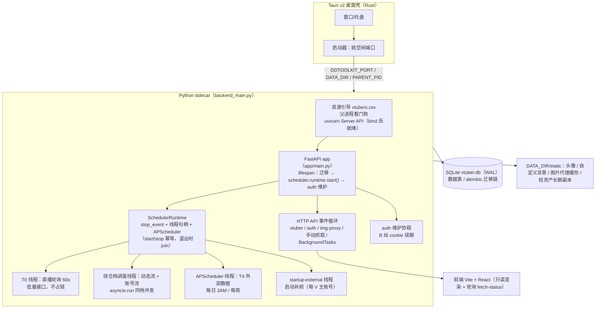

## 1. 一句话定位

**本地优先的个人 VTuber 证据归档系统**：Tauri 桌面壳拉起一个 FastAPI sidecar，
把 B 站 / 微博的账号资料、动态投稿、直播场次与第三方历史**固定化**到单机 SQLite；
前端只读渲染，所有抓取由后端的**分层调度 + 手动任务优先**驱动，第三方站点只在
每日/每周低频拉取。

---

## 2. 运行时形态（进程 / 线程 / 协程）

| 并发单元 | 载体 | 职责 | 是否占抓取锁 |
|---|---|---|---|
| HTTP API | FastAPI 事件循环 | 路由、手动抓取（同步端点在线程池） | 手动抢锁（可抢占自动档） |
| BackgroundTasks | 事件循环（响应之后） | 收录 / 加账号后的抓取 + 第三方回填 | 同上 |
| T0 直播状态 | 独立守护线程 | 每 60s ±15s 批量回写 `live_*` 字段 | **不占锁**（与一切任务并行） |
| 综合档 | 调度线程 | 动态流（预算自适应，见 §3.1）+ 账号流（数据到期，约 24h）**同档并发** | 两把锁 |
| T4 外部数据 | APScheduler 线程 | zeroroku / danmakus cron | 手动任务在跑则**排队等待**（v0.9.3，不再跳过） |
| 启动外部补抓 | 独立守护线程（`startup-external`） | 每 V 主账号的第三方数据，<24h 跳过 | 与综合档互斥（`_external_running`），不占锁 |
| auth 维护 | 事件循环协程 | B 站 cookie 心跳/续期、微博登录态探测 | — |

**这五条都由 `scheduler.runtime`（`SchedulerRuntime`）起与停**（R1，devlog/211）：
各自持 `threading.Event` + 线程句柄 + APScheduler + **在飞事件循环登记表**，
`start()` / `stop()` 幂等；线程里用 `wait()` 代 `time.sleep`、`run()` 代 `asyncio.run`
（后者让"停止"能取消在飞轮次）。详见 §6 第 31 条。

**冷启动优化**：`app/routers/vtuber.py` 不直接 import `scheduler`（依赖链重：apscheduler /
tenacity / httpx / fetcher），经 `_sched()` 缓存包装首次调用才导入；`main.py` 的 lifespan
也把调度器 import 放在函数内——让 uvicorn 尽快 bind 端口。

**数据目录**：一切可变数据都在 `DDTOOLKIT_DATA_DIR`（桌面端 = `%APPDATA%\com.ddtoolkit.app`，
开发态 = `…-dev`）：`vtuber.db`（+ WAL/SHM）、`.env`（凭据）、`vtubers.csv`（候选池）、
`logs/{app,sidecar}.log`、`static/{avatars,custom_bg,img-cache,assets}`。
（`static/avatars` 是 R47 之前/之内的历史落点，L1 起**新下载的头像进 `static/assets/avatar/`**，
旧文件留在原地只做登记 —— 见 §3.11 与 `services/assets.py`。）

---

## 3. 数据来源地图

| 来源 | 接口 | 鉴权 | 频率 | 落库 |
|---|---|---|---|---|
| **B 站直采** | `x/space/wbi/acc/info`、`x/relation/stat`、`live/room/v1/Room/get_status_info_by_uids`（批量 100/req）、`arc/search`、`polymer/web-dynamic/v1/feed/space`、`/detail`、`x/web-interface/view`、`x/article/view` | Cookie（SESSDATA 等，扫码登录 + refresh_token 续期）+ WBI 签名 | T0 60s / 动态流 预算自适应（约 30s~）/ 账号流 约 24h / 手动 | accounts、snapshots、posts、live_sessions(feed) |
| **微博直采** | `weibo.com/ajax/profile/info`、PC 时间线 ajax | Cookie（扫码登录保存） | 同上 | accounts、snapshots、posts |
| **zeroroku**（第三方） | `/api/bilibili/author/{mid}/history`、`/live-paid-aggregations` | 无 | 每日 3AM | snapshots(source=zeroroku)、live_gift_days |
| **danmakus**（第三方） | `vup-list`、直播场次接口 | 无 | 每周（索引）/ 每日（场次） | thirdparty_vtubers、live_sessions |
| **laplace** | 声明为源（`jobs=[]`），当前仅作为 danmakus 的辅助 | 无 | — | — |
| **本地名单** | `vtubers.csv`（随包分发，首启引导到数据目录） | — | 手动导入 / 候选池检索 | vtubers + accounts（收录时） |
| **图片代理** | `/img-proxy?url=`（白名单主机 + 磁盘缓存） | 按主机带 Referer | 按需 | `static/img-cache` |
| **轻资产固化** | 抓取侧顺路下载（`scheduler._download_avatar`）+ 远端主机与 API 不同域（CDN） | 无（走 CDN） | 只在**稳定键未命中**时发一次 | `static/assets/{kind}/` + `local_assets` 索引 |

外部源契约（`app/services/externals/`）：`ExternalSource.run_job(kind, db, client,
account_ids)`，幂等纪律「重复执行不产生重复行」；`account_ids` 白名单用于收录/加账号时
只回填该账号，避免全量扫第三方站点。

---
