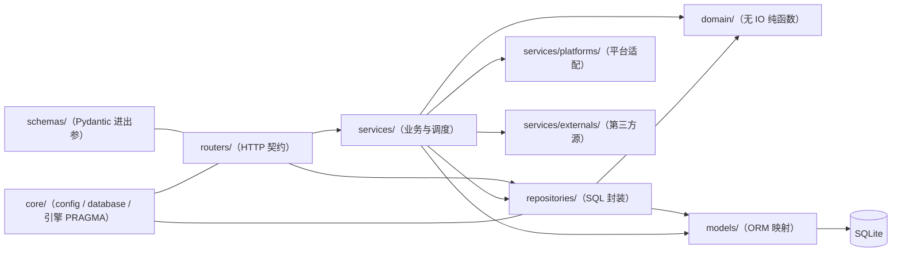

## 1. 分层与依赖方向

**依赖方向只许向下**（M1a，devlog/213）：`routers → services → repositories → models`，
`domain/` 是**叶子**（谁都能用、它谁也不依赖）。反向边一律判红 ——
判据 `tests/test_dependency_direction.py`（AST 扫 import）。

| 目录 | 职责 | 约定 |
|---|---|---|
| `app/routers/` | HTTP 契约、状态码语义（404/409/415/413）、`Depends(get_db)` | 不写 SQL；抓取类端点做忙判定；**文件落盘走 services**（如背景上传 `services/vtuber_background.py`，见 §6 第 34 条） |
| `app/repositories/` | 按仓库类持会话，批量删除 / 分页 / 统计等 SQL（类数以代码为准） | 多数写方法**末尾 commit**；级联清理 `delete_by_*` 与 `AccountStatSnapshotRepo.add` **不提交**（留给调用方一个事务，见 §6 第 32 条）；`PostRepo.create(commit=False)` 供批量入库；**不许 import `app.services`** |
| `app/models/` | SQLAlchemy 2.0 ORM（单文件 12 表） | 唯一约束/索引与迁移链一致；**不许 import 上面任何一层** |
| `app/domain/` | 无 IO 的纯函数（目前只有 `text.py::normalize_title`） | **叶子**：不许 import 任何 `app.*` 上层，也不许 `sqlalchemy` / `httpx` / `fastapi`；纯函数下沉放这里 |
| `app/schemas/` | Pydantic 输入输出模型 | `Out` 用 `from_attributes` |
| `app/services/` | 调度、抓取、平台适配、第三方源、认证、类型引擎、墓碑、清理 | 不碰 HTTP；重依赖延迟 import |
| `app/core/` | 配置（数据目录/环境变量）、引擎与 PRAGMA、`get_db`、共享 HTTP 客户端构造（`http.py`） | 新代码发请求一律 `new_async_client()` |

---

## 2. 跨模块不变量

> 只放**改任何模块都要知道**的。**模块内的不变量在各模块文档里** ——
> 全量索引见 §3 的表（37 条，一条不丢）。

9. **冻结运行时路径**：`PROJECT_ROOT = sys._MEIPASS`（打包后 alembic.ini / 迁移脚本随包）；

11. **HTTP 客户端统一走 `app/core/http.py::new_async_client()`**：直接 `httpx.AsyncClient()`
    每次构造都要 `load_verify_locations`（~1s，同步阻塞事件循环）；SSLContext 与事件循环
    无关，因此可在「每档 `asyncio.run()` 各起一循环」的模型下安全共享；

15. **模块级对象不得持有 asyncio 原语**（`Lock`/`Semaphore`/`Event`/`Queue`）：综合档是
    「**每轮一个 `asyncio.run()`**」，`asyncio.Lock` 首次 await 就绑死当时那个循环，
    第二轮必抛 `is bound to a different event loop` —— 2026-09-13 实际事故：
    起跑闸门把动态流**每轮**打成异常（devlog/076）。要跨轮复用就存**同步**状态
    （`threading.Lock` + 时刻表，锁外 `await`），或把原语按事件循环惰性创建。
    护栏：`test_platform_pacer_survives_new_event_loops`
    + `test_module_level_pacers_hold_no_event_loop_primitives`。

20. **`asyncio.create_task` 必须留强引用**：收录回填是 fire-and-forget，返回值无人
    引用时任务可能被 GC 回收（Python 文档明确警告）→ 表现为「回填静默不跑」。
    统一走 `routers/vtuber.py::_spawn_background`（`_background_tasks` 集合 + done 回调）。

26. **业务端点必须持本次启动的会话 token**（S1，devlog/201）：后端监听 `127.0.0.1:<随机端口>`，
    而**端口可以扫**；在没有这道门之前，本机任何进程、以及任何网页都能读到全部归档、
    改数据、触发抓取，而 `DATA_DIR/.env` 里是**活的登录凭据**。
    - token 由 **Tauri 每次启动生成**（32 字节 CSPRNG → 64 位十六进制），**只存内存**、
      不落盘、不进 argv，经子进程 env(`DDTOOLKIT_API_TOKEN`) 传给 sidecar；
      前端要的那一份走 `get_api_token` 命令 —— **该命令自己校验调用方窗口 label**
      （`build.rs` 没有 app manifest ⇒ 自定义命令**默认不查 ACL**，只拆 capability 等于没做）。
    - 请求头 `X-DDToolkit-Token`；比较走 `hmac.compare_digest`；失败统一 401
      且**不回显 token**（响应体、日志、OpenAPI schema 三处都有用例钉着）。
    - **公开白名单只有四处**：`/healthz`、`/static/*`、`GET /img-proxy`、`GET /video-proxy`。
      `/healthz` 是桌面端的就绪探活；另三个是 `` / `<video>` **直连**（带不了自定义头）
      与静态图；两个代理各有主机白名单（`/video-proxy` 只认四个平台视频 CDN，
      且不转发 `Cookie`/`Origin`）。
      **往这个白名单里加东西要当成改安全边界**，`tests/test_api_auth.py` 有一条
      "路由表对账"用例：新增路由若既不在白名单、又没被要求 token，会直接红。
      ⚠️ 但"对账"**不足以**证明公开性 —— `tests/conftest.py` 会给每个 `TestClient` 默认塞上
      正确 token，所以"能过门"可能只是"带了 token"。真机形态（**一个头都不带**的媒体请求）
      由 `test_header_less_media_endpoints_are_public` 单独钉（它**故意用错 token** 建客户端）。
      2026-10-03 的 `/video-proxy` 就是栽在这里：没进白名单 ⇒ 真机每一段视频都 401，
      而当时单测全绿（devlog/292）。
    - **开发态**（没有 Tauri：探针 / `npm run dev` / 直接跑 `backend_main.py`）用
      `DDTOOLKIT_DEV_API_TOKEN` 指定固定值；前端那一份由 `vite.config.ts` 的
      `VITE_DEV_API_TOKEN` 注入，**两处值必须一致**（不一致的症状是"页面数据全空 ⇒
      布局断言集体报红"，看起来像布局坏了）。
    - ⚠️ **没配 token ⇒ 拒绝**（S1b 收口，devlog/202）。批次 1 期间这里是"放行"
      （让"前端注入还没落地"时应用仍可用），但那样**"没配"与"配了"在行为上分不出来**，
      而症状是"一切正常" —— 本仓最忌讳的那类静默失效。现在没配 = 每个业务请求 401
      （**吵闹的失败**）。真机不可能走到这里（Tauri 一定注入）。
    - ⚠️ **前端的启动闸门只在桌面端关**（`api.ts` 的 `holdApiUntilReady` 自己判
      `__TAURI_INTERNALS__`）：浏览器里没有异步注入可等，关闸只会把探针自己的请求挂死
      —— 实测过，症状是"探针没量到 fetch-status"，看起来像产品坏了。
      对应地，**任何打后端的 fetch 都必须经过 `request()` 或 `authFetch()`**：
      `dev/probe.ts` 原先有十余处裸 `fetch`，S1 之后它们逐条 401（同样伪装成"布局坏了"）。
    - ⚠️ **开发态脚本同理，"谁起后端谁就得给它 token"**（devlog/203）：给子进程设了
      `DDTOOLKIT_PORT` 的脚本（`ui_probe` / `dev_check` / `smoke_upstream` / `perf_report`）
      都必须并进 `dev_token.backend_env()`，打后端时走 `dev_token.headers()`。
      那个固定值**只有一处真源** `scripts/dev_token.py`（TS 侧的两处复述由
      `tests/test_dev_token.py` 结构扫描钉住）。⚠️ 漏掉的症状**没有一个像门禁问题**：
      dev_check 报"网络不可达"、smoke 报"上游挂了"、perf_report 打出假数字 —— S1 之后
      这一组挂了整整一批才被发现（判据与命令见 `docs/DEV-LOOP.md` §6.13）。
    - ⚠️ **CORS 不是主防线，token 才是**（实测踩出来的，devlog/201 §五）：
      `CORS_ORIGINS` **保持默认 `"*"`**。一度想顺手收紧它，结果**打断了浏览器形态的开发态** ——
      探针与 `npm run dev` 都是跨源（页面在 `localhost:<vite>`、后端在 `127.0.0.1:<port>`），
      而没有允许头时浏览器**不让页面读响应**。症状极具误导性：**后端日志里一条 401 都没有**
      （请求到了、也是 200），页面数据全空 ⇒ 探针报"缺投稿 chip / 缺 list-video 帧 /
      页面标题为空"，**看起来像内容或布局坏了**。而收益接近零：拿不到 token 的网页
      即使能读到响应，读到的也只是 401。⇒ 要收紧就收紧 token 的**分发**
      （S3-A 的命令级权限），别动 CORS。
      值含正则元字符时按**正则**处理（探针的 Vite 端口每次随机），
      但 `"*"` 必须排除在正则判定外 —— 它本身就是元字符，会被 `re.compile` 拒掉。

33. **依赖方向只许向下，纯函数下沉到 `app/domain/`**（M1a，devlog/213）：
    `routers → services → repositories → models`；`app/domain/` 是**叶子**（谁都能用、它谁
    也不依赖）。三条禁令，判据 `tests/test_dependency_direction.py`（**AST 扫 import**，
    不是文本搜索 —— 注释里就写着那句历史 import）：
    - `repositories/**` **不许** import `app.services.**`。原案：`vtuber_repo.py` 为了一个
      纯字符串函数 `normalize_title` 去 import `services.live_type`（§2.7 的反向边）——
      它让"仓库层能不能被单独理解"取决于 services 的整条依赖链，而且下一个顺手 import 会照抄。
    - `models/**` 不许 import `services` / `repositories` / `routers`（ORM 是最下面那层）。
    - `domain/**` 不许 import 上面任何一层，也**不许** `sqlalchemy` / `httpx` / `fastapi` ——
      放这儿的必须是无 IO 纯函数，否则它只是"换个地方的服务层"。
    - ⚠️ **搬家不许搬成副本**：`services.live_type.normalize_title` 现在只是
      `app.domain.text` 的**同一个对象**的再导出（判据断言 `is`）——两份实现迟早漂移。
    - 仓库层**不许替平台做决定**：`LiveSessionRepo.upsert_danmakus` 的 `platform` 由调用方传入
      且**刻意没有默认值**（给默认值 = 把决定权又收回来）。

35. **跨线程往事件循环里送东西：`queue.Queue` 中转 + `call_soon_threadsafe` 唤醒，不许
    `run_in_executor(queue.get)`**（M0，devlog/241）：推送通道的发布方可能是**没有事件循环的
    线程**（T0 守护线程产生开播边沿），而订阅者的队列绑在 uvicorn 的循环上 ⇒ 只有一种形态同时
    满足"任何线程都能发布"与"投递只发生在循环线程里"：线程安全的 `queue.Queue` 中转 +
    `loop.call_soon_threadsafe(wake.set)` 唤醒 + 协程里 `get_nowait` 清空（第 15 条的延伸：
    `asyncio.Event` 在 `start()` 里**现造、每代重建**；发布点必须在 `db.commit()` **之后**）。
    ⚠️ 「阻塞读丢给工作线程」那套（`await loop.run_in_executor(None, q.get)`）**看着标准却会挂死**：
    `stop()` 取消 drain 之后那个工作线程仍阻塞在 `get()` 上，而 `asyncio.run()` 收尾要
    `shutdown_default_executor(wait=True)` 去 join 它 ⇒ **整个测试套卡住**（不是变红，
    定位手法见 `DEV-LOOP.md` §6.18）。真源 `app/services/messages.py`，
    判据 `tests/test_messages.py`（19 条，含跨线程发布与"循环重建后仍能发"）。

## 3. 全部不变量的索引（37 条）

> 本表由 `docs/plans/` 之外的构建脚本按归属生成，**不是手抄**；
> 要改归属就改归属表本身。跨模块的那 7 条在本文件 §2，其余在各自模块文档。

| # | 不变量 | 归哪份 |
|---|---|---|
| 1 | 库内时间一律 naive UTC，输出补 `+00:00` | `docs/backend/DATA-MODEL.md` |
| 2 | posts 无外键——删除 V / 账号必须走 `app/services/purge.py`（帖子按 platform+uid | `docs/backend/DATA-MODEL.md` |
| 3 | 新增迁移必须同步 `MIGRATION_HEAD`（测试断言与 alembic head 一致） | `docs/backend/DATA-MODEL.md` |
| 4 | 唯一约束去重：账号 `(platform, platform_uid)`、帖子 `(platform, platform_uid | `docs/backend/DATA-MODEL.md` |
| 5 | 抓取去重靠内存集合，不靠捕获 IntegrityError（避免事务回滚污染整批） | `docs/backend/FETCH-PIPELINE.md` |
| 6 | 归档边界剪枝：抓取前先跑归档规则，已归档帖零网络请求 | `docs/backend/FETCH-PIPELINE.md` |
| 7 | 手动任务优先于定时档（自动档起跑让位 + 持锁断点让位，两个方向都要在） | `docs/backend/FETCH-PIPELINE.md` |
| 8 | 外部源幂等，且只在每日/每周低频访问第三方站点 | `docs/backend/LIVE-AND-DANMAKU.md` |
| 9 | 冻结运行时路径：`PROJECT_ROOT = sys._MEIPASS`（打包后 alembic.ini / 迁移脚本随包） | `docs/backend/ARCHITECTURE.md` |
| 10 | 凭据只落本机 `DATA_DIR/.env`（原子替换），不进仓库、不上传 | `docs/backend/AUTH-CAPABILITIES.md` |
| 11 | HTTP 客户端统一走 `app/core/http.py::new_async_client()`：直接 `httpx.AsyncClient()` | `docs/backend/ARCHITECTURE.md` |
| 12 | 增量停止必须整页扫完 + 豁免置顶帖：平台会在流首插乱序条目（微博 `isTop` 可多条、 | `docs/backend/FETCH-PIPELINE.md` |
| 13 | 一条数据的多来源在写入侧合并：B 站投稿的 `video`（arc/search）与 `video_dynamic` | `docs/backend/FETCH-PIPELINE.md` |
| 14 | 场次合并要防「开放式区间」：`end_at` 缺失既可能是「正在直播」也可能是「数据未定稿」 | `docs/backend/LIVE-AND-DANMAKU.md` |
| 15 | 模块级对象不得持有 asyncio 原语（`Lock`/`Semaphore`/`Event`/`Queue`）：综合档是 | `docs/backend/ARCHITECTURE.md` |
| 16 | 新增挂 `accounts` / `vtubers` 外键的表 → 同步 `app/services/purge.py` | `docs/backend/DATA-MODEL.md` |
| 17 | OverlayScroll 会插一层 `.os-scroll`：给被包容器写 CSS 一律用后代选择器 | `docs/frontend/UI-MAP.md` |
| 18 | 并发粒度是平台：同平台内部串行，不要在一条平台流里再并发放大速率 | `docs/backend/FETCH-PIPELINE.md` |
| 19 | `scripts/backend-8000.bat` 属个人脚本，不得提交 | `docs/ops/RELEASE.md` |
| 20 | `asyncio.create_task` 必须留强引用：收录回填是 fire-and-forget，返回值无人 | `docs/backend/ARCHITECTURE.md` |
| 21 | 上游结论必须在「冷进程 + 空数据目录」里复现一次（2026-09-15 立，devlog/085） | `docs/DEV-LOOP.md` |
| 22 | 判据至少有一条用例吃真实数据（同日立）：自造样本会让判据"看起来在工作"却永不命中 | `docs/DEV-LOOP.md` |
| 23 | 未登录 ≠ 不可用，但内容抓取必须登录（2026-09-15，devlog/086） | `docs/backend/AUTH-CAPABILITIES.md` |
| 24 | 依赖来源只认 `uv.lock`（2026-09-25，devlog/197）：真源是 `pyproject.toml` + `uv.lock` | `docs/ops/RELEASE.md` |
| 25 | 删旧数据目录只认"一次性票据"（2026-09-25，devlog/198）：`delete_old_data_dir` 收的是 | `docs/desktop/SHELL.md` |
| 26 | 业务端点必须持本次启动的会话 token（S1，devlog/201）：后端监听 `127.0.0.1:<随机端口>` | `docs/backend/ARCHITECTURE.md` |
| 27 | 真跑 schema 迁移之前必须先备份（批次 16，devlog/207）：`app/main.py::_migrate_with_safety` | `docs/backend/DATA-MODEL.md` |
| 28 | 迁移失败不得留下打不开的库，且失败要分类告诉用户（批次 16，devlog/207） | `docs/backend/DATA-MODEL.md` |
| 29 | 自定义命令的准入表默认拒绝（S3-0，devlog/208）：`lib.rs::COMMAND_ACL` 逐条列出 | `docs/desktop/SHELL.md` |
| 30 | 外链只走 `open_external`，主机有白名单（S3-B，devlog/208） | `docs/desktop/SHELL.md` |
| 31 | 调度线程只许由 `SchedulerRuntime` 起停，且睡在 `wait()` 上（R1，devlog/211） | `docs/backend/FETCH-PIPELINE.md` |
| 32 | 一次业务写入的多个落库步骤必须共用一次 commit（R3，devlog/212）：中间多一次 | `docs/backend/DATA-MODEL.md` |
| 33 | 依赖方向只许向下，纯函数下沉到 `app/domain/`（M1a，devlog/213） | `docs/backend/ARCHITECTURE.md` |
| 34 | 上传 / 替换文件：先写临时文件、原子 rename、成功之后才删旧的（M3b，devlog/214） | `docs/backend/ASSETS.md` |
| 35 | 跨线程往事件循环里送东西：`queue.Queue` 中转 + `call_soon_threadsafe` 唤醒，不许 | `docs/backend/ARCHITECTURE.md` |
| 36 | 同一份数据不许有两个渲染器（R46，devlog/249）：图片一律走 | `docs/backend/ASSETS.md` |
| 37 | 远端资源要"抓一次、长期用"（L1，devlog/257）：头像/封面这类小、不变、反复要的 | `docs/backend/ASSETS.md` |

## 4. 扩展点

| 想做什么 | 改哪里 |
|---|---|
| 接入新平台（抖音/小红书…） | 继承 `platforms/base.py::BasePlatform` → `platforms/registry.py` 注册 → 前端平台常量；调度器自动接管 |
| 接入新第三方源 | 实现 `externals/base.py::ExternalSource` → `externals/__init__.py` 注册（声明 `jobs` 与周期） |
| 新增表/列 | 新建 `alembic/versions/{fNNN}_*.py`（编号按**实际实施顺序**顺延，当前 head `f009` = `local_assets`）→ 同步 `MIGRATION_HEAD` → 补 `models` 与 Repo → 若挂 `accounts/vtubers` 外键，**同步 `services/purge.py`**（不挂外键的如 `local_assets` 不必，但要把"引用关系怎么查"写进 `services/assets.py`） |
| 用户手改的字段被抓取覆盖 | **不再需要锁定**（`accounts.locked_fields` 已随 f004 删除）：抓取照常覆盖，覆盖前把旧值写进 `services/vtuber_history.py::record_field_change()`。⚠️ 记录只在**平台侧覆盖前**发生（手改不入账，devlog/075）；展示暂缓 —— 归入「账号信息历史快照」那条线（§TODO R9） |
| 调整抓取频率/节流 | `app/core/config.py`（T0-T4 周期、请求间隔、批量休息、风控冷却） |
| 新增前端视图 | `docs/frontend/UI-MAP.md`（右栏视图光条 + 场景状态机） |
| 改抓取/布局后的验证 | `python scripts/dev_check.py`（测试 + 后端冒烟）、`python scripts/ui_probe.py`（布局不变量） |
