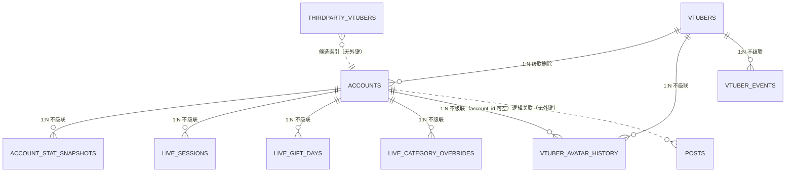
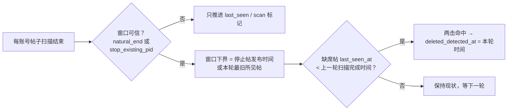

## 1. 数据模型

### 1.1 ER 总览

> 逐表列级定义见 §1.3（本节只画关系）；外键与级联规则见 §1.2。

### 1.2 外键与级联规则

| 关系 | 约束 | 删除行为 |
|---|---|---|
| `vtubers 1—N accounts` | FK + `cascade="all, delete-orphan"` | 删 V 连带删账号 |
| `accounts 1—N account_stat_snapshots` | FK，无 ORM 级联 | **不自动删**，需显式清理 |
| `accounts 1—N live_sessions` | FK，无 ORM 级联 | 同上（一个账号可上千条） |
| `accounts 1—N live_gift_days` | FK，无 ORM 级联 | 同上 |
| `accounts 1—N live_category_overrides` | FK，无 ORM 级联 | 同上 |
| `accounts 1—N vtuber_field_history` | FK，无 ORM 级联（`account_id` **可空**） | 同上；可空意味着删 V 时还要**按 `vtuber_id` 再清一遍** |
| `accounts 1—N vtuber_avatar_history` | FK，无 ORM 级联（`account_id` **可空**，f008，R47） | 同上一行（同一形态：可空 ⇒ 两个键都要清） |
| `vtubers 1—N vtuber_events` | FK，无 ORM 级联 | 同上 |
| `vtubers 1—N vtuber_field_history` | FK，无 ORM 级联 | 同上 |
| `vtubers 1—N vtuber_avatar_history` | FK，无 ORM 级联（f008，R47） | 同上 |
| `posts` ↔ `accounts` | **无外键**（`platform + platform_uid` 逻辑关联） | 需按平台+UID 显式清 |
| `thirdparty_vtubers` | 无外键 | 独立，随源整表刷新 |

> 因为 `foreign_keys=ON`，**删 V / 删账号必须走 `app/services/purge.py`**：
> 帖子按 `(platform, platform_uid)`、子表按 `account_id`、活动条目 / 曾用值 / **卡片布局（f006）** / **历次头像（f008）** 按 `vtuber_id`。
> 漏清任何一张 → `DELETE FROM accounts` 被外键挡下 → 整次事务回滚（v0.9.3 修复的
> 「解除订阅失败」事故，见 devlog/040）。

### 1.3 表定义

#### `vtubers` — 主播本体（平台无关）

| 列 | 类型 | 约束/说明 |
|---|---|---|
| `id` | INTEGER | PK |
| `name` | TEXT | NOT NULL，索引 `ix_vtubers_name` |
| `faction` | TEXT | 阵营（手动维护，d001） |
| `birthday` | TEXT | MM-DD |
| `debut_date` | TEXT | YYYY-MM-DD 或仅 YYYY |
| `setting` | TEXT | 角色设定 |
| `avatar` | TEXT | 默认头像 URL |
| `background_path` | TEXT | 卡片页自定义背景，`static/custom_bg/` 相对路径（d002） |
| `background_focus` | TEXT | 背景**取景**（需求 7，f011）：JSON `{"x":0..1,"y":0..1,"scale":1..3}`，NULL = 原样铺。⚠️ **归一化存**（比例不是像素）—— 窗口尺寸/DPR 变了取景不该跟着跑。★ **方向与 CSS `object-position` 同向**（V1b-2 定案，`devlog/419`）：`x=0` 看图片左边缘、`x=1` 看右边缘（`y` 同理，0 = 上边缘）；几何 `translate((0.5-x)·(s-1)·100%, …) scale(s)`，见 `frontend/src/utils/backgroundFocus.ts` |
| `background_video_path` | TEXT | 背景**视频**（需求 9，f011）：`static/custom_bg/` 相对路径，NULL = 只有静态图。与 `background_path` 同款口径（**只取文件名**，不许越出目录） |
| `notes` | TEXT | 备注 |
| `sign_override` | TEXT | 手改的签名（**覆盖**，f004）。不写 `accounts.sign`；清空 = 撤销覆盖 |
| `sign_source_account_id` | INTEGER | 卡片签名跟随哪个账号（**无外键**，f004）；NULL = 主账号，指向不存在的 id 时回落主账号 |
| `sort_order` | INTEGER | NOT NULL 默认 0：**左栏自定义顺序**（f010）。⚠️ 语义与 `accounts.sort_order` **不同**：那边"未列出的排其后"，这边"把传进来的**填回原位**"（左栏可带筛选拖） |
| `created_at` / `updated_at` | DATETIME | UTC now |

#### `accounts` — 各平台账号

| 列 | 类型 | 约束/说明 |
|---|---|---|
| `id` | INTEGER | PK |
| `vtuber_id` | INTEGER | NOT NULL，FK → vtubers.id；索引 `ix_accounts_vtuber_id` |
| `platform` | TEXT | NOT NULL：bilibili / weibo / … |
| `platform_uid` | TEXT | NOT NULL；与 platform 组成 **UNIQUE `uq_account_platform_uid`** |
| `display_name` / `avatar_url` / `avatar_path` | TEXT | 平台昵称 / 头像 URL / 本地缓存相对路径 |
| `sign` / `url` | TEXT | 签名 / 主页链接 |
| `followers_count` | INTEGER | 默认 0；**每次抓取覆盖，历史在快照表** |
| `room_id` | TEXT | 直播间 ID |
| `live_status` | INTEGER | 0=离线 1=直播中 |
| `live_title` / `live_url` | TEXT | 开播标题 / 直播间链接 |
| `last_fetched_at` | DATETIME | 最近一次账号抓取成功时间 |
| `posts_last_scan_at` | DATETIME | 帖子扫描上一轮完成时间（墓碑判定的比较基准，e002） |
| `sort_order` | INTEGER | 默认 0：平台徽章展示顺序（f002） |
| ~~`locked_fields`~~ | — | **f004 已删除**（字段锁定退役，改为"允许覆盖 + 记曾用值"） |

> `display_name` / `sign` 被抓取覆盖**之前**，旧值会记进 `vtuber_field_history`
> （`scheduler._fetch_one_account` 与 `PUT /account/{id}` 两个写入点）。

#### `posts` — 动态 / 投稿 / 专栏 / 转发 / 音乐

| 列 | 类型 | 约束/说明 |
|---|---|---|
| `id` | INTEGER | PK |
| `platform` / `platform_uid` / `platform_post_id` | TEXT | 三元组 **UNIQUE `uq_post_platform_uid_pid`**（c002） |
| `type` | TEXT | video / video_dynamic / image / article / text / repost / music（live 卡片转存 live_sessions 后不入表） |
| `title` / `summary` | TEXT | 标题 / 前 200 字摘要 |
| `body_text` | TEXT | 正文纯文本（P2 全文搜索，e003） |
| `cover_url` / `permalink` | TEXT | 封面 / 原文链接 |
| `body_json` | TEXT | 结构化类型差异数据（图片/视频/预约/富文本 Delta…） |
| `stats_json` | TEXT | `{"view":N,"like":N,"comment":N,"forward":N}` |
| `published_at` | DATETIME | 发布时间（naive UTC） |
| `raw_json` | TEXT | 平台原始响应（证据保真层） |
| `is_archived` | BOOLEAN | 默认 0（c001）；归档后不参与更新抓取遍历 |
| `is_pinned` | BOOLEAN | NOT NULL 默认 0（f005）：平台置顶（B 站「置顶」/ 微博 `isTop`）。每轮抓取按**第一页**的置顶集合同步（新置顶标记、取消置顶撤销） |
| `pinned_refreshed_at` | DATETIME | 置顶帖最近一次走**详情接口**刷正文的时刻（f005，节流窗口见 `settings.PINNED_DETAIL_REFRESH_HOURS`） |
| `last_seen_at` | DATETIME | 最近一次确认仍在线（墓碑，e002） |
| `deleted_detected_at` | DATETIME | 判定已删除的时刻（墓碑，e002） |
| `created_at` | DATETIME | 入库时间 |

索引：`ix_posts_platform_uid_published (platform, platform_uid, published_at)` 覆盖分页；
`ix_posts_platform_uid_pinned (platform, platform_uid, is_pinned)` 覆盖置顶排序（f005）；
`ix_posts_published_at` 覆盖归档规则；`ix_posts_deleted_detected` 覆盖墓碑筛选。

#### `account_stat_snapshots` — 账号统计快照历史（P0，e001；e004 加 `source`）

| 列 | 类型 | 约束/说明 |
|---|---|---|
| `id` | INTEGER | PK |
| `account_id` | INTEGER | NOT NULL，FK → accounts.id；索引 `ix_account_stat_snapshots_account_id` |
| `followers_count` | INTEGER | 抓取后的最新粉丝数 |
| `live_status` | INTEGER | 顺手记录：0=离线 1=直播中 |
| `live_title` | TEXT | 开播标题快照 |
| `captured_at` | DATETIME | NOT NULL，抓取时刻；索引 `ix_account_stat_snapshots_captured_at` |
| `source` | TEXT | `self`（本工具直采）/ `zeroroku`（第三方回填） |

**写入策略**：账号抓取成功后追加一行（全量/单 V/T0 直播跳变共用挂点
`scheduler._record_stat_snapshot`，随事务提交），全量记录不降噪。

#### `live_sessions` — 直播场次（e006）

| 列 | 类型 | 约束/说明 |
|---|---|---|
| `id` | INTEGER | PK |
| `account_id` | INTEGER | NOT NULL，FK → accounts.id |
| `platform` / `source` | TEXT | `danmakus`（第三方历史/同步）/ `feed`（B 站动态直播卡片） |
| `live_id` | TEXT | 平台级场次 key；**UNIQUE(account_id, live_id)** |
| `title` / `room_id` / `cover_url` | TEXT | 标题 / 房间 / 封面 |
| `start_at` / `end_at` | DATETIME | 起止（`end_at` 由快照或次日 danmakus 补全） |
| `parent_area_name` / `area_name` | TEXT | 分区 |
| `total_income` | FLOAT | danmakus 收益（元） |
| `max_online_count` / `danmakus_count` | INTEGER | 峰值人气 / 弹幕数 |
| `raw_json` | TEXT | 原始场次数据保真 |
| `created_at` / `updated_at` | DATETIME | UTC now |

索引：`ix_live_sessions_account_start (account_id, start_at)`。
**self 快照推导的虚拟场次不落表**，读取时由 `LiveSessionRepo.merged()` 合并。

#### `live_gift_days` — 礼物 / 大航海 / SC 日聚合（e004）

| 列 | 类型 | 约束/说明 |
|---|---|---|
| `id` | INTEGER | PK |
| `account_id` | INTEGER | NOT NULL，FK → accounts.id |
| `source` | TEXT | 默认 `zeroroku` |
| `gift_date` | TEXT | `YYYY-MM-DD`；**UNIQUE(account_id, source, gift_date)** |
| `gift_amount` / `guard_amount` / `sc_amount` / `total_amount` | TEXT | 金额保字符串精度（站点返回 `"1234.500"`） |
| `room_id` | TEXT | 房间 |
| `created_at` | DATETIME | UTC now |

#### `live_category_overrides` — 直播分类校正（e007）

| 列 | 类型 | 约束/说明 |
|---|---|---|
| `id` | INTEGER | PK |
| `account_id` | INTEGER | NOT NULL，FK → accounts.id |
| `live_id` | TEXT | NOT NULL；**UNIQUE(account_id, live_id)** |
| `category` | TEXT | 9 类之一（不含 live 兜底） |
| `created_at` / `updated_at` | DATETIME | UTC now |

校正既是最高优先级推断信号，也反哺该账号的词库（`live_type.build_learned`）。

#### `vtuber_events` — 重要日期 / 活动（e005）

| 列 | 类型 | 约束/说明 |
|---|---|---|
| `id` | INTEGER | PK |
| `vtuber_id` | INTEGER | NOT NULL，FK → vtubers.id |
| `title` | TEXT | 活动名（如「生日歌回」） |
| `event_date` | TEXT | `YYYY-MM-DD` |
| `created_at` | DATETIME | UTC now |

索引：`ix_vtuber_events_vtuber_date (vtuber_id, event_date)`。

#### `profile_cards` — 档案视图的卡片布局（f006，R37-P2）

| 列 | 类型 | 约束/说明 |
|---|---|---|
| `id` | INTEGER | PK |
| `vtuber_id` | INTEGER | NOT NULL，FK → vtubers.id（**删 V 必走 `services/purge.py`**） |
| `card_key` | TEXT | NOT NULL：**实例 id**（内置卡 = kind；P3 自定义卡允许同 kind 多实例） |
| `kind` | TEXT | NOT NULL：渲染类型（前端卡片注册表认它；后端**不校验取值** —— 扩展点在前端） |
| `x` / `y` | INTEGER | NOT NULL：12 列网格里的列起点（0–11）与行起点 |
| `w` / `h` | INTEGER | NOT NULL：列宽（1–12）与行数 |
| `config_json` | TEXT | 可空：卡片自定义配置（P3 用，P2 不写） |
| `created_at` / `updated_at` | DATETIME | 写入 / 更新时刻 |

约束与索引：唯一键 `uq_profile_card_vtuber_key (vtuber_id, card_key)`；
`ix_profile_cards_vtuber (vtuber_id, y, x)` 覆盖"按 V 取出、按阅读顺序排"。

**写入口径**：整版替换（`ProfileCardRepo.replace_all` = 一个事务里 delete + insert），
前端是"编辑一整张画布、松手存一次"；**格位越界 / card_key 重复由路由层 422 拦下，不做静默夹取**
（夹取会把前端 bug 写进库，用户下次打开只会觉得"卡片自己动了"）。

#### `vtuber_field_history` — 曾用名 / 曾用签名（f004）

| 列 | 类型 | 约束/说明 |
|---|---|---|
| `id` | INTEGER | PK |
| `vtuber_id` | INTEGER | NOT NULL，FK → vtubers.id |
| `account_id` | INTEGER | **可空**，FK → accounts.id（账号已删的历史行留空） |
| `field` | TEXT | NOT NULL：`display_name` / `sign`（登记表见 `services/vtuber_history.py::FIELDS`） |
| `value` | TEXT | NOT NULL：被覆盖掉的旧值 |
| `changed_at` | DATETIME | NOT NULL，写入时刻 |

索引：`ix_vtuber_field_history_vtuber (vtuber_id, field)`。

**写入策略**：值**真的变了**才追加一行（相同值不重记，A→B→A 只留 A、B）；
**只有一个写入点**——抓取回写（`scheduler._fetch_one_account`，平台侧旧值）；
`PUT /account/{id}` **不入账**（手改不是"平台上曾经用过的"，devlog/075）。
读取走 `GET /vtuber/{id}/former-values`（各字段最多 5 条、最近优先、按值去重），
**该端点当前未接入 UI**（展示归入「账号信息历史快照」，见 TODO R9）。
**为什么必须记账**：`account_stat_snapshots` 只存粉丝数/直播状态/开播标题，
**不含昵称与签名** —— 不记账就是永久丢失（devlog/074 纠正的前提）。

#### `vtuber_avatar_history` — 历次头像账本（f008，R47）

| 列 | 类型 | 约束/说明 |
|---|---|---|
| `id` | INTEGER | PK |
| `vtuber_id` | INTEGER | NOT NULL，FK → vtubers.id |
| `account_id` | INTEGER | **可空**，FK → accounts.id（账号解除订阅后这一行仍说明"曾经有过这张脸"） |
| `platform` | TEXT | 可空：来源平台（账号被删后仍标得出是哪个平台的头像） |
| `avatar_url` | TEXT | NOT NULL：平台侧头像**原文**（远端 URL） |
| `avatar_path` | TEXT | 可空：本地缓存 `static/` 相对路径（延后下载时先空着） |
| `first_seen_at` | DATETIME | NOT NULL，首次见到这张图的时刻（列表按它倒序 = 时间线） |
| `last_seen_at` | DATETIME | 可空，最近一次**仍见到**它的时刻 |

唯一键 **UNIQUE(vtuber_id, avatar_url)**（幂等 upsert 的键）；
索引 `ix_vtuber_avatar_history_vtuber (vtuber_id, first_seen_at)`。

**写入策略**（`services/vtuber_avatars.py::record_avatar_version`）：
**每次抓到都记**（不是"URL 变了才记"）—— upsert 只前移 `last_seen_at`，
好处是升级**自愈**（库里已有的老头像下次抓取补上一行，选择器不会先空着）。
每个 V 封顶 **`AVATAR_VERSION_LIMIT`** 张，超出丢**最旧**的，但**跳过用户当前选中的那张**
（`protect_url`，否则"当前"这一项会从列表里消失而卡片还在用它）。
读取走 `GET /vtuber/{id}/avatars` → `{current_url, versions[]}`；
**`current_url` 是推导的**（`vtubers.avatar` → B 站账号 → 首个账号，口径 = 前端 `resolveAvatar` 的 URL 侧），
**库里没有 `is_selected` 这一列** —— 存一个选中标记就是第二份真源。

⚠️ **"别覆盖 URL"只是半件事**：本地缓存文件名原先**固定**（`static/avatars/{uid}{ext}`），
新图下载会把旧文件**覆盖掉** ⇒ 只记 URL 的话旧选项全是破图。所以
`_download_avatar` 改成版本化命名（R47 是 `{uid}_{URL 的 sha1 前 8 位}{ext}`；
**L1 起换成 `static/assets/avatar/{平台}_{uid}_{sha1(稳定键) 前 8 位}{ext}`**，见下一节）。
淘汰只删**行**、不删文件（用户可能正用着那张，删文件会让卡片直接破图）。

⚠️ **L1（devlog/257）起账本按"稳定键"归并**：`record_avatar_version` 判存在用的是
`assets.key_of(url)`（去掉签名参数的 URL），不是完整 URL —— 实测微博头像签名约 3 小时
轮换一次，按完整 URL 判存在会让**同一张脸**每轮多一个"版本"。
归并时 `avatar_url` 跟到最近一次见到的那个 URL，**但当前选中的那条不动**
（`vtubers.avatar` 与行的 `avatar_url` 是"当前用的是哪张"的两侧真源，只有字符串相等才对得上）。

#### `local_assets` — 轻资产长期储存索引（f009，L1）

| 列 | 类型 | 约束/说明 |
|---|---|---|
| `id` | INTEGER | PK |
| `kind` | TEXT | NOT NULL：`avatar` / `cover` / …（模块化扩展点） |
| `key` | TEXT | NOT NULL：**稳定键** = 去掉签名参数的 URL（`assets.key_of`，白名单 `SIGNATURE_PARAMS`） |
| `url` | TEXT | NOT NULL：最近一次见到的**完整** URL（回源与展示用） |
| `path` | TEXT | NOT NULL：`static/` 相对路径（`static/assets/{kind}/…`；`remember` 登记的历史文件可能是 `static/avatars/…`） |
| `ext` / `bytes` | TEXT / INTEGER | 可空：扩展名与字节数（统计、清理） |
| `sha256` | TEXT | 可空：内容摘要（去重、校验；L4 的历史行合并也靠它） |
| `pinned` | BOOLEAN | NOT NULL，默认 0：用户选过的 / 手动 pin 的 ⇒ `prune` 永不删 |
| `created_at` / `last_used_at` | DATETIME | `created_at` 决定"最旧"，`last_used_at` 决定 LRU（命中会刷新） |

唯一键 **UNIQUE(kind, key)**；索引 `ix_local_assets_kind_sha256`、`ix_local_assets_kind_pinned`。

**没有 Repository 类**：本表的读写全在 `services/assets.py`（`lookup` / `lookup_keys` /
`get` / `put` / `remember` / `pin` / `stats` / `prune`）—— 它的写入必须与抓取事务**同一个
session 收口**（先写文件、再写索引行，见 `docs/backend/ASSETS.md 不变量 37），拆一层仓储只会
多一次"谁提交"的歧义。⚠️ **不挂外键 ⇒ 不进 `purge.py`**；"还被谁引用"由
`assets._referenced_keys()` 显式查（`vtubers.avatar` / 账号 `avatar_url` / 历次头像账本）。

#### `thirdparty_vtubers` — 第三方 VTuber 索引（e004）

| 列 | 类型 | 约束/说明 |
|---|---|---|
| `id` | INTEGER | PK |
| `platform` / `platform_uid` | TEXT | 默认 bilibili；uid 索引；**UNIQUE(source, platform_uid)** |
| `name` | TEXT | NOT NULL |
| `type` | TEXT | vtuber / group / fan / unknown |
| `room_id` | TEXT | 房间 |
| `group_name` | TEXT | 企划 / 公会（阵营自动打标候选） |
| `source` | TEXT | 来源（danmakus） |
| `updated_at` | DATETIME | 周级整表刷新 |

### 1.4 迁移链（alembic，22 版本，head = `f009`）

| 版本 | 内容 |
|---|---|
| `a001` init_v2 | 建 `vtubers` + `accounts`（含账号唯一约束） |
| `b001` posts_v2 | 建 `posts`（含 (platform, platform_post_id) 唯一约束） |
| `c001` post_archived | `posts.is_archived` |
| `c002` posts_per_uid_dedup | 唯一约束改为 (platform, platform_uid, platform_post_id)（SQLite 重建表） |
| `d001` columns_and_indexes | `vtubers.faction` + 三个热路径索引（分页 / 归档 / by_vtuber） |
| `d002` vtuber_background | `vtubers.background_path` |
| `e001` account_stat_snapshots | 建快照表 + 两索引 |
| `e002` post_tombstone | `posts.last_seen_at / deleted_detected_at` + `accounts.posts_last_scan_at` + 墓碑索引（含一次性数据回填） |
| `e003` post_body_text | `posts.body_text`（全文搜索） |
| `e004` external_sources | 快照表加 `source` + 建 `live_gift_days` / `thirdparty_vtubers` |
| `e005` vtuber_events | 建活动条目表 |
| `e006` live_sessions | 建直播场次表 |
| `e007` live_category_overrides | 建分类校正表 |
| `f001` post_note | `posts.note`（投稿动态并入后的 UP 主附言，v0.9.6） |
| `f002` account_order_and_locks | `accounts.sort_order` + `accounts.locked_fields`（v0.9.7） |
| `f003` app_meta | 建通用 KV 表 `app_meta`（v0.9.8，键 `external.startup.last_run`） |
| `f004` sign_source_and_field_history | `vtubers.sign_override / sign_source_account_id` + 建 `vtuber_field_history` + **删 `accounts.locked_fields`**（devlog/074） |
| `f005` post_pinned | `posts.is_pinned`（NOT NULL 默认 0）+ `posts.pinned_refreshed_at` + 索引 `ix_posts_platform_uid_pinned`（R35，devlog/139） |
| `f006` profile_cards | 建 `profile_cards`（档案视图卡片布局；唯一键 `(vtuber_id, card_key)`，**挂 vtubers 外键 ⇒ purge 必清**）（R37-P2，devlog/142） |
| `f007` event_kind_emoji | `vtuber_events` 加 `kind`（NOT NULL 默认 `event`，**回填既有行**）+ `emoji`（可空）+ 索引 `ix_vtuber_events_vtuber_kind`；⚠️ **SQLite 不支持 `ALTER COLUMN` ⇒ 走 `batch_alter_table`**（R42-A，devlog/162） |
| `f008` avatar_history | 建 `vtuber_avatar_history`（历次头像账本；唯一键 `(vtuber_id, avatar_url)`，**挂 vtubers/accounts 两个外键 ⇒ purge 必清**）（R47，devlog/249） |
| `f009` local_assets | 建 `local_assets`（轻资产长期储存索引；唯一键 `(kind, key)`，**不挂外键 ⇒ 不进 purge**）（L1，devlog/257） |
| `f010` vtuber_order | `vtubers.sort_order`（NOT NULL 默认 0；左栏自定义顺序，需求 4/5，devlog/413） |
| `f011` background_focus_and_video | `vtubers.background_focus`（取景 JSON）+ `vtubers.background_video_path`（背景视频，需求 7/9，devlog/417） = **当前 head** |

**纪律**：新增迁移后必须同步 `app/main.py` 的 `MIGRATION_HEAD`（`tests/test_services.py`
断言与 alembic head 一致），否则冷启动快路径会把旧库误判为已最新。启动迁移四形态：
全新库 `upgrade head` / create_all 旧库补列补索引后 `stamp head` / 版本落后增量升级 /
已最新零开销返回。

> ⚠️ **桥接路径补不了唯一约束**（SQLite 无 `ADD CONSTRAINT`）：`_sync_legacy_schema`
> 只补列与索引，因此 stamp 前会先过 `main._missing_unique_keys`，不一致即**拒绝启动**
> 而不是写下一个「本库已等于 head」的假承诺（devlog/053）。
> ORM 元数据与迁移链的结构等价性由
> `tests/test_services.py::test_orm_metadata_matches_migration_chain` 看住。

### 1.5 存储约定

- **时区**：库内 datetime 一律 **naive UTC**（SQLite 抹掉 tz）；路由层比较参数须同为 naive；
  `PostOut` / `AccountStatSnapshotOut` 等序列化时补 `+00:00`，避免前端按本地时区偏移 8 小时。
- **文件**：头像 / 背景存 `static/` 相对路径（`avatar_path`、`background_path`），随
  `DDTOOLKIT_DATA_DIR` 走；`static/img-cache/` 是图片代理磁盘缓存，可随时重建。
  ⚠️ **头像文件名是版本化的**（f008，R47）：`static/avatars/{platform}_{uid}_{URL 摘要}{ext}`
  —— 固定文件名会让新头像**覆盖**旧图，历次头像就只剩 URL 没有图。旧库里那些
  `{platform}_{uid}{ext}` 的老文件仍然有效（`avatar_path` 存的就是全名，不做迁移）。
- **删除**：见 §1.1 外键表 —— 一律经 `app/services/purge.py`。
>
> **删除**：见 §1.2 外键表 —— 一律经 `app/services/purge.py`。

## 2. Repositories（`app/repositories/vtuber_repo.py`，14 个类）

构造注入会话：`Repo(db)`。CRUD 惯例：`create` 用 `model_dump()` 展开；`update` 逐个
`setattr`；`get` 返回 `None` 表示不存在。

**提交约定（R3 逐方法核实，devlog/212）**：多数写方法在**方法末尾** `commit`（下表
`✅ 末尾`）；三类例外才是"原子性靠什么"的关键，别只看默认那一行：

| 例外 | 谁提交 | 为什么 |
|---|---|---|
| 级联清理 `delete_by_account` / `delete_by_vtuber` / `delete_by_platform_uids` | **调用方**（`services/purge.py` 或具体流程） | purge 必须"要么全删要么不动" ⇒ `purge.py` 里**一个 `.commit()` 都不许有**（判据 `tests/test_repository_commit_convention.py`） |
| `AccountStatSnapshotRepo.add` | 调用方 | 快照必须与业务写入**同一个事务** —— T0 的直播跳变边沿就靠这条（两笔 commit 会把边沿永久吞掉，devlog/212） |
| `LiveSessionRepo.upsert_feed` | 调用方（`_route_live_item` 之后由 `_flush_pending` 落盘） | ⚠️ 与隔壁 `upsert_danmakus`（自己 commit）**不一致**。今天两者都对，但这正是"owner 看不出来"的标本 |

多表流程的事务 owner（五个流程逐条核实过，判据全部在 `tests/test_transaction_boundaries.py`）：

| 流程 | owner | 中途失败会怎样 |
|---|---|---|
| (a) 删账号 / (b) 删 VTuber | Router 端点：`purge_*` 不提交 + `Repo.delete` 末尾 commit | 全回滚，一行不少 |
| (c) T0 live 字段 + 跳变快照 | `live_sweep_core` 的**单次** `commit()`（R3 修；原先是两笔） | 全回滚，边沿下一轮还能补上 |
| (d) 档案布局 `ProfileCardRepo.replace_all` | Repo 自己（全仓唯一在 Repo 内成对 commit/rollback） | 保留旧布局 |
| (e) 收录 V + Account | Router 端点（单事务两行） | 409 且不留孤儿 V |

### 2.1 `VTuberRepo`

| 方法 | 语义 | 提交 |
|---|---|---|
| `all()` | 全部 V，`joinedload(accounts)` 预取 | — |
| `get(id)` | 按主键取（带 accounts 预取） | — |
| `create(data)` / `update(id, data)` | 插入 / 部分更新（+commit/refresh） | ✅ 末尾 |
| `delete(id)` | 删除；accounts 级联（**子表需先经 purge 清空**） | ✅ 末尾 |

### 2.2 `AccountRepo`

| 方法 | 语义 | 提交 |
|---|---|---|
| `by_vtuber(vtuber_id)` | 某 V 的全部账号 | — |
| `get(id)` / `create(vtuber_id, data)` / `update(id, data)` / `delete(id)` | 标准 CRUD | ✅ 末尾 |
| `all_for_fetch(platform=None)` | 可抓取账号（`platform_uid` 非空），可按平台过滤 | — |

### 2.3 `AccountStatSnapshotRepo`

| 方法 | 语义 | 提交 |
|---|---|---|
| `add(account_id, followers_count, live_status=None, live_title=None, captured_at=None)` | 追加一行（不 commit） | ❌ 调用方 |
| `recent(account_id, limit=100, source=None)` | 按 `captured_at` 倒序取最近 N 条 | — |
| `fan_trend_points(account_id)` | 粉丝趋势点：`self` 按天取最后一条（降抖动）、`zeroroku` 全量点（补历史） | — |
| `live_sessions(account_id)` | 由快照推导直播场次（`live_status` 边沿配对，读取时合并用） | — |
| `delete_by_account(account_id)` | 批量删除（级联清理，不提交） | ❌ 调用方 |

### 2.4 `LiveSessionRepo`

| 方法 | 语义 | 提交 |
|---|---|---|
| `upsert_danmakus(account_id, items, *, platform)` | 第三方场次批量幂等 upsert（**平台由调用方传入**，M1a） | ✅ 末尾 |
| `upsert_feed(account_id, live_id, fields)` | B 站动态直播卡片幂等 upsert，返回是否新增 | ❌ 调用方 ⚠️ |
| `list_by_account(account_id)` | 表内场次（按 `start_at`） | — |
| `merged(account_id)` | **读取时合并**：表内场次 ∪ self 快照虚拟场次；同场去重（同 room 90min）、中断续播并段（同标题 60min）、`end_at` 补全、来源标记 `danmakus+self` 等 | — |
| `delete_by_account(account_id)` | 批量删除（级联清理，不提交） | ❌ 调用方 |

> ⚠️ `upsert_feed` 与 `upsert_danmakus` 的提交行为**不一致**（见本节开头的例外表）：
> 前者靠调用方后续的 `_flush_pending()` 落盘。今天两条路都对，但改它的人看不出这件事。

### 2.5 `LiveCategoryOverrideRepo`

| 方法 | 语义 | 提交 |
|---|---|---|
| `map_by_account(account_id)` | `{live_id: category}`（推断时 override 最高优先级） | — |
| `upsert(account_id, live_id, category)` | 校正写入 | ✅ 末尾 |
| `delete(account_id, live_id)` | 取消校正 | ✅ 末尾 |
| `delete_by_account(account_id)` | 批量删除（级联清理，不提交） | ❌ 调用方 |

### 2.6 `PostRepo`

| 方法 | 语义 | 提交 |
|---|---|---|
| `by_uid(platform, platform_uid)` | 该账号全部帖子（旧接口，`published_at` 倒序） | — |
| `paginated(platform, platform_uid, page, page_size, post_type, is_archived, is_deleted, q, date_from, date_to)` | 服务端分页 + 过滤，返回 `(total, items)` | — |
| `stats(platform, platform_uid)` | 总数 / 归档数 / 墓碑数 / 类型分布 / 时间跨度 | — |
| `archive_before(cutoff)` | 归档规则：`is_archived=0 且 published_at<cutoff` → 置 1，幂等，返回条数 | ✅ 末尾 |
| `get(id)` / `create(data, commit=True)` / `update(id, data)` / `delete(id)` | 标准 CRUD | ✅ 末尾（`commit=False` 时 ❌） |
| `delete_by_platform_uids(list[(platform, uid)])` | 按「平台+UID」组清空（解订阅/删账号用；跨平台同 UID 不误删，不提交） | ❌ 调用方 |
| `by_pid(platform, platform_uid, platform_post_id)` | 按唯一键取单条（f005：置顶刷新要读 `id`/`type`/`pinned_refreshed_at`） | — |
| `sync_pinned(platform, platform_uid, pinned_ids)` | 置顶集合同步（f005）：标记新置顶、**撤销**已取消的；返回 `{marked, cleared}`。**只在第一页解析成功后调用** | ✅ 末尾 |

**`paginated` 过滤语义**：`q` 匹配 `title`/`summary`（OR，`ilike`）；`date_from`/`date_to`
为 `published_at` 范围（`date_to` 次日零点排他 → 含结束日全天，设范围时排除空时间帖）；
`post_type` 逗号分隔多型（如 `video,video_dynamic`）；`is_deleted` 墓碑筛选
（True=仅已删 / False=仅未删 / None=全部）；排序 `is_pinned desc, published_at desc`
（f005 起置顶帖排本账号列表最前，只在第 1 页头部出现一次；`by_uid` 仍是纯时间序）。

### 2.7 `LiveGiftDayRepo`

| 方法 | 语义 | 提交 |
|---|---|---|
| `list_by_account(account_id, source=None, limit=0)` | 按日期倒序取礼物聚合（limit=0 全量） | — |
| `delete_by_account(account_id)` | 批量删除（级联清理，不提交） | ❌ 调用方 |

### 2.8 `ThirdpartyVtuberRepo`

| 方法 | 语义 | 提交 |
|---|---|---|
| `search(kw, source=None, limit=20)` | 名称关键词 / uid 前缀匹配（候选池搜索增强） | — |
| `by_uid(platform_uid, source=None)` | 按 uid 取索引条目 | — |

### 2.9 `VtuberEventRepo`

| 方法 | 语义 | 提交 |
|---|---|---|
| `list_by_vtuber(vtuber_id)` | 手动条目（按日期升序） | — |
| `create(vtuber_id, title, event_date)` / `delete(event_id)` | 增删 | ✅ 末尾 |
| `future_reservations(vtuber_id, now=None, days=90)` | 从预约帖 `body_json.reservation` 解析未来直播预约（含年份推断） | — |
| `delete_by_vtuber(vtuber_id)` | 批量删除（级联清理，不提交） | ❌ 调用方 |

### 2.10 `VtuberFieldHistoryRepo`

| 方法 | 语义 | 提交 |
|---|---|---|
| `delete_by_account(account_id)` | 清该账号的曾用值行（级联清理，不提交） | ❌ 调用方 |
| `delete_by_vtuber(vtuber_id)` | 清该 V 的曾用值行（`account_id` 可为 NULL，删 V 时必须走这条；不提交） | ❌ 调用方 |

### 2.11 `ProfileCardRepo`（f006，R37-P2）

| 方法 | 语义 | 提交 |
|---|---|---|
| `by_vtuber(vtuber_id)` | 该 V 的卡片布局（按 `y, x` = 阅读顺序） | — |
| `replace_all(vtuber_id, cards)` | **整版替换**：一个事务里 delete + insert，失败整体回滚（不留半版布局）；自己 commit | ✅ 自成事务 |
| `delete_by_vtuber(vtuber_id)` | 批量删除（级联清理，不提交） | ❌ 调用方 |

### 2.12 `VtuberAvatarHistoryRepo`（f008，R47）

| 方法 | 语义 | 提交 |
|---|---|---|
| `delete_by_account(account_id)` | 清该账号留下的头像版本行（级联清理，不提交） | ❌ 调用方 |
| `delete_by_vtuber(vtuber_id)` | 清该 V 的全部头像版本行（`account_id` 可为 NULL，删 V 时必须走这条；不提交） | ❌ 调用方 |
| `list_by_vtuber(vtuber_id, limit=0)` | 该 V 的版本行，**新的在前**（`limit<=0` = 不截断） | — |

> 写入不在 Repo（要按"幂等 upsert + 封顶淘汰 + 跳过当前选中"的口径判断）：
> 见 `services/vtuber_avatars.py::record_avatar_version()` 与 `avatar_versions()`。

### 2.13 `AppMetaRepo`（f003）

| 方法 | 语义 | 提交 |
|---|---|---|
| `get(key)` / `get_dt(key)` / `all_with_prefix(prefix)` | 通用 KV 读（键如 `external.startup.last_run`、`ratelimit.<平台>`） | — |
| `set(key, value)` | 写一个键 | ✅ 末尾 |
| `set_dt(key, when=None)` | 写一个 UTC 时间戳（**走 `set`** ⇒ 提交行为同它） | ✅ 末尾（间接） |
| `delete(key)` | 删一个键 | ✅ 末尾 |

> 写入不在 Repo（要按"值没变就不记"的业务口径判断）：见
> `services/vtuber_history.py::record_field_change()` 与 `former_values()`。

---

## 2. 删除检测（墓碑机制，v0.5.1）

- 「已验证窗口」是防误判关键：增量模式停在某帖时，更早的帖子本轮**根本没扫**，
  不参与判定；
- 已归档帖不参与；已墓碑不重复判定、不逆转（复活只刷新 `last_seen_at`）；
- 判定失败只记日志，不影响抓取结果。

## 数据层不变量

1. **库内时间一律 naive UTC**，输出补 `+00:00`；

2. **posts 无外键**——删除 V / 账号必须走 `app/services/purge.py`（帖子按 platform+uid，
   子表按 `account_id`：统计快照 / 直播场次 / 礼物日 / 分类校正 / 曾用值 / **历次头像（f008）**；
   **`profile_cards`（f006）与活动条目按 `vtuber_id`** —— 不是按 account_id），漏清一张就会被
   `foreign_keys=ON` 整次回滚（v0.9.3 修复的事故；f004 的 `vtuber_field_history` 与 f008 的
   `vtuber_avatar_history` 两个外键都有，删 V 必须再按 `vtuber_id` 清一遍——`account_id=NULL`
   的行按 account 清不到；回归用例 `test_delete_vtuber_cleans_account_children`
   与 `tests/test_vtuber_avatars.py` 的 ⑨ 看住）。清单的真源是
   `app/services/purge.py` 头部那张表，别在别处再抄一遍；

3. **新增迁移必须同步 `MIGRATION_HEAD`**（测试断言与 alembic head 一致）；

4. **唯一约束去重**：账号 `(platform, platform_uid)`、帖子 `(platform, platform_uid,
   platform_post_id)`、场次 `(account_id, live_id)`、礼物日 `(account_id, source, gift_date)`；

16. **新增挂 `accounts` / `vtubers` 外键的表 → 同步 `app/services/purge.py`**：
    漏一处，删 V 就会被 `foreign_keys=ON` 整次回滚（清单见第 2 条）。
    ⚠️ 反过来也成立：**故意不挂外键的共享资源表**（f009 的 `local_assets` —— 同一张图可能
    被多个 V 用、账号删了用户选过的那张还要留）**不进 purge**，代价是"还被谁引用"必须
    显式可查（`services/assets.py::_referenced_keys()`），否则清理会删掉在用的资源。

27. **真跑 schema 迁移之前必须先备份**（批次 16，devlog/207）：`app/main.py::_migrate_with_safety`
    在动手前把库复制到 `<DATA_DIR>/backups/vtuber-<head>-<时间戳>.db`
    （`app/services/db_maintenance.py::backup_database`）。
    - **复制 `-wal`、不复制 `-shm`**：WAL 里有"已提交但还没并回主库"的数据，丢了就是丢数据；
      `-shm` 是共享内存索引，SQLite 打开时会自己重建（同一条理由也记在 `migrate.rs:20-30`）。
    - **快路径（版本已 == head）不备份** —— 那是常态启动，不能为此每次复制 50MB。
    - 保留 **最近 3 份**且总量封顶 300MB，超限按**最旧**淘汰，**永远至少留最新那一份**；
      排序按**文件名里的时间戳**（不是 mtime —— 复制/还原会改 mtime，那会让"最旧"变随机）。
    - ⚠️ **备份失败不挡住迁移**（磁盘满/权限问题时拒绝启动 = 用户连界面都进不去），
      但必须**说出来**：`/healthz` 的 `migration.backup.error` + 诊断包。

28. **迁移失败不得留下打不开的库，且失败要分类告诉用户**（批次 16，devlog/207）：
    迁移抛错时 `_quarantine_database()` 把坏库（**连同 `-wal`**）改名成
    `vtuber.db.failed-<时间戳>`、删掉 `-shm`，然后**用一本空库继续启动** ——
    应用可用，档案没丢，`/healthz` 的 `migration` 带出 `{status: "failed", error,
    quarantined, backup, recovered}`。
    - ⚠️ 隔离前**必须 `engine.dispose()`**：连接池握着句柄时 Windows 上改名会撞
      "另一个程序正在使用此文件"，WAL 也要先落盘。
    - ⚠️ **`/healthz` 是唯一能在"还没拿到 token"时把启动期故障带出去的通路**
      （启动幕轮询它的时候前端还没有令牌）—— "迁移失败要告诉用户"必须走这里。
    - ⚠️ **只有"schema 迁移失败"才允许说"数据可以找回"**：端口占用 / 超时 / 后端崩溃
      **不得**被误报成数据问题（误报会让用户去动数据目录，那才是真丢数据）。
      这句话在 `frontend/src/utils/bootFailure.ts` 里，**有 vitest 钉着**。

32. **一次业务写入的多个落库步骤必须共用一次 commit**（R3，devlog/212）：中间多一次
    `commit()`，失败时就会留下**半写、而且往往不可恢复**的状态。今天唯一必然复现的一处是
    T0 直播轮询：原来是两笔 commit（先写 `live_*`、再写跳变快照），第二笔失败 ⇒ 状态已落盘、
    快照缺失，而下一轮 `prev_status == live_status` ⇒ **这条边沿被永久吞掉**（直播日历少一场，
    `db.rollback()` 救不回来）。现已合成一笔。
    - **级联清理（`delete_by_*`）与 `AccountStatSnapshotRepo.add` 不许自己 commit**：
      `app/services/purge.py` 里**一个 `.commit()` 都不许有**，原子性靠调用方**一个**事务收口。
      判据 = `tests/test_repository_commit_convention.py`（AST 判，不做文本搜索）+ 行为版
      `tests/test_transaction_boundaries.py` ①（给 purge 中间注入一次 commit ⇒ 立刻红）。
    - ⚠️ **`LiveSessionRepo.upsert_feed` 与 `upsert_danmakus` 的提交行为不一致**（前者靠调用方
      后续的 `_flush_pending()` 落盘）：今天两条路都对，但那正是"owner 看不出来"的标本 ——
      动它们之前先看 `docs/backend/DATA-MODEL.md` §2 的例外表与流程 owner 表。
    - 五个多表流程的 owner 与失败行为**逐条核实过**（删账号 / 删 VTuber / T0 / 档案布局 /
      收录），判据全部吃**文件库 + `foreign_keys=ON`**（内存库测不出锁冲突与并发窗口）。

## ORM 会话的两条坑

### 6.20 ⚠️ `SessionLocal` 是 `autoflush=False`：写一行再查它，**查不到自己刚写的那行**（2026-09-28 加，devlog/249）

R47 的头像账本服务第一版没写 `flush`，于是"先查有没有同一 URL 的行 → 没有就追加"这个
**幂等 upsert 在同一个未提交会话里连续调用时会重复插入**（上一次 `db.add()` 还在
`session.new` 里，查询看不到它）⇒ 撞唯一键 `uq_vtuber_avatar_url`，而它是
**整批抓取的 commit 时**才炸 —— 症状与"抓取偶尔整批失败"一模一样，离现场很远。

两条相关事实：
- 本仓 `app/core/database.py::SessionLocal = sessionmaker(autocommit=False, autoflush=False, ...)`
  ⇒ **`autoflush=False` 不是默认值**，从别处搬来的"查一下就有了"的经验在这里不成立；
- 被 `db.delete(row)` 标删的行**同理**：不 flush 的话下一次查询**还会看到它**（删除还没下发）。

⇒ 规矩：**服务层里"读-改-写"同一个会话时，读之前先 `db.flush()`**（判据 = 那次调用
必须能看见本次会话里之前写/删的行）。护栏写法见 `tests/test_vtuber_avatars.py` 的封顶用例：
**不 flush 就会多出一行**，是能跑红的，不是纸面规矩。

---
