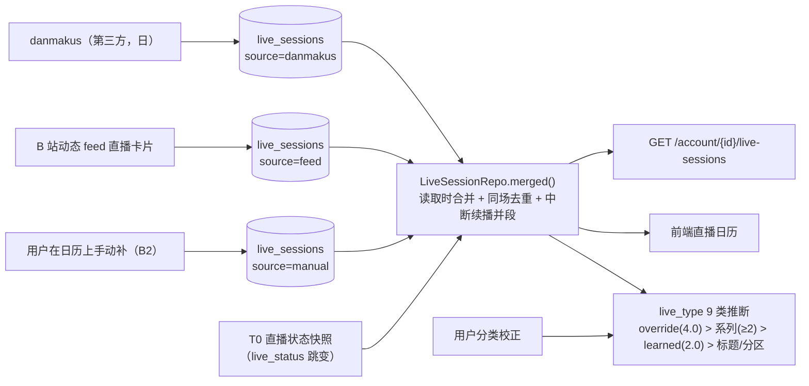

## 1. 直播场次管道（多源合一）

- 表内场次（danmakus / feed / **manual**）+ self 快照推导的「虚拟场次」在**读取时**合并，
  不落表；合并窗口 90 分钟，同 `room_id` 去重，同标题中断续播并段；
- `end_at` 由快照/次日 danmakus 补全；收益/弹幕数来自 danmakus。

**开播边沿的出口（M1，devlog/243）**：T0 每轮比较 `live_status` 得到 `edge` / `started`
（"开播"方向），原先**唯一**消费者是 `note_dynamics_activity()`（把动态流恢复满速）；
现在 `db.commit()` **之后**多一条 `message_hub.HUB.publish("domain.live.edge", …)`
（开播 ⇒ 顶栏出现 alert 级「XXX 开播了」）。⚠️ 顺序不能反：消息发出去收不回，
而事务可能回滚（判据 `tests/test_live_edge_notice.py::test_no_message_when_the_transaction_rolls_back`）。

**手动记录（B2，devlog/454）**：日历工具栏「+」/ 场次详情弹窗的铅笔 ⇒
`POST|PATCH|DELETE /account/{id}/live-sessions[/{live_id}]`（契约见 `docs/backend/HTTP-CONTRACT.md`）。

- **`source='manual'` 是第四种来源**，合并后与别的源拼成 `feed+manual` 这样的组合串 ⇒
  「这一场能不能改时间/能不能删」由服务端按**分词**判定（`app/domain/live_manual.py::is_manual_source`），
  响应里以 `manual` 字段给出 —— 前端不自己拆 `source`；
- 手动行**必须有 id**（`manual-<uuid4>`）：分类校正、详情/上游/词云端点全以 `live_id` 为键；
- 冲突（409）**只拦表内已有记录**的时段；只有 self 快照的时段**放行**（合并会把快照并进手动组，
  日历上仍是一条）—— 那是"给自动观测到的场次补标题/录播地址"唯一做得到的路径；
- 自动抓来的场次**只允许补录播地址**（时间/标题下次同步会被 `_upsert` 覆盖回去）；
- `vod_url` 是本表**唯一"用户手写、没有自动源"**的字段 ⇒ 合并规则里只增不减（不变量 39）。

## 场次与第三方源不变量

8. **外部源幂等**，且只在每日/每周低频访问第三方站点；

14. **场次合并要防「开放式区间」**：`end_at` 缺失既可能是「正在直播」也可能是「数据未定稿」，
    当无穷大会让很久以前的记录吞掉今天的场次 —— 用假定时长上界 + 双缺 end 时只认同标题
    （devlog/047）；

39. **用户手填的字段在多源合并里只增不减**（B2，devlog/454）：`live_sessions.vod_url` 是
    全表唯一**没有任何自动源**会重新给出来的列（danmakus/feed 的 upsert 从不写它）——
    而合并的高优分支是 `g.update(_row_dict(row))`，自动行那份 `vod_url` 是 `None`，
    一次合并就能把它抹掉（静默丢数据）。两处合并（`_merge_row_into_group` / `_apply_group_merge`
    的 dup 分支）都要显式兜底；判据
    `tests/test_vtuber_api.py::test_manual_vod_survives_room_merge` /
    `::test_manual_vod_survives_dup_merge`；

