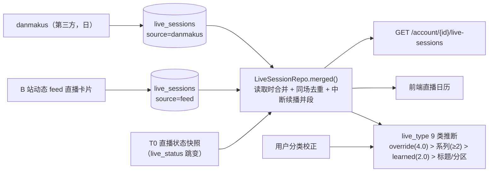

## 1. 直播场次管道（三源合一）

- 表内场次（danmakus / feed）+ self 快照推导的「虚拟场次」在**读取时**合并，
  不落表；合并窗口 90 分钟，同 `room_id` 去重，同标题中断续播并段；
- `end_at` 由快照/次日 danmakus 补全；收益/弹幕数来自 danmakus。

**开播边沿的出口（M1，devlog/243）**：T0 每轮比较 `live_status` 得到 `edge` / `started`
（"开播"方向），原先**唯一**消费者是 `note_dynamics_activity()`（把动态流恢复满速）；
现在 `db.commit()` **之后**多一条 `message_hub.HUB.publish("domain.live.edge", …)`
（开播 ⇒ 顶栏出现 alert 级「XXX 开播了」）。⚠️ 顺序不能反：消息发出去收不回，
而事务可能回滚（判据 `tests/test_live_edge_notice.py::test_no_message_when_the_transaction_rolls_back`）。

## 场次与第三方源不变量

8. **外部源幂等**，且只在每日/每周低频访问第三方站点；

14. **场次合并要防「开放式区间」**：`end_at` 缺失既可能是「正在直播」也可能是「数据未定稿」，
    当无穷大会让很久以前的记录吞掉今天的场次 —— 用假定时长上界 + 双缺 end 时只认同标题
    （devlog/047）；

