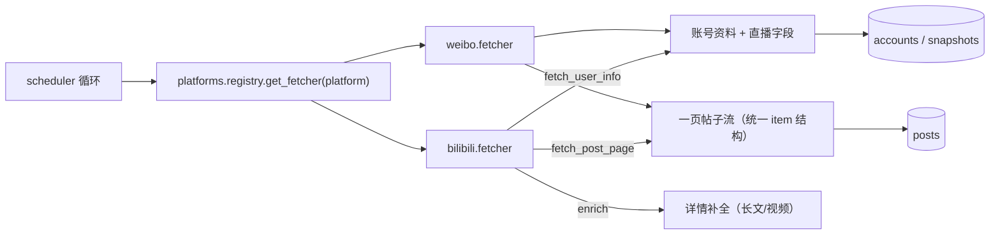

## 1. 平台适配层（直采）



- `BasePlatform` 只定义三个方法：`fetch_user_info` / `fetch_post_page` / `enrich`（可选）；
  **翻页是不透明 cursor**（第 4 阶段 ⑥，devlog/238）：`fetch_post_page(uid, cursor)`
  返回 `{"items", "has_more", "next_cursor"}`；页码平台把页码当 cursor 用，核心**不解析**它；
- 新平台 = 继承 + 在 `platforms/registry.py` 注册一行，调度器自动获得账号抓取、
  全量/增量帖子抓取、风控退避与完成报告（详见 `docs/backend/PLATFORMS.md`）；
- B 站请求走 `fetcher.py`：WBI 签名（`wbi.py`，混钥缓存）+ `auth_manager.build_headers()`
  注入 Cookie/UA；微博走 PC ajax 端点 + 扫码登录保存的 Cookie。

> 以下三节迁自 `docs/backend/PLATFORMS.md`（2026-09-30 并入）。

## 2. 目录与消费方式

```
app/services/platforms/
├── base.py             # BasePlatform 协议（爬虫框架接口）
├── registry.py         # 平台注册表：get_fetcher(platform)
├── streams.py          # PostStreams：帖子流的平台适配形状（翻页 + 可选台阶）
├── bilibili.py         # B 站**账号信息**适配（包装 app/services/fetcher 既有实现）
├── bilibili_posts.py   # B 站**帖子实现**（投稿动态合并 / 直播卡路由 / 详情补全 / 置顶刷新）
├── signing.py          # 请求签名（小红书 xhshow；NullSigner = 不需要签名的平台）
├── xiaohongshu.py      # 小红书适配
└── weibo.py            # 微博适配（m.weibo.cn 公开接口）
```

scheduler 统一消费框架：

- **账号信息抓取** `_fetch_one_account`：`registry.get_fetcher(acc.platform)` → `fetch_user_info(uid)`，
  统一回填 `display_name / sign / avatar / followers_count / url`（平台附加字段如 live_* 一并处理）。
  头像落盘按 `{platform}_{uid}{ext}` 命名防跨平台撞名。
- **帖子抓取** `_fetch_posts_for_account(acc, ...)` 按平台分发：
  - bilibili → 专属双流核心 `_fetch_posts_core`（视频+动态、归档边界、视频总数比对）；
    **核心只认 `PostStreams`**（uid 是**字符串**），B 站那套实现由 `scheduler.BILIBILI_STREAMS`
    绑上去 —— 那五个台阶的实现住在 `platforms/bilibili_posts.py`（devlog/229 + 236）
  - weibo / xiaohongshu 等单流平台 → 通用循环 `_fetch_platform_posts`（复用批量落库/去重/归档边界/
    定时任务让位/风控断点续抓/stop_reason/完成报告全链路）
- 全量（`async_fetch_all_posts`）、按名全量（`async_fetch_vtuber_posts`）、
  增量更新（`async_update_unarchived_posts`）均遍历**所有平台**账号。
- 风控统一走 `fetcher._detect_rate_limit`（HTTP 412/418/429 + json 风控文案），
  冷却/重试/断点续抓由 scheduler 兜底。
- **新平台必须接身份级那一层**（`identity_limit.py`，第 4 阶段 ⑤，devlog/237）：请求前
  `LEDGER.acquire(身份, 端点)`、请求后 `LEDGER.record(..., 四类之一, target=uid)`，并把
  "我们自己的节奏"（`last_error.kind="identity_throttled"`）与上游故障分开报。
  **照抄 `xiaohongshu.py` 的 `_admit` / `_observe` / `_outcome_of` 三个小函数即可** ——
  令牌桶与熔断的判据已经在 `tests/test_identity_limit.py`（24 条）。
  ⚠️ **限速表是显式的**：没写进 `ENDPOINT_RATE` 的端点**不限速**（只受熔断约束）——
  想给新平台限速就显式加一行，别指望兜底默认值。
- **直播状态是可选能力**（第 4 阶段 ⑧，devlog/240）：支持就设 `supports_live_batch = True`
  并实现 `fetch_live_batch(uids) -> {uid: {...}} | None`（T0 每分钟一次）；
  不支持就**保持默认 False** —— 调度侧会记一条日志后跳过（不是静默丢弃，也不算失败）。
  uid 形态的过滤、端点记账都在适配器里做（看 `platforms/bilibili.py` 的 20 行实现）。

## 3. 新平台接入步骤（以抖音为例）

> ⚠️ **先读 `docs/design/xhs-douyin-research.md`**（2026-09-27 调研快照）：
> ① **合规前提** —— 抖音 / 小红书的用户协议**明文禁止爬虫与自动化采集**，**不存在"允许的额度"**；
> 该文档 §6 是定性，且**已接入的 B 站 / 微博的同类问题本仓尚未复核**（§7 存疑 #16）；
> ② **技术前提** —— 这两家**不满足下方 `BasePlatform` 的三个隐含前提**（HTTP-only / 有稳定字符串 uid /
> cookie 即鉴权），且**采集引擎选型尚未拍板**（见 `docs/TODO.md` §1.2）。
> 本节的 `DouyinPlatform` 骨架只说明"大概长这样"，**不是可以直接照抄的结论**。

1. **实现适配器**（`app/services/platforms/douyin.py`）<!-- 未建 -->：

```python
from app.services.platforms.base import BasePlatform
from app.services.fetcher import _client_ctx, _detect_rate_limit

class DouyinPlatform(BasePlatform):
    platform = "douyin"

    async def fetch_user_info(self, uid, client=None) -> dict | None:
        # → {name, sign, avatar, followers_count, url, ...附加字段}
        ...

    async def fetch_post_page(self, uid, cursor=None, client=None) -> dict | None:
        # 一页帖子流（时间倒序）→ {"items": [...], "has_more": bool, "next_cursor": str | None}
        # ⚠️ cursor 对核心**不透明**（devlog/238）：`None` = 从头开始，
        #    之后每次把上一页给的 `next_cursor` 原样带回来；页码平台把页码当 cursor 用
        #    （见 `weibo._page_of_cursor`）。**核心不解析它**，你也别在核心侧做换算。
        # item: {platform, platform_uid, platform_post_id,
        #        type(text/image/video/repost/article), title, summary,
        #        cover_url, permalink, body_json, stats_json,
        #        published_at(naive UTC), raw_json}
        ...

    async def enrich(self, item, client=None) -> bool:
        # 详情补全（就地修改 item），返回是否发起过网络请求
        ...

fetcher = DouyinPlatform()
```

2. **注册**（`registry.py`）：`_REGISTRY["douyin"] = douyin.fetcher`
3. **配置**（`app/core/config.py`）：`IMG_PROXY_ALLOWED_HOSTS` 追加该平台图床域名
4. **前端**：`PostsPage` 的 `PLATFORM_LABEL` 与添加账号弹窗的平台下拉各加一项；
   `tauri.conf.json` CSP `img-src` 追加图床域名。
5. **测试**：按 `tests/test_weibo.py` 模板补适配器单测（httpx mock + 映射 + 分发）。

## 4. 微博接口速查（m.weibo.cn）

| 用途 | 接口 |
|---|---|
| 用户信息 | `GET https://m.weibo.cn/api/container/getIndex?type=uid&value={uid}` → `data.userInfo` |
| 微博列表 | `GET .../getIndex?containerid=230413{uid}_-_WEIBO_SECOND_PROFILE_WEIBO&page=N` → `data.cards[].mblog`（旧容器 `107603{uid}` 已失效，勿用） |
| 长文全文 | `GET https://m.weibo.cn/statuses/extend?id={mid}` → `data.longTextContent` |

- 请求头统一走 `weibo_auth.build_headers()`：iPhone UA + Referer + X-Requested-With + Cookie（扫码登录后自动携带）
- 类型映射：`pics`→image、`retweeted_status`→repost（origin 结构）、`page_info.type=video`→video、其余→text
- 时间：`created_at`（`%a %b %d %H:%M:%S %z %Y`）解析为 naive UTC；相对时间兜底
- 风控：HTTP 418/429 + `{"ok":0,"msg":"…频繁…"}`

## 5. 登录（扫码 B 站 / 微博；粘贴 cookie 小红书）

- 扫码端点：`POST /auth/{platform}/qr/start` → `{qr_id, url|image}`；`GET /auth/{platform}/qr/check?qr_id=` 轮询（waiting/scanned/confirmed/expired/failed，confirmed 时后端同步完成取 cookie 并写入 `.env`）；`GET /auth/{platform}/status` 登录态
- 前端：TopBar 登录按钮（B 站会话过期红点徽章）→ `LoginDialog`（Tab 清单来自 `utils/platformLogin.ts::LOGIN_TABS`，**单一事实来源**）→ B 站用 react-qr-code 渲染 url、微博显示 base64 图 → 2s 轮询 → 成功 toast
- B 站流程：generate → poll（qrcode_key）→ 回调 URL 种 SESSDATA 等 → nav 校验 → `.env`
- 微博流程：`passport.weibo.com/sso/v2/qrcode/image`（回退 `login.sina.com.cn` JSONP）→ check（50114001/50114002/20000000/50114004）→ `login.php?alt=` 种 SUB/SUBP 等 → crossDomainUrlList 补种 → `.env`
- **小红书：没有扫码**（它连二维码/状态接口都要签名与设备 cookie，见 `docs/design/xhs-douyin-research.md` §2.8）⇒ 走 `POST /auth/xiaohongshu/cookie`（body `{"cookie": "a1=…; web_session=…"}`）。⚠️ **先校验再落盘**：缺 `a1`/`web_session` 一律 400 且不写 `.env`；`status()` 只报"配齐了没"（不做探活：没有免签名的探活端点，硬探白挨一次风控），真实失效由抓取侧 `classify_http()=='cookie_invalid'` 反映。前端在登录浮窗的第三个 Tab 里粘贴（步骤文案 + 400 原文直接显示）
- `.env` 原子写共享：`app/services/env_store.py`（B 站 `auth.py`、微博 `weibo_auth.py`、小红书 `xhs_auth.py` 共用）

## 6. 使用方式（前端）

- 「添加账号」按钮（帖子面板总操作按钮组）：选择平台（bilibili / weibo / xiaohongshu）+ 输入 UID → 入库后自动抓取账号信息；小红书这一格**允许粘主页链接**（`utils/platformLogin.parseXhsUid` 先摘 uid）
- 「添加 VTuber」浮窗：B 站直搜 / 本地候选 / **小红书 uid**（`data-xhs-adopt`；没有搜索接口 ⇒ 只认 uid 或主页链接）
- 「账号切换器」（操作按钮组行首）：同一 V 的 bilibili/微博/小红书账号间切换，
  帖子列表/统计/抓取按钮均跟随所选账号的 `(platform, uid)`
- 抓取帖子/更新动态按所选账号平台执行（`/vtuber/fetch-posts?platform=weibo`）
