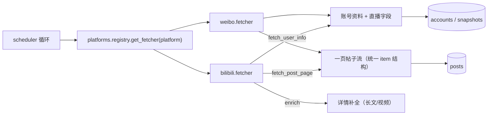

## 1. 平台适配层（直采）



- `BasePlatform` 只定义三个方法：`fetch_user_info` / `fetch_post_page` / `enrich`（可选）；
  **翻页是不透明 cursor**（第 4 阶段 ⑥，devlog/238）：`fetch_post_page(uid, cursor)`
  返回 `{"items", "has_more", "next_cursor"}`；页码平台把页码当 cursor 用，核心**不解析**它；
- 新平台 = 继承 + 在 `platforms/registry.py` 注册一行，调度器自动获得账号抓取、
  全量/增量帖子抓取、风控退避与完成报告（详见 `docs/backend/PLATFORMS.md`）；
- B 站请求走 `fetcher.py`：WBI 签名（`wbi.py`，混钥缓存）+ `auth_manager.build_headers()`
  注入 Cookie/UA；微博走 PC ajax 端点 + 扫码登录保存的 Cookie。

> 以下三节迁自 `docs/backend/PLATFORMS.md`（2026-09-30 并入）。

## 2. 目录与消费方式

```
app/services/platforms/
├── base.py             # BasePlatform 协议（爬虫框架接口）
├── registry.py         # 平台注册表：get_fetcher(platform)
├── streams.py          # PostStreams：帖子流的平台适配形状（翻页 + 可选台阶）
├── bilibili.py         # B 站**账号信息**适配（包装 app/services/fetcher 既有实现）
├── bilibili_posts.py   # B 站**帖子实现**（投稿动态合并 / 直播卡路由 / 详情补全 / 置顶刷新）
├── signing.py          # 请求签名：小红书 `XhsSigner`（xhshow，头即签名）+ 抖音 `DouyinSigner`
│                       #   （**签的是查询串**：a_bogus + verifyFp/fp + secsdk；NullSigner = 不签）
├── xiaohongshu.py      # 小红书适配
├── douyin.py           # 抖音适配（devlog/334）
├── vendor/dtksign/     # **第三方**（Apache-2.0，vendored）：a_bogus / sm3 / secsdk，见其 NOTICE.md
└── weibo.py            # 微博适配（m.weibo.cn 公开接口）
```

scheduler 统一消费框架：

- **账号信息抓取** `_fetch_one_account`：`registry.get_fetcher(acc.platform)` → `fetch_user_info(uid)`，
  统一回填 `display_name / sign / avatar / followers_count / url`（平台附加字段如 live_* 一并处理）。
  头像落盘按 `{platform}_{uid}{ext}` 命名防跨平台撞名。
- **帖子抓取** `_fetch_posts_for_account(acc, ...)` 按平台分发：
  - bilibili → 专属双流核心 `_fetch_posts_core`（视频+动态、归档边界、视频总数比对）；
    **核心只认 `PostStreams`**（uid 是**字符串**），B 站那套实现由 `scheduler.BILIBILI_STREAMS`
    绑上去 —— 那五个台阶的实现住在 `platforms/bilibili_posts.py`（devlog/229 + 236）
  - weibo / xiaohongshu 等单流平台 → 通用循环 `_fetch_platform_posts`（复用批量落库/去重/归档边界/
    定时任务让位/风控断点续抓/stop_reason/完成报告全链路）
- 全量（`async_fetch_all_posts`）、按名全量（`async_fetch_vtuber_posts`）、
  增量更新（`async_update_unarchived_posts`）均遍历**所有平台**账号。
- 风控统一走 `fetcher._detect_rate_limit`（HTTP 412/418/429 + json 风控文案），
  冷却/重试/断点续抓由 scheduler 兜底。
- **新平台必须接身份级那一层**（`identity_limit.py`，第 4 阶段 ⑤，devlog/237）：请求前
  `LEDGER.acquire(身份, 端点)`、请求后 `LEDGER.record(..., 四类之一, target=uid)`，并把
  "我们自己的节奏"（`last_error.kind="identity_throttled"`）与上游故障分开报。
  **照抄 `xiaohongshu.py` 的 `_admit` / `_observe` / `_outcome_of` / `_note` 四个小函数即可** ——
  令牌桶与熔断的判据已经在 `tests/test_identity_limit.py`（24 条）。
  ⚠️ 两条**新平台最容易漏**的（`devlog/337`）：
  ① `_note(kind)` 要**同时**写 `last_error` 与 `app.core.outcome.set_failure()` ——
     后者是报告文案的唯一来源（只写前者 ⇒ 小红书/抖音的失败永远被说成「网络」）；
  ② **闸门要问这个账号的平台**：`content_fetch_allowed(platform)` 别漏参数
     （漏了就是「非 B站账号被未登录 B站挡下 / B站登录着时越权放行」—— 这类已踩三次）。
  ⚠️ **限速表是显式的**：没写进 `ENDPOINT_RATE` 的端点**不限速**（只受熔断约束）——
  想给新平台限速就显式加一行，别指望兜底默认值。
  ⚠️⚠️ **而且限速表的键是全局的**（`Ledger._bucket` 只按 endpoint 查它）⇒ 两个平台
  **不能共用同一个端点名**：2026-10-04 抖音接进来时写了 `"detail": 0.12`，而 B 站详情抓取
  用的正是 `detail` ⇒ **抖音的限速把 B 站拖慢了**（两条用例当场红）。抖音因此改用
  `aweme_posts` / `user_profile` / `aweme_detail`；`tests/test_outcome_and_breaker.py` 有一条
  **各平台端点名两两不相交**的判据盯着这件事。
- **直播状态是可选能力**（第 4 阶段 ⑧，devlog/240）：支持就设 `supports_live_batch = True`
  并实现 `fetch_live_batch(uids) -> {uid: {...}} | None`（T0 每分钟一次）；
  不支持就**保持默认 False** —— 调度侧会记一条日志后跳过（不是静默丢弃，也不算失败）。
  uid 形态的过滤、端点记账都在适配器里做（看 `platforms/bilibili.py` 的 20 行实现）。
- **签名器不在 / 平台改版时要"响亮地失败"**（`signing.py`）：绝不退回"没签名也发"——
  那会被风控记一笔，而且线上查不出来。抖音更阴的一点是**失败形态是 `HTTP 200 + 0 字节空体`**
  （不是 403），所以适配器的分类必须把"空体"当失败（见 §3 第 2 步）。

## 3. 新平台接入步骤（抖音已按此清单落地，devlog/334）

> ⚠️ **先读 `docs/design/xhs-douyin-research.md`**（调研快照）+ `docs/plans/douyin-execution.md` §0：
> 抖音 / 小红书的用户协议**明文禁止爬虫与自动化采集**，**不存在"允许的额度"**；
> 抖音那条已由用户 2026-10-04 拍板（立场 C，风险自担 + 降险三条）。

1. **签名**（若平台要签）：先确认有没有**可 vendor 的纯 Python 实现**（抖音 = DTK，Apache-2.0，
   见 `platforms/vendor/dtksign/NOTICE.md`：blob SHA 比对 + 只改一行 import + sha256 判据）。
   ⚠️ **没 license 的仓库不能 vendor**（`license: null` = 保留所有权利），只能当参考读；
   签名器要有**发请求前的自检**，但要**分级**（抖音 `devlog/334` 的教训）：
   "这根本不是一条签名"（字母表/长度）⇒ `SignerUnavailable` 硬停；
   "内容不符预期"（解码器的已知歧义）⇒ **重签几次，仍不行就照发 + warning** ——
   ⚠️ **别拿启发式当闸门**：实测那个自检会以约 1/300 的概率对**自己刚签出来的**签名误报，
   当硬闸门就是"每 300 次静默少发一发"，而日志里写着"签名器与平台对不上"。
2. **实现适配器**（`app/services/platforms/<平台>.py`）：继承 `BasePlatform`，三个方法
   `fetch_user_info` / `fetch_post_page(uid, cursor)`（cursor 对核心**不透明**）/ `enrich`。
   - **响应分类必须有"这个平台自己的失败形态"**：抖音是"200 + 空体 = 签名被拒"、
     "200 + `aweme_detail: null` = 帖子没了（**业务失败，不许冷却身份**）"、
     "461/471 = 验证码 ⇒ 立即停"；
   - **`platform_post_id` 全程字符串**（19 位 id 会超 JS 安全整数）；
   - **三个 json 列存 JSON 串**（`json.dumps`），直接塞 dict 落库会报类型错。
3. **注册**（`registry.py`）：`_REGISTRY["<平台>"] = <模块>.fetcher`
4. **能力矩阵与闸门**（`app/services/capabilities.py`）：`FEATURES` 一条（含 `evidence` 实测依据）
   + `_login_states` / `_logged_in` / `snapshot` 各加一家 + `content_fetch_allowed` 分支
   （**没配 cookie 就不发请求**）。⚠️ `tests/test_platform_branches.py` 的"未知平台"样本
   **不要用真实平台名**（被咬过两次：小红书、抖音）。
5. **登录**：`services/<平台>_auth.py`（粘贴 cookie 那条路，照 `xhs_auth.py` 抄）+ 路由
   `POST /auth/<平台>/cookie` + `GET /auth/<平台>/status` 的分支 + `frontend/src/utils/platformLogin.ts`
   的 `LOGIN_TABS` / `COOKIE_LOGIN` 文案。
6. **配置**（`app/core/config.py`）：`<平台>_COOKIE`（+ 身份相关项，如抖音的 `DOUYIN_UA`：
   它会被算进签名）+ `IMG_PROXY_ALLOWED_HOSTS` 追加图床域名；
   `frontend/src-tauri/tauri.conf.json` 的 CSP `img-src` 追加同一批域名
   （漏一处的症状是**静默破图**，`tests/test_img_proxy_hosts.py` 会红）。
7. **前端**：`utils/postTypes.ts` 的 `PLATFORM_LABEL` / `PLATFORM_EN` / `typeGroupsFor` /
   `accountHomeUrl`，添加账号弹窗与「添加 VTuber」的收录按钮（没有搜索接口的平台只能按 uid 收录）。
   ⚠️ 还要加**三处壳层/媒体白名单**，漏一处的症状都是**静默**的：
   图片代理 `IMG_PROXY_ALLOWED_HOSTS` + CSP `img-src`（破图）、`/video-proxy` 的
   `ALLOWED_HOSTS`/`HOST_POLICY`（视频播不了）、Rust 侧 `EXTERNAL_HOSTS`（"打开主页"失败）。
   ⚠️ **媒体地址大多是"限时签名"的**（`devlog/363`）：抖音播放地址里 `l=<签发时刻>`
   （形如 `20261005191106…`），实测**活约 8 小时**，过期后 CDN 一律 **403**；视频又**不被固化**
   （`assets._media_urls` 明确排除）⇒ 隔天点开必然播不了，唯一出路是**重取详情**。前端那条链：
   播放器整条链全失败 ⇒ `onAllFailed` ⇒ `POST /posts/{id}/refresh-media`（图片四级全失败也走同一条，
   `devlog/320`）；⚠️ 重取回来是**原地换 prop**，播放器必须**把镜像序号与判死状态归零**，否则新地址也用不上。
   ⚠️ **判"过期"之前先控制变量**：裸请求打一个**没过期**的同款地址同样 403（防盗链，口径见
   `video_proxy.HOST_POLICY`）⇒ 要 ① 从地址里读 `l=` 对时 ② 带平台自己的 `Referer` 做对照；
   **同一地址带 Referer 206 / 不带 403** 才说明"地址还活着，403 是防盗链"。
8. **合规总开关**（抖音 `DOUYIN_ENABLED`，默认 **False**，devlog/335）：协议禁止自动化采集的平台，
   "配了凭据"**不等于**"要在后台一直抓" ⇒ 加一个用户可见的热更开关，并且**双保险**：
   `_admit` 这个唯一入口上硬闸（关着一个字节都不发）+ `capabilities` 闸门（理由指向设置里的开关，
   而不是让人去登录）。
   ⚠️ 能力矩阵里这条要报**第四态 `disabled`** 而不是 `requires_login`（`devlog/338` 的用户真机反馈）：
   "我们自己关了"与"平台要登录"的**补救动作不同** —— 混用会让刚粘完 Cookie 的用户以为没生效。
   开工时**先确认开关开了没有**（`app_meta` 里有没有 `settings.DOUYIN_ENABLED`）：默认关着时
   账号信息与首屏帖子**一个请求都不发**，症状是"抓不到数据"而日志里写着「总开关关着」。
9. **测试**：适配器单测（假 client + **真签名器**）+ 四类响应那两条（业务失败不冷却 /
   200+空体不算成功）+ 闸门与 `has_more`/cursor 判据 + **`body_json` 契约**（直接调
   `assets._media_urls`，别自己再解析一遍 —— 形状写错是静默的）+ 总开关关着时零请求；
   跑 `pytest` 与 `vitest` 全绿。

```python
class DouyinPlatform(BasePlatform):          # 真实形状见 app/services/platforms/douyin.py
    platform = "douyin"
    supports_live_batch = False              # 可选能力默认关（调度侧记日志后跳过）
```

## 4. 微博接口速查（m.weibo.cn）

| 用途 | 接口 |
|---|---|
| 用户信息 | `GET https://m.weibo.cn/api/container/getIndex?type=uid&value={uid}` → `data.userInfo` |
| 微博列表 | `GET .../getIndex?containerid=230413{uid}_-_WEIBO_SECOND_PROFILE_WEIBO&page=N` → `data.cards[].mblog`（旧容器 `107603{uid}` 已失效，勿用） |
| 长文全文 | `GET https://m.weibo.cn/statuses/extend?id={mid}` → `data.longTextContent` |

- 请求头统一走 `weibo_auth.build_headers()`：iPhone UA + Referer + X-Requested-With + Cookie（扫码登录后自动携带）
- 类型映射：`pics`→image、`retweeted_status`→repost（origin 结构）、`page_info.type=video`→video、其余→text
- 时间：`created_at`（`%a %b %d %H:%M:%S %z %Y`）解析为 naive UTC；相对时间兜底
- 风控：HTTP 418/429 + `{"ok":0,"msg":"…频繁…"}`

## 5. 登录（扫码 B 站 / 微博；粘贴 cookie 小红书与抖音）

- 扫码端点：`POST /auth/{platform}/qr/start` → `{qr_id, url|image}`；`GET /auth/{platform}/qr/check?qr_id=` 轮询（waiting/scanned/confirmed/expired/failed，confirmed 时后端同步完成取 cookie 并写入 `.env`）；`GET /auth/{platform}/status` 登录态
- 前端：TopBar 登录按钮（B 站会话过期红点徽章）→ `LoginDialog`（Tab 清单来自 `utils/platformLogin.ts::LOGIN_TABS`，**单一事实来源**）→ B 站用 react-qr-code 渲染 url、微博显示 base64 图 → 2s 轮询 → 成功 toast
- B 站流程：generate → poll（qrcode_key）→ 回调 URL 种 SESSDATA 等 → nav 校验 → `.env`
- 微博流程：`passport.weibo.com/sso/v2/qrcode/image`（回退 `login.sina.com.cn` JSONP）→ check（50114001/50114002/20000000/50114004）→ `login.php?alt=` 种 SUB/SUBP 等 → crossDomainUrlList 补种 → `.env`
- **小红书：没有扫码**（它连二维码/状态接口都要签名与设备 cookie，见 `docs/design/xhs-douyin-research.md` §2.8）⇒ 走 `POST /auth/xiaohongshu/cookie`（body `{"cookie": "a1=…; web_session=…"}`）。⚠️ **先校验再落盘**：缺 `a1`/`web_session` 一律 400 且不写 `.env`；`status()` 只报"配齐了没"（不做探活：没有免签名的探活端点，硬探白挨一次风控），真实失效由抓取侧 `classify_http()=='cookie_invalid'` 反映。前端在登录浮窗的第三个 Tab 里粘贴（步骤文案 + 400 原文直接显示）
- **抖音：也没有扫码**，且**要多收一个 UA** ⇒ `POST /auth/douyin/cookie`（body `{"cookie": "uifid=…; s_v_web_id=…; ttwid=…", "user_agent": "…"}`）。
  ⚠️ 为什么 UA 是凭据的一部分：`a_bogus` 把 UA 算进签名，而**填错的症状是静默的**（HTTP 200 + 0 字节空体，devlog/333）⇒ 它必须与 cookie 来自同一个浏览器会话，不能躺在默认值里（`DOUYIN_UA`）。
  必需键：`s_v_web_id` + `uifid`（或 `UIFID_TEMP`）+ `ttwid`；`status()` 额外报一个 `ua_configured`（**不回显 UA 全文**：它是身份指纹）。
- `.env` 原子写共享：`app/services/env_store.py`（B 站 `auth.py`、微博 `weibo_auth.py`、小红书 `xhs_auth.py`、抖音 `douyin_auth.py` 共用）

## 6. 使用方式（前端）

- 「添加账号」按钮（帖子面板总操作按钮组）：选择平台（bilibili / weibo / xiaohongshu / douyin）+ 输入 UID → 入库后自动抓取账号信息；后两家**允许粘主页链接**（`utils/platformLogin.parseXhsUid` / `parseDouyinUid` 先摘 uid）
- 「添加 VTuber」浮窗：B 站直搜 / 本地候选 / **小红书 uid**（`data-xhs-adopt`）/ **抖音 uid**（`data-douyin-adopt`）——两家都没有可用的搜索接口，只认 uid 或主页链接；抖音还**认不出纯抖音号**（那要搜索接口，本版未接）⇒ 认不出时按钮禁用
- 「账号切换器」（操作按钮组行首）：同一 V 的多平台账号间切换，
  帖子列表/统计/抓取按钮均跟随所选账号的 `(platform, uid)`
- 抓取帖子/更新动态按所选账号平台执行（`/vtuber/fetch-posts?platform=weibo`）
